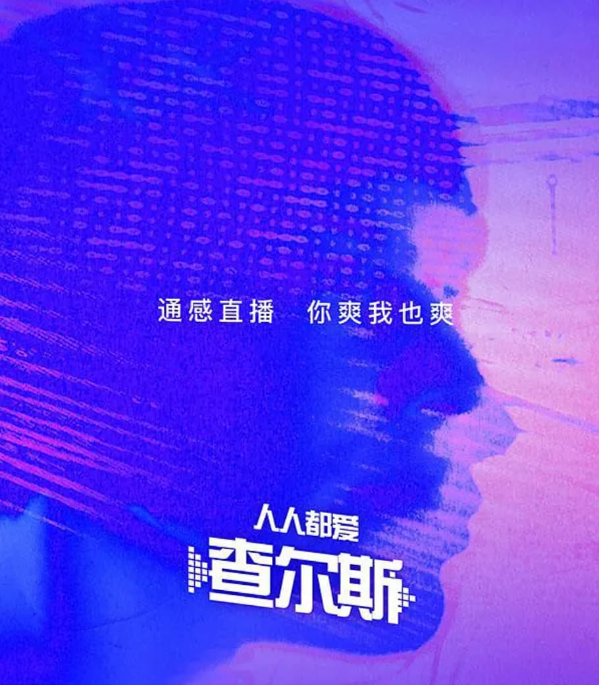

# 人人都爱查尔斯

作者: 宝树

---

## 1

他进入了太空，宛如获得自由的鱼儿跃出了水面。

透过“飞马座”号的舷窗向下看去，最初是灰色的城市和棕色的小镇，然后是绿色的农田和黄色的沙漠，很快一切都被白茫茫的云海覆盖。等他钻出云海，已经在太平洋上空，世界变成了一个蔚蓝色的曲面，隐约显出巨大的球体轮廓，北美大陆是天边一线，亚洲隐藏在弯曲的海天线下面，整个地球被裹在一层朦胧的光晕中，那是大气层。而在他头顶，点点星光已经从暗黑色的天穹露出头。随着引力的减弱，他感到了失重，虽然身体被牢牢固定在座椅上，但是仍然感到自己在飘浮着。飞行器仿佛翻了个儿，太平洋的无尽海水悬在他头顶，而身下是黑暗的无底深渊，让他有一种错觉，觉得自己不是在太空，而是安睡在大海的底部，一切显得恬静而悠远。有那么几秒钟，查尔斯·曼觉得自己是世界上最远离尘嚣的人，似乎可以永远就这样飘荡在地球之外的空间里，融入大自然的高远纯净。

但他很快想起来，不，应该说他一直都知道，这是一个不可实现的幻想，整个世界都在看着他，至少有十亿人在观看他的“直播”。“飞马座”号正在世界最高规格的航天飞行大赛——跨太平洋锦标赛之中。现在飞船正在大气层外以九点七马赫的高速射向太平洋西岸，目的地——日本东京。

像弹道导弹一样，参加比赛的飞行器往往在飞行中途进入太空，以便最大限度减少空气阻力。在太空中，为节省燃料，飞行器基本依靠惯性飞行，重新进入大气层后才会启动发动机。因此有那么几分钟，查尔斯悠闲自在地观赏着窗外的蓝色星球，听着座舱里的爵士乐，甚至发布了一条脑写的微博：

“我感到自己离地球前所未有的远，在这一刻，‘我’的存在，世界和我，变成了相对的两极，我就是我，不再是地球上芸芸众生的一份子，而是孤独的宇宙流浪者……”

“飞马座”号的电脑屏幕上清楚地显示出了他的位置，他大约在阿留申群岛上空，一大队蓝色光点正从星星点点的岛屿上空向西移动，一个醒目的红点在它们前列——正是“飞马座”号0他的背后有一百多架飞行器，前面有三架，排在第四，还算不错，但还不足以取得名次。最前面的飞行器已经在一百多公里外，排第三的那架离他也有十多公里。似乎是为了提醒他，背后一架银白色的飞碟迅速接近，很快从只有三百多米的近处悠然掠过他的左面，像一颗流星那样划过。那是乔治·斯蒂尔的“仙女座”号。

“查尔斯，今天怎么不行了？”通话频道中传来斯蒂尔的讥笑，“泡妞花的精力太多了吧？”

“乔治，我只是在休息，欣赏欣赏太空美景，对我来说，比赛尚未开始。”

“恐怕对你来说，比赛已经结束了，伙计。”乔治反唇相讥。

“不，比赛现在刚刚开始。”查尔斯冷冷地说，按下了一个按钮。

骤然间，“飞马座”号抛掉了整个尾部，宛如蜕皮新生的蝴蝶。新露出的尾部喷管中吐出蓝色的强光，标志着核聚变发动机启动了！查尔斯感到了加速效应，有一股力量压着他，让他几乎喘不过气来，这种熟悉的感觉却让他热血沸腾。减轻了一小半重量之后，“飞马座”号的速度短时间内提升了二点二个马赫，轻松地反超了“仙女座”号。

“嘘！”查尔斯吹了一声口哨。

“这不可能！你怎么可能有……十二马赫的速度！”

“东京见，乔治，”查尔斯说，“如果你的小飞碟能撑到那里的话。千万别掉海里，我可不想在庆祝酒会上的生鱼片里吃到你的戒指。”他知道上亿人都通过广播听到了这句俏皮话，嘴角泛起得意的微笑。

似乎为了印证他的预言，身后的“仙女座”号颤抖起来，显示出自己已经达到速度的极限，但它仍加速了一小段，进行了一番绝望的尝试，最后不得不放弃。

“你等着吧，查尔斯，总有一天……”乔治在电波里气急败坏地叫喊着。

查尔斯大笑着，风驰电掣，飞向前方，核聚变发动机全力运转着，将飞行器的速度推向顶峰。

“卡伦斯基！哈米尔！田中！游戏开始了！”

以梦幻般的速度，“飞马座”号超过了一架又一架飞行器，很快重新进入大气，启动了防护罩。空气在它周围燃烧起来，“飞马座”号宛如灿烂的火流星划过太平洋的天空，落向日本列岛。

在离东京不远的海上，“飞马座”号最后超过了田中隆之的“天照”号。为了安全降落，“天照”号不得不在离东京还很远的时候就开始减速，而“飞马座”号却嚣张地没有减速，从“天照”号的头顶飞过去，然后飞过了东京上空。

“查尔斯，你去哪里？再不停下来就要飞到西伯利亚了！”耳机里传来教练的警告。

但查尔斯在飞过东京后才开始全力减速，绕了一个圈子再飞回来，仍然赶在“天照”号之前降落在东京奥林匹克体育场的草坪上。查尔斯看到，满场的观众都起身为他鼓掌欢呼。

“查尔斯，恭喜你蝉联了冠军！”教练在耳机里说，“颁奖仪式将在一个小时以后举行，你准备一下致辞吧。”

“你代我领奖好了，”查尔斯说，“我还有一个浪漫的樱花约会。”

“别耍性子，这次是爱子天皇亲自颁奖！晚上还有日本读者的见面会，你要赏樱花，明天我们会安排的。”

“我对这些没兴趣，”查尔斯大笑，“仓井雅在等我。”

“查尔斯，你实在是太……”

然而“飞马座”号已经再度起飞，在众目睽睽之下升到高空中，消失在东京的高楼广厦间。

## 2

突如其来的微微刺痛让宅见直人睁开眼睛，有好半天他都没反应过来自己身在何处。这是他的房间，只有七八平方米，一张榻榻米就占了一半，另一半是一张电脑桌，没有别的家具，不过他需要的也就只是这两样东西。

直人坐起身来，才意识到自己已经有七八个小时躺在床上，膀胱憋得有点儿发疼。许久没有进食，血糖已经低到了危险的程度，所以手腕上的健康监测仪才会报警，如果再不吃点儿东西，健康监测仪就会断定他已经昏迷，直接向附近的医院发出求救信号。

直人去厕所撒了泡尿，倒了一杯矿泉水，打开放在电脑桌上的药瓶，瓶子里是满满的高纯营养片，富含人体所需要的主要营养成分，并且能抑制胃酸的分泌，吃五片就相当于一顿饭。当然这玩意儿的味道不敢恭维，和塑料泡沫差不多，但是既然每天都可以享受鹅肝、松露和鱼子酱之类的顶级大餐，谁还在乎这些！

直人倒了十片营养片，就着冷水吞服下去。然后打开电脑，调出一个界面，分秒必争地敲打着一般人看来毫无意义的数字和符号。他在为一个金融管理软件编写代码，这份工作枯燥无味，好在收入不菲。但他每天最多工作两个小时，这是能够维持他每天在这个小房间里靠吃营养片活下去的最低工作时间。他不想为这种生活付出更多劳动，但也没法要得更少了。

“必须赶快，”直人一边干活一边想，“不能再这么割裂了，这会破坏好不容易形成的内在协调性，必须快点回去……最多再有五分钟……”

但是偏偏有人呼叫他，直人皱了皱眉头，打开对话视频，一个胖胖的短发女孩子蹦了出来，是住在隔壁的朝仓南。她做了一个表示可爱的表情，“直人，你在吗？”

废话。“在啊。”

“告诉你一个好消息，你知道吗？查尔斯来了！”

又是废话。“我听说了，怎么？”

“是查！尔！斯！”朝仓强调说，“查尔斯·曼，你的偶像！他刚才拒绝了天皇的颁奖，说去和仓井雅约会了，现在这新闻轰动了整个网络！不过听说晚上他在银座那边还有一个读者见面会和签名售书活动，这是千载难逢的机会，不如我们去看他好不好？我有一本他写的《彼岸之国》，想让他签名呢！”

“对不起，”直人根本没想就拒绝了，“我很忙，我要工作。”

“可你每天都在房间里工作，花两小时出去走走都不行吗？何况今天是查尔斯——”

“我赶着要交任务呢。”

“可是——”

“对不起，再见！”直人径直关掉了视频对话。

幼稚的女人，浪费我的宝贵时间，直人想。他知道朝仓暗地里喜欢他，可是在和伊丽莎白·怀特、玛丽安娜·金斯顿、宝拉·克劳齐亚、杨紫薇等世界各地的艳星名媛有过肌肤之亲后，再对着朝仓那张小圆脸，他实在提不起兴趣。何况朝仓的存在总让他想起自己到底是谁，而他现在最不需要的就是找到自我。

不行，不能再在这个房间里待下去了。多待一秒钟都会令人发疯。直人草草结束工作，推开电脑，在榻榻米上躺下去，闭上眼睛，营养片已经开始消化，虽然胃里并不舒服，但是至少没那么饥饿了，可以再撑七八个小时。

建立连接通路，感觉信息传递，脑电波变为电磁波，又变成中微子束，然后再次变为电磁波和脑电波。

重力感同步：我站在什么地方。

触觉同步：微风从我身上吹过，带着春天的暖意和海洋的潮润。

听觉同步：风声和婉转的鸟啼。

视觉同步：满目粉红粉白，凝结为千万树樱花，在春天的绿意中绽放，一个穿着和服的女郎跪坐在樱树下，眉目如画，绽放笑靥，是仓井雅！

而我是查尔斯，独一无二的查尔斯。

## 3

“飞马座”号在箱根的一个小湖边降落。

仓井雅在湖边的一片樱花林中等他，正当春深，这里的樱花开得艳如云霞。地下已经铺上了洁白的野餐布，上面摆好了精致的鱼片、海胆刺身和清酒。仓井雅穿着宽松的青缎和服跪坐在一棵樱树下，见到他，温柔而不失妩媚地一笑，“嗨，查尔斯。”她用流利的英语说。

“嗨，小雅。”查尔斯在她身边坐下，揽住了她纤细柔美的腰肢。

“我刚刚看了直播，”仓井说，“查尔斯，恭喜你再次蝉联世界冠军，干一杯？”她用白皙的手托起了小巧的酒杯。

“那个么，算不了什么。”查尔斯接过酒杯一饮而尽，顺便在她吹弹可破的脸上亲了一下，“你知道，我这么快飞过来，全是为了见你……”

“骗人！”仓井笑盈盈地说。

“真的，我们已经有好几个月不见了，我一直在想着你。”

“想着我？”仓井歪着头，似笑非笑地说，“哼，那你和克劳齐亚小姐是怎么回事？”

查尔斯微有些尴尬，含含糊糊地说：“她么……其实你们都是很好的姑娘，都跟我的亲人一样……”

仓井雅聪明地没问下去，换了个话题，“对了，我最近拍的那部电影你看了么？我送了你首映式的票，不过你没来。电影叫做《北海道之恋》。”最后五个字她咬得字正腔圆。

“当然！你演得棒极了，宝贝。”查尔斯抚摸着她散发着樱花清芬的秀发，“我非常喜欢……”他努力回忆仓井雅扮演的人物名字，可惜想不起来，“……你演的那个角色，情感诠释得太到位了。”

仓井的嘴边露出了一丝浅笑，她知道这意味着世界上已经至少有一千万人听到了这句话，很快就会有上亿人在网上查询她演的电影，好莱坞仿佛已经在向她招手。“那查尔斯你说，你最喜欢哪一段呢？”她撒娇地问道。

“当然是……是结尾的那段，我觉得非常、非常感人……”查尔斯说，忙设法岔开话题，“对了，这里不是风景区么，怎么一个人也没有？”

“这一带是私人的地产，地主是三上集团的总裁，他听说你要来，所以免费让我们在这里约会，不会有人打扰的。”

“替我谢谢他，这里真的很美。”查尔斯望向四周，富士山头的皑皑白雪在远处发亮，千树万树的樱花在春风中摇曳着，落樱如雨，飘向凝碧的湖面。空气中都是清新的芬芳。

“这里会让梭罗妒忌得发狂，”查尔斯深深吸了口气，“我有一种预感，如果我住在这里，或许可以写一部比《瓦尔登湖》更优美的作品。”

“瓦尔登湖？是什么？”仓井雅不解地问。

“是……没什么。”查尔斯露出狡黠的笑容，“小雅，你尝试过在樱花树下……”他咬着仓井的耳朵说了一句悄悄话，当然世界上无数人还是听到了。

“坏蛋，就知道你不肯放过我。”仓井咯咯笑了起来。

查尔斯搂住了半推半就的仓井雅，这古怪的和服是从哪里解开来着？哦，是在后面……

远处传来马达声响，打破了湖边的宁静。查尔斯回过头，看到一个蓝色的小点在天边出现。“不会又是那些狂热的粉丝跟踪吧……”他咕哝着。

但那个小点迅速变大，旁边出现了双翼。查尔斯很快看到了机身上的日本国旗和下面的一行英文，这居然是东京警视厅的空中警车。

警车在湖边降落，就停在“飞马座”号边上，一名女警从警车里出来，大步走到他们面前。

“先生，你是查尔斯·曼？”她用口音很重的英文问。

“是的，你是要来签名么，小姐？”查尔斯嬉皮笑脸地盯着面前的女警，她很年轻，算不上美丽，但身材挺拔，神态庄重，自有一种英姿飒爽的气质。

“查尔斯·曼先生，”女警面无表情地说，“我们怀疑你涉嫌从事恐怖活动，按照我国的反恐法律，请你跟我们回去协助调查，你有权保持沉默……”

我？恐怖活动？难道这是某个拙劣的恶作剧？查尔斯回头望向仓井雅，但仓井也是一脸莫名其妙的表情。

“等等，什么恐怖活动？”

“低空超速飞行，”女警简略地解释说，“超过两马赫已经违法，超过五马赫就是对城市的严重威胁，被视为有恐怖袭击的可能，而你刚才的速度超过了十马赫！按照《日本反恐特别条例》第七章第八十二款，必须立刻拘留审问。”

“开什么玩笑，你不知道今天有比赛吗！”

“是的，比赛有特殊规定，在一定区域内可以获得豁免，但是你很快再次起飞，速度仍然超过了法定额度，且这次飞行不在比赛的范围内，所以我们必须逮捕你。”

“你们要逮捕我？就因为超速飞行？这简直……”查尔斯怒气上涌，忍不住要大骂，但很快控制住了自己。查尔斯，保持风度，记住有一千万人在你身后。

“你们不能这么做，这太荒谬了！”仓井雅匆匆穿好了衣服，上前护着查尔斯。然后开始用日语和女警快速交涉起来，伴随着各种激动的手势。

不过查尔斯看出来这没有意义，对方不会退让的，警车里还有几个膀大腰圆的男警员。“好吧，”他平静下来，做了个打住的手势，耸了耸肩，“有机会参观一下日本的警察机构也不错，小姐，我将来可要把你写到小说里，你不会反对吧？”

“随您的便，”女警似乎松了口气，“如果您需要和律师联络的话……”

“已经找了，”查尔斯指了指自己的脑袋，意思是他的律师已经看到了直播，“对了，能否请问你的芳名？”他已经看到了她的胸牌，但上面是他不认识的汉字。

女警犹豫了一下，然后微微垂下眼睛，“细川穗美。”

“细川——穗美，”查尔斯重复了一遍，“你能否答应我一件事？”

细川穗美用询问的目光望着他，查尔斯摊了摊手说：“你破坏了我的一个约会，所以等这件事完了之后，你可要赔我一个。”

“查尔斯先生，”细川说，脸有些发红，忘记了其实应该称呼他为“曼先生”，“让我提醒你，骚扰警官在日本可是重罪。”细川的语气中带着几分恼怒。

但查尔斯分明在她的眼神中看到了一丝喜悦。

一股狩猎的兴奋从他的心底升起。

## 4

按照规矩，查尔斯被戴上手铐，在几名警员的押解下坐上空中警车，被送往东京警视厅，仓井雅被警方拒绝随行。一路上，查尔斯一直和穗美搭讪，穗美冷冷地不理他，但脸上偶尔也会露出笑意，旁边几个男警员的脸色自然要多难看有多难看。

当他们到达警视厅大厦的楼顶停车场时，几家本地新闻社的空中采访车已经闻讯赶来。还有一群粉丝不顾阻拦，喊着支持查尔斯的口号，驾着私人飞行器强行在楼顶降落，警视厅不得不又出动了七八辆空中警车，调来了几十名警员维护秩序，场面一团混乱。查尔斯在一群警察的簇拥下向入口走去。穗美在他身边，由于拥挤，常常尴尬地碰到查尔斯，触到他健美的身体。

“你知道么，”查尔斯对穗美笑着说，“上次我在马尼拉搞签售会的时候，一大群菲律宾人冲过来要我签名，简直是人山人海……我倒没什么，人群中一个女人摔倒了，后来才知道被挤得流产了，真可怜。”

“真的？那太不幸了。”穗美忍不住说。

“真的，不过也有一个好消息，我边上一个女孩被挤怀孕了。”

“啊？”穗美一愣才反应过来，好不容易才忍住笑，“又编瞎话。”

“真的！”查尔斯一脸无辜，“最倒霉的是，她居然说那孩子是我的！”

穗美终于忍不住扑哧一声笑了出来，然后说了句什么。但查尔斯什么也没有听见。周围突然奇怪地死寂下来，一点声音也没有。只看到人头攒动，闪光灯此起彼伏。随后，重力感也没有了，查尔斯如同悬在自己的身体里，仿佛要飞起来，触觉也随之而消失。

然后画面变为一片花白。他缓缓睁开眼睛，只觉得头脑昏沉沉的，头顶是陋室斑驳的天花板，身边的机箱还在嗡嗡作响。

他过了片刻才想起来，他不是查尔斯，只是宅见直人。

直人不知道发生了什么事，摇摇晃晃站起来，坐到电脑前上网查询，看到网上也在议论纷纷，无数人在破口大骂警方无事生非，不但看不成仓井雅的激情戏，还导致直播中断。不过很快有人给出了答案，东京警视厅出于保密原则，进行了中微子屏蔽。外界暂时无法接收到查尔斯的直播了。

“可恶的条子，正事不干，就知道妨碍大家，八个雅鹿！”直人大声咒骂着，在房间里转着圈。天知道直播要中断多长时间，两小时？八小时？难道要超过一天？那他该怎么办？整整一天里他不能再成为查尔斯，他们为什么不干脆戳瞎他的眼睛，扎聋他的耳朵！？

他平静了一下，打开编程软件，想再编一段程序，但怎么也集中不起精神，一行内连着出了好几个错，根本干不下去。直人绝望地摔下键盘，躺回到榻榻米上，辗转反侧，只觉得每一块肌肉都不自在，像毒瘾发作一样难受。周围的一切感知都是陌生的，查尔斯的感觉离他越来越远，他本该高高飞翔的灵魂被困在宅见直人的卑微肉体之中。

门铃突然响起来。

终于有可以转移注意力的东西了。直人跳起来，走到门口，在门边的显示屏上看了一眼门口站着的人，一个矮矮胖胖的女孩，是朝仓南。

“怎么是你？”直人拉开门，没好气地问。

“我……”朝仓窘迫地提起手上的一个饭盒，“我下午做了便当，想请你尝尝。”

“我不……”直人看了看朝仓涨红的脸，终于把冲到嘴边的拒绝收了回去，“好吧，谢谢你。”

他去接便当，但是笨手笨脚地竟没接住，饭盒摔在地上，热腾腾的鳗鱼饭和油炸天妇罗撒了一地。“对不起，”朝仓忙蹲下收拾，“我怎么没拿稳……”

直人突然感到一阵惭愧，“不不，没有的事，是我没接住。”他赶忙也蹲下来收拾起来。

他们手忙脚乱地弄了半天，总算把地板收拾干净了，朝仓很沮丧，“唉，可惜这些饭都不能吃了。”

“没事，其实我吃过了，一点儿不饿……”直人犹豫了一下，“那个，进来坐坐吧。”

朝仓走进房间，四下看着，直人觉得脸上有点儿发烧，“不好意思，房间太乱……”

朝仓却嘻嘻而笑，“男生的房间都是这样的嘛……我是这么听说的。宅见君，你每天就在房间里工作吗？”

“嗯，”直人倒了杯矿泉水给她，“如今在家里工作的人很多，何况我的工作只需要一台电脑就够了。”

“那你每天不出门，不和外面的人接触，难道不闷吗？”

“一点儿不闷，我可以……上网。”直人犹豫了一下说，“网上什么都看得到。”

“那是两码事，”朝仓认真地看着他，眼中充满了关怀，“你应该多活动活动，我看你脸色不太好，好像很久没出门了？”

“我没事……”直人含含糊糊地说。这时朝仓看到了床头一个硕大的黑色六边形箱体，“这是什么？”

“没什么，这是电脑配的设备……”直人不想多说，但朝仓已经认出来了，“这是……中微子波转换器！难道你在接收感官直播？”

“这个……你怎么知道？”直人反问。

“我朋友里美家有个一模一样的。”朝仓说，“她说是用来收看感官直播的，可是我不知道具体怎么用。”

“这是一种接收中微子波并转换成电磁波的装置，”直人解释说，“用中微子通讯可以直接穿过整个地球，延时最少，所以是最方便的，但因为技术原因，脑桥芯片无法接上笨重的中微子发射器，只能以电磁波的形式发送讯号，通过附近的转换器变成中微子波束，再通过另一端的转换器变成电磁波。对了，你收看过感官直播么？”

“没有，”朝仓叹了口气，“我一直觉得这东西很可怕。”

“可怕？怎么会？”

“别人的视觉、听觉、触觉传到你的大脑里，感觉好像是被妖魔附体了一样。”

“哈，哪有那么严重……”直人笑着摆手，“恰恰相反，是你附在别人身上，你可以看到他看到的，听到他听到的，知道他生活的每一个细节，多有意思！”

“说得倒也是，像我最喜欢的言真旭和金东俊，要能知道他们在干什么也挺好的。”

“言真旭好像没有开通感官直播，金东俊……我帮你上网查查，”直人在键盘上敲击了一阵，“有了，他去年开通了直播，每天大约有两个小时直播时间。”

朝仓也挤到电脑前，念着弹出视窗上的几行大字：“‘你想和东俊哥合体吗？在东俊哥深邃的脑海里触摸他的灵魂，和东俊哥一起生活和工作，向你揭示韩国演艺圈不为人知的秘密……’哇！好厉害！”

但她很快又露出了害怕的神色，“可是听说接收广播要切开大脑做手术，很疼的，这我可不敢。”

“没那么吓人，只是一个小手术，植入一块带发射器的脑桥芯片，并且和各感官对应的脑神经连接，如果没有它，你不可能收到外来的广播，也不可能建立感官协调性。现在全世界有上亿人都做过这个手术了，日本就有将近五百万呢。”

“可是手术费用应该会很贵吧？”

“不贵，你肯定能负担，不过要接收金东俊的直播倒是价值不菲，你看这里写着——这些优惠条款都是虚的，不用管——每小时998日元。如果你每天都接收两小时的话，一个月得要六七万日元。”

“这么贵啊？”

“要不然金东俊为什么会开感官直播呢？”直人冷笑，“多少粉丝想要知道偶像的生活是什么样的，他眼中的世界又是什么样子的，用他的眼睛和耳朵去感知是什么感觉，就是十万日元一小时也有许多人愿意，当然财源广进了。这还是韩国的，好莱坞那些大牌明星的直播价格更高得离谱。不过你放心，在他们设定的直播时间里，你不可能看到任何真实的东西，那些宴会啊、旅行啊、慈善活动啊，一切都是刻意美化的，只不过是变相的演戏罢了。”

“这么说感官直播也没什么意思嘛……”

“那些娱乐明星当然没有意思……”直人眼中闪着热烈的光，“但是也有一些非常有意思的直播。有一个名人，他每天基本二十四小时打开直播，而且全免费，你可以看到他生活中任何一个细节，完全是真实的人生，光明磊落，绝无虚假。他不是那些脑子空空如也的明星，他有思想，有情趣，是一名才华横溢的作家，还是一名飞行家，而且还投入了慈善事业——”

“等等，你说的就是查尔斯？”

“是的，就是……”直人勉强把那个“我”字咽下去，“……查尔斯·曼，世上独一无二的查尔斯，那个大写的‘人’。”他轻轻叹息了一声，脸色黯淡了下来。

查尔斯，我真正的自己，你现在怎么样了？

## 5

“你可以走了。”细川穗美的身影出现在拘留室门口，冷冷地说。

查尔斯一副早在意料之中的样子，他从椅子上站起来，看了看表，“还不到七点，晚上一起吃饭？”

“我还有工作。”穗美还是淡淡的样子，“走这边。”

“你刚才不是说不能保释么？怎么现在又放我走了？”

“你的那些崇拜者，”穗美没好气地说，“至少有十万人堵在警视厅门口，简直要把整座大厦给拆了。他们要求立刻恢复你的直播，半个东京的交通都瘫痪了。真不知道你这样的人怎么会有那么多人喜欢！”

“因为有支持者抗议，你们就放了我？”

“既然你不是恐怖分子，上面决定这件事就不必追究了，警方不会起诉你，走吧。”

“不，”查尔斯摇头，“如果你们不打算起诉我，又为什么要抓我？我要求一个合理的解释，否则我不会离开警视厅。”

“你……”穗美瞪着查尔斯。一个高大的金发女人适时出现在她背后，“这完全是日本警方的失误造成的，你们应当向曼先生道歉。”

“丽莎，”查尔斯招呼自己的经纪人，“我等了你半天，你怎么现在才到？”

“麦克唐纳那边已经处理好了，”丽莎对查尔斯点点头，“查尔斯，因为你当时并没有离开飞行器，所以可以视为比赛并未结束，顶多是意外偏离航线，在箱根迫降……你没有违反日本法律，他们无权扣留你。日本警方应该为浪费你的宝贵时间正式道歉，我们将在各大媒体发表声明，并保留法律追究的权利。”

“算了，”查尔斯大度地说，“只要这位美丽的小姐和我共进晚餐，警方那边我可以全都既往不咎。”

穗美忍不住想反唇相讥，但电话铃声急促地在她耳边响起，接通之后，她的脸色微微变了，是警视总监亲自打来的。

“查尔斯，”丽莎拉过他，低声说，“你必须尽快离开这里，恢复直播。现在有几百万人在网上抗议了。”

“干吗那么急？难得清静几分钟。”

“不，你必须尽快恢复直播。”丽莎的口吻不容拒绝。

查尔斯看了丽莎一眼，她脸色平静，看不出喜怒。查尔斯不禁有些发憷。当他刚刚出道，诸事不顺遇到人生最大瓶颈的时候，丽莎·古德斯坦主动来到他身边，帮他打理一切，无论是比赛、写作还是公众活动，都是她安排的。在查尔斯的灿烂星途上，丽莎功不可没。但查尔斯一直谈不上喜欢丽莎，甚至有些怕她。可他知道自己离不开她。近年来，随着查尔斯的事业越来越如日中天，丽莎也越来越多地顺从他的意思，但每当丽莎坚决表示自己意见的时候，查尔斯还是无力否决。

“好吧。”他不情愿地说。

丽莎也放缓了口吻，“查尔斯，你知道随时有一千多万人收看你的直播，有一百二十万人每天收看五个小时以上，有三十万人差不多无时无刻不在收看你。因为你的广播几乎从不中断。人们信任这一点，刚才的广播中断了两个小时，已经有很多人无法忍受了。”

“但他们可以收看别人的，全世界至少有十万人开着直播。”

丽莎笑了，“别人怎么能跟你比？你可是独一无二的查尔斯。不过别忘了，每天都开直播的人可不少，许多人想取代你，如果你再不继续直播，可能有很多人会转向其他直播者，这对你会很不利。”

“是的，我……明白了。”穗美挂断了电话，板着脸对查尔斯说，“查尔斯先生，我在此代表东京警视厅向你郑重道歉。”说完她深深鞠了一躬。

查尔斯笑了，“没关系，我想尝尝日本的小吃，现在你能陪我一起去吧？”

穗美不置可否，“请这边走。”

丽莎脸上现出了暧昧的笑容，侧过头在查尔斯耳边低声说：“整个世界都在看着你们呢，只要征服她，收视率就会再翻一番的。”

## 6

“宅见君，你怎么了？”

“嗯？”直人回过神来，发现朝仓正关切地看着自己，“对不起，你说什么？”

“我是问你，收看别人的感官直播是什么感觉？”

“这个很有趣味，”直人想了想说，“首先需要一个磨合阶段，无论收看任何人的直播都是这样。一开始不会很顺利，你看到的颜色不像颜色，声音不像声音，好像是在看二十世纪的2D电影，有一种无法形容的古怪。人与人的感官生理上差不多，但神经元结构上总有微妙的差别，所以你必须非常努力才能把握这些感觉的意义，更不用说体会其中的细微差别了。你会有好几天都觉得是云里雾里，很不真切，然后某一天，突然像顿悟一样，你便能真正感到那些感觉是自己的了。”

“你能感到那个人身上所有的感觉吗？”

“差不多是所有的，视觉、听觉、触觉、嗅觉、味觉、重力感、冷热感……以及身体痛苦。比如，如果直播者的手被一根针扎了，你也会感到同样的尖锐刺痛感，不过因为信号经过过滤，在强度上要低一些。这是对接收者大脑的一种保护。你知道英国歌手菲利普·波尔特吧，三年前他在直播的时候，突然被一名狂热的粉丝在其腹部连捅十多刀而死，两万收看者同时痛得死去活来，其中近五百人立刻昏厥，三十多人因此猝死……那是轰动世界的大新闻，从那以后就加强了对接收者的保护，以防直播者遭遇险情时危及他人。”

“嗯，那么……”朝仓问，“快乐呢？直播能传递快乐吗？”

“这个……”直人想了想，“一般来说，无法直接传递快乐，因为快乐涉及人整体的状态，不是个别的感觉。但某些生理性的愉悦感是可以传递的，比如享用美食的感觉。”

“那你也不知道对方在想什么了？”

“是啊，无法知道。各种感觉都有固定的脑活动区域，但是思想没有，思想是大脑各区域协调工作的产物，不可能定位到具体的部分，而且依赖于特殊的记忆模块，难以一一对应地传递。实际上，正是因为思想无法传递，人们才敢于进行直播，因为他们心中还能保留一块自己的隐私之地。”

“所以，收看一个人的直播是什么感觉呢？”朝仓越发好奇了，“你能看到他看到的，听到他听到的，就像活在他身体里那样，但是你又不知道他在想什么？而且也无法控制他的身体动作？感觉好像自己的身体被别人控制了一样，那应该很别扭吧……”

“你说得不错。”直人的谈兴被勾了起来，突然很想倾诉他这几年的心得，“但请注意，这只是第二阶段！下一阶段就是建立意识协调性。也就是说，你要和他建立同步的思想活动，以配合他的动作，就好像那是你自己的动作一样。”

“这怎么可能呢？”

“有点儿难，但并非完全不可能，你必须尝试。首先得学会放弃自己多余的想法，习惯直播者的生活和做事方式，当然也要学会理解他用的语言。当做到这些之后，你在大部分情况下就可以像直播者那样去思考和行动。实际上，这并不像你想象得那么艰难。人大部分的念头和行动基于身体感受，当把后者视为‘自己的’之后，也就得到了打开前者的钥匙。比如面前有杯香喷喷的咖啡，端起来喝一口不是很正常的动作吗？”

“但是……总有一些事情是接收者无法想到的吧？比如一些比较高级的思维过程和决定。”

“呃，是的……所以需要你用心去体会。但也有一些技巧，你必须什么也不去想，把自己的内心空出来，让接收到的感觉带着你走，这样经过一定时间，你会感到自己渐渐和直播者建立了冥冥中的感应，就好像你变成了他本人一样。”

“那你只能和一个直播者建立这种关系吧？”

“理论上当然不止一个人，不过同一个对象是最理想的。如果经常调换接收对象，就很难保持意识协调性了。”

“可这是为什么呢？”朝仓问。

“什么为什么？”

“为什么你要在感觉上成为直播者本人呢？这不是过分的想法吗？我们希望了解直播者，并不代表你要成为他本人啊！何况这也是不可能的。”

“怎么不可能？！”直人有些恼火，“你没有尝试过，所以完全无法体会那种奇妙的感觉，那种灵肉合一的理想状态，那种你真正拥有另一种生活，另一种人生的感受……否则你就不会那么说了。”

“嗯，大概是我不了解，”朝仓无意争辩，“不过直人君，你也应该多出去运动一下啊。附近新开了一家体育馆，我每天都去打球或者游泳，我们一块儿去吧？”

直人觉得有些可笑，他今天刚飞行了上万公里，从地球的一边飞到了另一边，现在这个小姑娘要带自己去运动？她懂得什么！

不过查尔斯的直播看来一时半会儿无法恢复，那么不管怎么说，总需要做点儿什么来打发时间，或许这也是一个不错的选择，总比在家里不知干什么好，不如……

“这么说的话，”直人点点头说，“我就——”

叮咚——提示音在他耳边响起，脑桥的芯片将讯息传达进他的脑海，天，查尔斯的直播又开始了！

“我就过两天再去吧，谢谢你！”直人忙打了个哈欠，“对不起，我有点儿累，现在想先睡一会儿……”

“可是……”朝仓无力地抗议，但终于被直人请了出去。

直人关好门，热血沸腾地躺下，觉得眼前的陋室又变得美好而温馨，接下来会发生什么？我会和仓井雅、细川穗美还是其他什么人在一起？做什么事情？怎样打发这个美好的夜晚？

无论如何，真正的生活又开始了。

## 7

查尔斯戴着墨镜，手里拿着一串章鱼丸子，坐在秋叶原街头的一家小吃店里，他津津有味地咀嚼着。细川穗美坐在他对面，面前的一碗豚骨拉面一口也没碰过。虽然稍作掩饰，但店里的不少客人还是认出了他，跟他打招呼，查尔斯也挥手致意。还不时有人来要签名或合影，但都礼貌有序。

穗美左右看看，稍稍松了一口气，“你就这么大摇大摆地坐在这里，不怕被那些粉丝围堵？”

“不怕，我的粉丝当然会第一时间收看我的直播，既然他们可以直接看到我在干什么，为什么还要跑来围着我们？对了，你怎么不吃面？”

“我……还是没法适应，”穗美觉得自己脸上在发烧，“这种一千万人都在盯着我们的感觉……”

“不是盯着我们，”查尔斯笑嘻嘻地说，“是盯着你，一千万人在通过我的眼睛看着你。”

“反正感觉很不对劲。”穗美嗔道。

“刚见面的时候，你可没那么紧张。”

“因为我不太清楚这些什么感官直播的玩意儿，刚才你跟我说了我才知道的。这是近几年才兴起的吧？”

“不，有十年了，我是最早进行直播的人之一。”

“哦，对，不过近几年才在东亚普及的。日本是一个重视个人隐私的社会，我很难想象如何完全公开自己的一切。”

“并不是一切，”查尔斯微笑着说，“至少我上厕所的时候一定会暂时关闭直播，要不然可太臭了，没人爱看。”

“但是你的各种生活，甚至那种……事情……”穗美不由吞吞吐吐起来。

“你是说性爱？”查尔斯直言不讳，“这是人正常的生理需要，没什么可隐瞒的。”

“但毕竟是个人的私事呀。”

“但全世界都在看着你酣畅淋漓地享受的感觉也是很棒的，”查尔斯对她眨眼睛，“仓井雅说她很喜欢呢。”

“她？当然喜欢了！”穗美撇了撇嘴，“她就是干这个的。”

查尔斯大胆地继续发动进攻，“也许你应该尝试一下新的生活方式，现在天体运动在日本也流行了，何况——”

“听着，查尔斯先生，”穗美有些羞恼地直视着他，一字一顿地说，“不是所有人都欣赏你这套生活哲学。因为不得已的缘故，我受一些上级人士的嘱咐尽力招待你，但吃完这顿饭，我们从今之后再也没有任何关系，你懂吗？”

看来是块难啃的骨头。查尔斯摊了摊手，“当然，那是你的自由。”

曾经有好些个女孩对我说过类似的话，查尔斯想，因为她们对暴露在公众面前最初有一种本能的恐惧，但是不久后，她们就离不开这种被全世界关注的美妙感觉，她们会一个个爱上这种新生活，放弃之前的固执……细川穗美也许会和她们一样，但如果不一样，或许更有意思……

三个七八岁的男孩蹦蹦跳跳地走到他们身边，打破了二人间的沉默，对查尔斯说：“こんばんは，チャールズ様！”

“Konbanwa！”查尔斯知道男孩说的是“晚上好”的意思，于是笑着照样学样。

孩子们用日语叽里呱啦说了一堆话，查尔斯不解地看着穗美，穗美只好充当翻译，“他们说下午看了你飞行的直播，说很喜欢你，将来也要做像你这样的大飞行家和作家。”

查尔斯摸了摸一个男孩的小脑袋，“孩子，做不做作家或者飞行家并不重要，重要的是，做你自己，去做你心里想做的。”

“可是我就想当一个飞行家，太帅了！”男孩说。穗美在一旁继续充当着翻译。

“那就先做一个小飞行家！你可以先去三维虚拟机上体验一下，参加虚拟飞行比赛。”

“虚拟的太无聊了，我想开真的飞行器，就像您的‘飞马座’号一样！”

“事情总要一步步来，”查尔斯耐心地说，“如果你真的热爱这项运动，首先就会喜欢上虚拟机。或者你也可以多收看我或者其他飞行家的直播，能从中学到很多东西——对了，儿童不宜时段除外。”

一番问答后，孩子们拿着查尔斯送给他们的签名照片高高兴兴地走了，穗美撇了撇嘴，“你还挺能说的。”

查尔斯笑笑，“我只是说出自己内心的想法。这是我一直坚持的价值观，每一个人都该做他自己，实现自己的价值。我不是什么高高在上的偶像，要人去顶礼膜拜。我开放直播的目的和其他人不一样，我只是想让大家都了解，查尔斯就是这样一个人。”

“你不是靠这个赚钱的么？”穗美尖锐地说。

查尔斯皱起眉头，他最反感这种误解，“你错了，我不用靠这个生活，无论是作为飞行家还是作家，我的收入都可以维持我过一份相当舒适的生活。我的直播是完全免费的，我没有从中获得过一分钱的利润。”

“对不起，我不是那个意思。”

“没关系，”查尔斯耸耸肩，“有很多人都这么看我，我也无力改变别人的想法，我只是不希望我的朋友误解我。如果你了解我，应该知道在开始直播之前，我就发表了好几篇小说，并且拿了跨太平洋飞行赛的季军，我根本不需要靠直播来增加自己的名声。不错，这些年我顺应了直播时代的发展。现在随时都有上千万人收看我的直播，但我一向认为，我作为个人并不重要，重要的是我代表了直播的理念。这个理念并不是要摧毁个人隐私，而是共享更多的信息，分享彼此的苦乐，使得人类作为一个整体连为一体。在这个过程中，人们在从直播中丰富自己的生活经验的同时，才能更真切地理解自己的内心，知道自己的价值在哪里。”

“说得也有些道理……”穗美若有所思，“但一直有无数人盯着你的一举一动，还是太……太不自由了。”

“这么想其实是不自信的表现，”查尔斯不以为意，“我就是我，独一无二的查尔斯，即使被亿万人看着，我的自由也一点不会减少。”

“也许因为你是美国人，”穗美说，“你们美国人一向充满了自信，但日本人不是这样，从小父母都教给我们太多的礼仪，我们必须学会在别人的注视下来规范自己的行为，从而更渴望自己的私密空间。我记得，在我读幼稚园的时候，每天我和其他孩子都在一个小花园里面玩耍，说是玩耍，其实还是要遵守很多规矩。那个花园的尽头是一排树，树的后面就是墙，但事实上，在树和墙之前还有一小片空间，只是一般人注意不到。有一次，我发现了那么一小块地方，里面有几丛野花。虽然是树枝下普通的一小块地方，但我开心极了，每次都偷偷爬到这里来自己玩。我不是不愿意和朋友分享，但只有一个人在这里的时候，才会感到安静和放松。我可以一个人傻笑，或者一个人流泪，不会有人打扰。可惜过不了多久，这里被其他人发现了，好多人都跑过来，践踏那些草地，采摘那些野花，我的小世界也就毁了。”穗美有些黯然，她不知道自己为什么会和查尔斯说这些，她和其他人都没有说过，现在倒好，全世界都知道了她的童年秘密。

查尔斯有些动容，想了想说：“但那是别人破坏了你的小花园，他们并不只是在一旁看着你。”

“不，有没有破坏区别不大，只要他们在那里，我的感觉就被毁了，我就不再是我自己了。难道你没有过这样的感觉？”

“这个……大概小时候会……”查尔斯第一次有些犹豫，“不过现在早就没了。”

穗美看着他，眼波流动，“那么我倒有一个建议：关掉你的直播，感受一下在自己的世界里，一切只属于你自己的感觉，也许你会感到些许不同。”

“关掉直播？”

“也许只需要一分钟，你就会感到那些不同。”

“不行，这会破坏我对收看者的承诺……”

“查尔斯，你不是说你推崇的价值是做自己想做的事么？”穗美有些嘲讽地说，“仅仅一个实验，你都不敢？”

“这个……”

“查尔斯，你不能听她的！”查尔斯眼前跳出了一个虚拟视窗，这是丽莎通过脑桥芯片输入他视觉神经的，只有他能看到，直播者那边都被过滤掉了。

“可是，我只是想试一两分钟而已。”查尔斯也将自己的念头通过芯片发射出去。

“一秒钟也不行，几千万人在盯着，这关系到你的形象！”查尔斯仿佛看到丽莎声色俱厉的样子。

穗美察觉到了查尔斯的细微动作，她猜到了他是在用脑桥芯片和他人联络，她似笑非笑地说：“我猜，是你老板不让吧？那就算了……”

“老板？”查尔斯被激怒了，“我没有老板，我就是我自己的老板，不需要听其他任何人的！”

他用大脑命令智能芯片停止直播，并在心里念出控制密码进行了确认。刹那间，似乎有一种嗡嗡的背景音消失了，四周异常地安静下来。这不是他第一次中止直播，但却是第一次为了中止而中止。感觉似乎确实不同。现在，无论他说什么，做什么，都只有眼前的这个女孩知道了。他和她之间一下子奇妙地亲密起来。

“感觉如何？”穗美问。

“没什么特别嘛，”查尔斯轻描淡写道，“不过还不错。”

不，不是那么简单。仿佛世界消失了，只剩下他和对面的女郎，但又仿佛一个新的维度打开了，通往一个无限延伸的深邃空间。

## 8

宅见直人喘着粗气，在一片蕨类丛林中狂奔，身后一头张牙舞爪的霸王龙追赶着他，它每迈出一步，大地都发出震颤。但它走得不快，如同猫戏老鼠一样不紧不慢跟在他后面。直人几乎能感到它鼻子里喷出的热气。

直人竭力迈动步子，想要逃离怪兽的魔爪，但他大汗淋漓，腿脚酸软，脚步不由慢了下来。没多久，霸王龙一个大步就超到了他前面。它转过硕大的身子，张开血盆大口，咬向他的脑袋。直人不由大叫一声，瘫软在地上。

霸王龙和丛林消失了，变成了一行行浮动的数据：“距离：546米；时间：116秒；平均速度：4.7米/秒；肺活量：1250cc；健康状况：B-；……”

朝仓的小圆脸朝他俯下来，直人趴倒在三维视景跑步机上，累得说不出一句话。

“才跑了五六百米就不行了？”朝仓嘻嘻笑着说，“我都能跑一千米呢，直人，你真是太久没锻炼了。”

直人总算爬了起来，喘息着说：“什么事……都得……有个过程嘛……”

“那咱们继续吧，我把恐龙的速度再调低点？”

“不行……我得……先歇歇……”

他们坐到一边的视景躺椅上，便有凉爽的微风自动吹拂过来，面前出现了碧海蓝天的视景，涛声起伏，旁边还有两杯冰镇柠檬汁，这倒是真的。

凉风习习，一大口柠檬汁下肚，直人惬意得似乎每个毛孔都张开了，“好久没有这么舒服过了，运动过以后再来这么一杯，感觉太棒了。”

“在看查尔斯的直播时你也会锻炼么——我的意思是，也会有锻炼的感觉吗？”

“倒是有……”直人说，“不过查尔斯的身体永远是那么健康有活力，我这身子没法比，再说因为有痛苦感的阈限，所以从来不会感到太累的。”

“所以啊，以后跟我多来这里锻炼吧！”朝仓笑盈盈地说，“我们去游泳吗？”

“快看，查尔斯这混蛋终于滚出来了！”直人还没回答，旁边突然传来一声叫喊。

直人向一旁看去，墙壁上的投射屏正在播报新闻：“昨日在东京秋叶原失踪的著名美国飞行家查尔斯·曼在失去联络十七个小时后，于今日午间重新现身，他身边还有一位日本女性，亦即最新的绯闻女友细川穗美小姐……”

查尔斯又出现了！

昨天晚上，查尔斯听了穗美的怂恿停止了直播，此后一直没有恢复。直人手足无措，最后赶去秋叶原，结果刚出地铁，就看到人山人海涌向查尔斯所在的小吃店，却只看到查尔斯的“飞马座”号拔地而起，消失在夜空中。据说查尔斯和穗美遨游太空、享受二人世界去了，然后整整一夜都没有消息。直人左等右等，一无所获，今天百无聊赖之中和朝仓一起来健身房，想不到总算有了查尔斯的消息。

“……查尔斯拒绝接受采访，只说是飞船失去动力。但据媒体报道，他的飞船在近地轨道上停留了一夜，而细川小姐当时也在舱中……”

“反正我算看出来了，查尔斯说的那套什么自由啊共享啊都是假的，到时候直播还不是想关就关，根本没把我们当自己人。说穿了和其他明星有什么两样，一样的货色。”旁边有人一边看新闻一边说。

“你这么说就不对了！”直人忍不住站起来抗议说。

那人也是个二十多岁的青年，诧异地看了直人一眼，反唇相讥，“我说什么关你屁事？”

“如果你喜欢查尔斯的话，怎么能这么说？你们不了解他吗？很可能只是芯片故障嘛！”

“原来是查尔斯的脑残粉。”青年不屑，“什么故障，你没听到昨天的直播么？他说了是自己要停止直播的。”

“这个……就算是，那也只是暂时的，以前他在布拉格和仰光的时候不也有过这样的暂停么，你难道不理解人家需要有点自己的隐私吗？”

“我又不是那家伙的崇拜者，”青年冷哼道，“我收看他直播，只不过为了看他怎么和那些女星在一起玩，过把干瘾，结果仓井雅他不要，去找这么个女警，还停止了直播，那我还看什么？可笑！”

“你这种素质的收看者，根本就不配去收看查尔斯的直播，你怎么能理解他的生活理想？”

“这么说你倒是理解，可到头来不还是被他一脚踢开？白痴，懒得理你！”对方冷笑一声，扬长而去。

直人气呼呼地坐下，一肚子火不知道往哪里发。

新闻中继续播报着：“……查尔斯的经纪人丽莎·古德斯坦女士表示，昨天的直播中断只是由于技术故障引起，目前直播已经完全恢复，她代表查尔斯为引起的不便而致歉……”

“直人，你不会又要赶回去收看查尔斯的直播吧？”朝仓小心翼翼地问。

“别问我，不知道！”直人恶声恶气地说。

“问问而已，你不用这么凶吧？”朝仓咕哝着。

“不好意思，”直人调整了自己，“我只是……”他不知说什么好，又颓然躺在椅子上。

直人的心里也在怨着查尔斯，这家伙凭什么关掉直播，凭什么中断我和他之间的联系？这些日子以来，直人几乎已经能够感到自己融入了查尔斯的灵魂，当他说要关掉直播的时候，直人甚至发出了赞同的呼声，而没有想到自己会被屏蔽在外面，以至于下一秒钟，直人就被抛回了自己的房间里。

那时，直人才痛苦地感到，自己永远无法成为查尔斯，只是依附在查尔斯身上的游魂。

近三四年来，直人几乎无时无刻不在收看查尔斯的直播，每天他都生活在查尔斯的生活里，和他一起面对一切，一起参加竞赛，一起构思和写作，连美语都练得比日语更流利，直人几乎已经忘了自己是谁。只要他仍然把自己当成查尔斯，就可以取得一个个令人瞩目的成就，参加上等阶层的酒会，周游世界，住七星级酒店，享受粉丝的热爱，与许多漂亮女人一夜风流……

但最重要的不是这些，而是查尔斯身上体现出来的个人价值、自由精神和充满自信的生活方式，在查尔斯身上，他才感到自己活得像一个人。而他本人呢，宅见直人，一个不得志的程序员，一个人生的失败者，工作没有前途，日子了无生趣，和父母关系冷漠，女友跟别人跑了，连说得上话的朋友也没有……几年前他甚至想过自杀，如果不是查尔斯拯救了他，他说不定早已经过了黄泉比良坂。

是查尔斯给了他新生和希望，重塑了他的灵魂，让他觉得自己可以有一种有价值和尊严的生活。但现在，这一切又变了。直到昨天，直人才真切感到，查尔斯可以随意停止直播，切断对他来说不可分割的联系。过去的一切不过是自己一厢情愿的臆想，他纵然拥有和查尔斯一样的灵魂，却也无法真正拥有查尔斯的生活。

他还是宅见直人，也只能是他自己。不过，今天的经历让他觉得，或许暂时做回宅见直人自己，也不是什么坏事。当然，他还会收看查尔斯的直播，但不是现在……

直人下定决心，站起来，伸了个懒腰，“朝仓，我们继续跑步去吧！今天我要跑够三千米呢。”

“好啊！”朝仓开心地笑了。

## 9

“查尔斯，我再重复一遍，你不能这么做！”丽莎在电话里怒气冲冲地咆哮着。

“丽莎，我跟你说过至少十次了，”查尔斯坚决地重申，“以后我和穗美在一起的私人时间不会进行广播，这是我的决定！”

“所以你每天的直播时间就减少到了不到八个小时？这会扯断你和那些粉丝之间的纽带！这一个月来，你的收视率狂跌不已，上周只有不到两百万人还在收看你的直播了，你已经从收视冠军的宝座跌到第十名以后了，醒醒吧，现在那个中国丑星小金凤的关注者都比你多！”

“那就让他们去关注小金凤好了，对我不会有什么损失。”

“查尔斯，”丽莎像在克制住自己的愤怒，放缓语气说，“听着，我们需要仔细谈谈，越快越好。”

“改日吧，”查尔斯冷冷地说，“今天是我和女友认识一百天的纪念日，今晚我可不想被人打扰。”

“可是——”

查尔斯不客气地掐断了电话，对面的穗美眉毛一扬，“什么事？”

“只不过是工作上的事，没什么大不了的。”

“那我们继续吧！还没玩够呢！”

穗美笑着抓住他，查尔斯拦腰一抱，穗美就半倒在他怀里。看着穗美带着羞意的笑容，查尔斯心神荡漾。突然穗美从他怀里挣脱，查尔斯感到脚下一绊，重心失衡，反而摔倒在地。

“哈哈，你又输了！”穗美拍手大笑。查尔斯不由庆幸自己关闭了直播，要不然自己摔跤输给一个纤纤女郎的样子就会被全世界看到了。穗美毕竟是受过正规格斗训练的，看上去娇小柔弱，但真正玩起摔跤来，自己总是输多赢少。

“快，认赌服输，变成小马！”穗美说，不等他站起来，就骑到了他身上。查尔斯只有苦笑着承担了马匹的角色，狼狈地乱爬起来。

从什么时候起，潇洒不羁的查尔斯变成了现在这副模样？

说来也巧，那天查尔斯关闭直播后，一堆无所适从的粉丝跑来围堵他，查尔斯和穗美只好乘着“飞马座”号狼狈离去，却忘了飞船的燃料几乎耗尽，到了太空就动弹不得。查尔斯打开直播，想要呼救时，才发现飞船上的中微子转换器也没有了电力供应，和外界全然失去联络。结果，一次简单的饭后散步变成了在太空中十几个小时的惊魂飘游。

但也正是那次经历，大大拉近了他和穗美的距离。穗美从没有上过太空，那天因为失重飘来飘去，水都喝不进嘴里，不免有许多尴尬场面。那天并没有像人们想象中那样发生什么，但几天后，查尔斯带着一飞船的玫瑰再次飞到日本，软磨硬泡开始了第二次约会……他们终于成了情侣。只是穗美有一个原则，在他们约会的时候，决不能打开感官直播。查尔斯答应了下来，而不久后，他就在这种私密关系中发现了新的乐趣。他会去做许多从前根本不会想去做的事，扮小猫小狗，说白痴兮兮的情话，像孩童一样打打闹闹……怎么轻松怎么来，而不是在全世界的注视下，在床上完美地展现他的情人风范。

在许多年之前，查尔斯也曾经有过这样放松的人生岁月，只是年深日久地直播生涯让他已经忘了过去的自己。

今晚，在查尔斯新买下来的箱根湖边的别墅里，又是一次温暖而自在的约会，虽然没有那么浪漫，也不一定很激情，但却可以由着他们胡闹。

“喂喂，骑够了没有？”查尔斯抗议着，把背上的穗美掀了下来，压在身下，开始吻她的脖颈：“あなた……”他学会了日语中表示老夫老妻的称谓，“我爱你……”

“嗯……”穗美目光迷离，双唇呢喃。整整一个夜晚在等着他们，不会再有其他人注视，这个房间完全是属于他们的……

他伸出手，想要解开穗美的衣襟，却颤抖着指向了另一个方向——

他一记耳光狠狠地抽在了穗美脸上！

穗美的微笑凝固住，她呆住了，一句话也说不出来，双目难以置信地望着查尔斯。

“查尔斯？”过了片刻，穗美才叫了出来，“你疯了？”

查尔斯面目狰狞，脸上的肌肉不住抽动，他抬起手指着门口，言简意赅地说：“滚！”

“查尔斯，你怎么能对我——”

查尔斯粗暴地推开她，“出去！”

穗美惊骇欲绝，怔怔地盯着查尔斯看了半天，终于爬起来，披上外套。“查尔斯，你真是个混球！”她飞起一脚踢在查尔斯的裆下，然后头也不回地冲了出去。

下体传来的疼痛让查尔斯弯下了腰，然后跪倒在地，双手撑着地板，喉咙痛痒难当，他剧烈地咳嗽起来，几乎连肺都要咳出来，眼中都是泪水。四肢也都在奇异地抽痛着，不知过了多久，当他从肌体的苦楚中稍稍恢复过来时，才发现面前有一双红色的高跟鞋和一对修长的丝袜美腿。

查尔斯抬头望去，看到了丽莎·古德斯坦熟悉的面容。

“丽莎？”查尔斯惊讶地爬起来，“你怎么来了？”

丽莎的表情似笑非笑，“你不肯来找我，我只有自己来了。”

“可是你怎么知道我在这里？我明明是关闭了位置查找的功能，还有——”

丽莎没有回答，却反问道：“一巴掌赶走自己的女朋友感觉如何？”

查尔斯又感觉到眼前开始模糊，“你怎么知……这么说，刚才难道是……是你……”

丽莎轻轻抚摸着他的脸颊，用悲悯的口吻说：“查尔斯，查尔斯，不要怪我，这是你逼我们的。”

最可怕的怀疑被证实了。查尔斯瞪圆了眼睛，喃喃说：“你能通过芯片控制我的肢体？是你的人在操纵我？可是，那种芯片怎么会……怎么……我以为只是单方面输出的。”

“不存在纯粹的单方面输出，其他人能够通过中微子波束接收到你的脑波，你也能接收到其他人的。”

“可我以为只是感官知觉，想不到居然……”

丽莎的目光中带着不屑和怜悯，“查尔斯，你不知道的事情还很多呢……让我们从头说起吧，你记得十年前的那个秋天吗？那是你初赛告捷之后的第二年，你花了几十万改装飞船，参加飞行比赛，雄心勃勃想要夺冠。结果一败涂地，血本无归。你走投无路，打算放弃自己的飞行事业，回家接手你父亲在田纳西乡下的小农庄。”

“我记得，是你在一个小酒吧里找到了喝得烂醉如泥的我。”查尔斯回忆着，那是一段他平素不愿意去想的记忆，“当时你告诉我，你是一个脑科学实验室的工作人员，正在试验一种脑桥芯片，可以实现不同的人之间感知功能的共通。如果自愿参加，成功了可以有二十万美元的酬劳，如果损害我的健康，更有极其高昂的补偿金。我为了筹集下一次参加比赛的资金，接受了手术，不久就开始了实验性质的直播。”

“但事实上，那不是真正的实验。”丽莎接口说，“十五年前，贝尔实验室发明了一种芯片，可以嵌入人的脑桥部分，本来是用来实现脑机关联，结果不甚理想，但科学家在这个过程中却意外地发现，它可以实现不同的人之间的脑波传递。在你之前已经有过几次实验，动物的、人的，技术上都很成功。然而，这项划时代的发明却派不上用场，没人想在脑子里装一个金属盒子，把自己的意识状态传递给别人，虽然他们并不反对看到别人的。

“为了推广这项技术，我们找了几个普通人，许以优厚的报酬，说服他们进行直播，这倒是问题不大。可问题是，除了个别好奇心过剩的家伙，同样没有人愿意在自己脑子里动一刀，就为了看到区区几个无名小卒的家长里短。

“因此我们想到了一个更好的主意：如果有令人感兴趣的名人愿意直播自己的生活，示范效应是显著的，会带动大批粉丝和其他民众接受脑桥芯片，整个产业就激活了。

“我们和一些电影明星、运动巨星和知名作家接洽过，但是很可惜，没人乐意。这也不奇怪，如果你已经功成名就，生活安逸，干吗要冒险把自己头颅打开，装上那么一个古怪玩意儿，让所有人都看着你的一举一动？因此，我们需要物色一个合适的人选成为这场新技术革命的突破口。上头决定，找到一个有潜质的草根少年，包装他，宣传他，让他成为感官直播的代言人。”

## 10

“所以你们就找到了我。”

“是的，”丽莎直言不讳，“你当时已经小有名气，却陷入事业的瓶颈，你需要钱，因此会接受手术，你从心底渴望那种被万众仰望的感觉，因此对直播不会有很大抵触。你相貌英俊，性格风流，这对我们更有利。只要你的事业能够成功，就能吸引越来越多的人收看你的直播。让自己转眼间和世界上最酷最有型的风云人物合为一体，这个诱惑没有几个人能经得起。”

“原来如此，可是为什么偏偏是我？你们怎么知道我将来能够获得巨大的成功？”

“呵呵，”丽莎笑着摇头，“查尔斯，亲爱的，你果然还是那么自恋。你还不明白么？”

查尔斯内心已经隐隐明白，浑身一阵冰冷，但丽莎毫不留情地揭穿了这个秘密，“当然并非‘偏偏’是你，你只是我们留意的诸多对象之一，选你只不过是偶然。如果我们选中了其他人，一样能把他推向成功的顶峰。查尔斯，你从来不是靠自己而成大事的，没有我们就没有你。”

“这么说不公平，我的成功的确有感官直播的帮助，但也是靠我自己的努力！”查尔斯挣扎着抗辩说。

“你的努力？”丽莎冷笑，“查尔斯，你做了十年美梦，该醒醒了！你真以为自己是不世出的飞行天才？这些年你之所以赢得那些比赛，驾驶经验和技巧只是次要因素，根本原因是你拥有比其他人更好、价格更昂贵的飞船，你可以找到最专业的设计师和各种技术上的顶尖专家，这些都是用钱买的。以你的先进飞船，就算电脑自动驾驶，说不定也可以飞第一。”

查尔斯涨红了脸，却无从反驳，“这……就算是用钱买的，也是我自己的钱！我为许多飞行器厂商做广告，还有厂商赞助，这是我的正当收入。”

“无非是鸡生蛋蛋生鸡的老问题，那些赞助是谁为你安排的？那些广告业务是谁为你打理的？那些最新款的飞船，刚从风洞里出来就成为你的座驾，那些最先进的引擎和最高级的主控电脑，最舒适的指令舱和空气调节系统，被最专业的技师以最合理的布局组装在你的飞船上，你觉得这一切都是理所当然的？难道他们就必须为你服务？查尔斯，你不是笨蛋，但是这些年你一直被鲜花和掌声包围，让你看不到许多事情。”

“这么说，这一切背后都是你，还有贝尔实验室在搞鬼？”查尔斯恍然大悟，“怪不得，我一直觉得你有点儿古怪，一开始你代表实验室，后来又在芯片公司，然后当了我的专业经纪人……你背后的老板究竟是谁？”

“你不用问，问了也没有意义。贝尔实验室，卡特尔纳米技术，高纳利文化娱乐，狮鹫之星传媒，代卡洛斯飞船集团，斯普林格出版社，时代传媒，太平洋电视台，美利坚民主基金会……和你打交道的这些公司和机构，是一个庞大的利益共同体，它们都是其中一份子，但没有谁说了算，如果说有一个幕后大老板，那既不是美国政府也不是罗斯柴尔德家族，而是资本本身。你是整个体系中最重要的环节之一，但绝不是独立的。可如今，你的自作主张危及了这个体系整体的利益。”

“就因为我减少了感官直播？”查尔斯不禁苦笑，“可现在你们已经形成了完善的产业链，有十万人在进行直播！为什么还不肯放过我？”

“但是没有人比得上你，查尔斯。虽然今天许多人开通了直播，但是肯终日直播自己的人还不多，你是其中最重要的一个，是我们打造出来的直播时代的第一位偶像，人们去收看小金凤那些三流货色只不过是猎奇罢了。但你却以自己的生活方式，实现了上亿人的梦想！你对整个事业的重要性无可取代。你那本《我的直播生活》在全球卖了超过三亿册！你象征着一种全新的生活方式，如果你要退回到偶尔直播的状态，直播就变成了一种简单的娱乐和调剂，不会再有那么多人痴迷，也许要花十年二十年才能恢复。”

查尔斯冷哼了一声，“嗯，你们不是很能打造偶像么？再打造一个好了。”

“为什么要重复已经做过的工作？这些年你的名字已经成了世界上最响亮的品牌，就拿你的小说来说，全球销量随便可以卖到几千万册，但是如果以杰克逊·史密斯的名义出版，可能几千册都卖不掉。”

“等一下，”查尔斯隐隐觉得不妙，狐疑地盯着丽莎，“杰克逊·史密斯是谁？”

“当然了，你从不知道他。”丽莎用一种古怪的腔调说，“杰克逊·丹尼尔·史密斯，得克萨斯州立大学毕业，一个不得志的小说家，好莱坞前编剧，出过两三本总共卖了不到一万册的小说，编过一些没人知道的B级电影，离过两次婚，四十岁不到就秃顶了……顺便说说，他还是你大部分小说的作者。”

“你疯了？！”查尔斯再也忍无可忍，“你到底在胡扯什么？”

“你不必那么激动，”丽莎淡淡地说，“回想一下，在你移植芯片之前，虽然你是一个三流文学爱好者，也写过一些散文和小故事，但从未写过长篇小说，为什么在第二年，你的成名作《雅典神殿》就横空出世？”

“我什么时候开始写作和你有什么关系？再说这能说明什么？”

“想想吧，你这些大获成功的小说，每部中关键的绝妙情节不都是突然蹦入你脑海的么？你认为那是缪斯给你的灵感？事实上，灵感也是一种感知，你大脑中有一小块区域——大约在额叶位置——决定了你的综合思维和自我意识，不可侵入——不是完全无法进入，只是一旦进入后，你会变成思维紊乱的精神病人。其他的部位，无论是感觉和运动皮层，还是语言中枢，都可以转译他人的脑波。我们只是根据史密斯的构思，让你的语言中枢产生出相应的概念，当神经冲动被额叶所综合时，就被你的自我意识认为是自己的灵感了。”

“这不可能！”查尔斯大吼着，“那些灵感，明明是我自己苦思冥想出来的……那种创作的感觉……怎么……怎么会是什么史密斯的？”

“在未来，很快就不会再有‘自己’了。所谓自我，只是额叶前端一小片决策神经区域制造出来的幻象，但我们却天真地以为它包含了从感觉到情绪和思维的一切。但感官直播时代撕裂了这些关系。查尔斯，你站在了新时代的开端，你是新时代的使徒。”

查尔斯委顿在墙角，忽又爆发出一阵神经质的笑声，“哈哈哈，真有意思，你花了这么长时间告诉我，我是一个一无是处的废人，我所自以为傲的成就，都不过是幻觉……现在你又对我说，我是什么使徒！”

“真相往往是令人刺痛的，”丽莎说，“但是沿着这个方向走下去吧，很快你就会知道，你是废人还是天才并不重要。重要的是你感到你是什么？纵然那些灵感是来自杰克逊·史密斯的，但你仍然感到千真万确是你自己的创作，这就足够让你获得写作的满足感了。

“在外面的世界，有千万人每天都感到，他们就是你，是查尔斯·曼，是大写的人（Man），他们不在乎自己实际上是什么玩意儿。至少有上百万人完全被你同化了。你给了他们本来惨淡的人生以缤纷的色彩。这个数字还将不断增长，没有人能抵抗这至高无上的诱惑。随着脑波传递技术的完善，将来还会有更多的人——几亿、几十亿的人加入这个行列，一旦他们开始收看直播，就会欲罢不能。而不久的将来，有很多更深的感觉和情绪能够传递，甚至是思维，这一行最终会变成什么样没有人知道，但这是一个真正技术奇点的开端。传统的个人生活将一去不复返，世界会变得越来越匪夷所思。”

“可这不是我的理想，我的理念一直是让每一个人成为他自己，追求自己的价值！”

“不，”丽莎摇头，“事实是，即使是你的崇拜者，每个人都愿意成为你，却没多少人愿意成为他自己，这就是人性。”

“好，”查尔斯咬牙切齿地说，“纵然我的一切都是假的，至少我的理念是真的，我不会放弃这个理念。告诉你，我会揭露今天你跟我说的一切。”他试图打开直播，但是不知为何没有反应。

“查尔斯，相信我，你最好不要尝试。”丽莎语带讥讽，“在我们背后，有超过一打人现在正在监视你的一举一动，无论任何时间、任何场合，他们可以远程控制，让你立刻胡言乱语，变成不折不扣的疯子，你忘了自己是怎么赶走你的女朋友么？”

查尔斯颓然捂住了脸，绝望地瘫倒在地，“既然你们这么强大，为什么不直接控制我的身体，让我说你们想让我说的，做你们想让我做的，让我变成一具行尸走肉？！”

“我们还没有这样的技术能力，感觉和运动涉及的大脑皮层不同，特别是你的肢体运动部分，需要的参量太多，计算量很大，控制起来也很费劲，刚才让你说出那些绝情话已经很困难了，而且相当不自然。”

“可惜穗美没有察觉这些微妙的差异，否则你们做的一切就会穿帮了。”

“不，已经穿帮了。”

一个清脆的女声高声说，查尔斯转过头，穗美明艳的身影又出现在房门口。

## 11

“穗……穗美？！”

“我回来了，”穗美对惊讶的查尔斯点点头，“刚才我确实想一走了之，但作为职业警察，我对一个人说话语气是否自然还算有些经验，很快就想到了蹊跷之处，于是我到了门外又重新折返，结果发现还有一个人在这里。我在门口已经听到了你们说的一切，你放心，我没有装什么脑桥芯片，他们对付不了我。”

“查尔斯，你必须让她闭嘴！”丽莎看了一眼穗美，扭头对查尔斯说，语气变得惶急起来，“如果你不想身败名裂的话。听我的，继续跟我们合作，你还可以享有一切名利和地位。至于保留一些你自己的隐私时间也不是不可以商量……”

“和你们合作？”查尔斯的牙齿咬得咯咯作响，“丽莎，你刚才还威胁要让我变成白痴！”

“查尔斯，你冷静点。那是不得已的选项，你是我们千辛万苦塑造出来的，只要有可能，我们不会碰你，今天我也只是想劝告你。”

“你们必须给查尔斯以自由，把那见鬼的芯片给拆下来。”穗美面对着丽莎，“刚才那些话我已经录下来了，如果查尔斯有什么闪失，我会立刻向媒体曝光整件事。虽然你们财雄势大，但想必还无法控制全世界。舆论不会站在你们这边，如果人们知道脑桥芯片可以侵入他们的大脑，控制他们的行为，你们的事业会立刻崩溃！古德斯坦，你们再也挟制不了查尔斯了。”

丽莎看了看穗美，又看了看查尔斯，无奈地苦笑，“看来我们是陷入僵局了。取下芯片，牌就全攥在你们手上了，没有人会蠢到答应这种自杀式的条件。但如果你们要泄露真相的话，查尔斯也随时会变成一个白痴，穗美小姐，你忍心这么做？”

一时间，室内的三个人都沉默下来，但空气中的紧张却丝毫未有舒缓。

“好吧，无论如何，你们不能再摆布查尔斯了。”过了一会儿，穗美带着让步的语气说。

“对，”查尔斯的声音中充满痛苦，“我希望你和你代表的势力离开我的生活，滚得越远越好！我和你们以后再无瓜葛。”

丽莎的脸色阴晴不定，良久才说：“你的意思是，我们不再干涉你们，而你们也会将一切封在肚子里，绝不外泄？”

查尔斯点了点头，现在他唯一想做的只是摆脱这个噩梦，“如果你们能放过我们，这没问题。”

“但你将会从成功的巅峰跌落，从此失去一切。”

查尔斯面色惨白，摇了摇头，“我从来没有什么成功，一直在做一个可笑的美梦，只是今天才终于明白，我想快点结束这个错误。”

丽莎看向穗美，穗美不语，似乎也默认了查尔斯的决定。丽莎终于下定决心，点了点头，“好吧，如你所愿。但你记住，不论你是否打开脑际连接，你的一举一动我们都能看到，不要想在我们眼皮底下玩什么花样。查尔斯，你是聪明人，不会跟我们添乱的，是不是？”

查尔斯缓缓点了点头。

“同样，你们也别想玩花样。”穗美提醒她说，“有关资料，我会善为存储，如果我和查尔斯有什么问题，网络上很快会铺天盖地都是你们最不想看到的东西。”

一丝冷笑划过丽莎的嘴边，“那就再见了，查尔斯，我的老朋友，希望你不会后悔。”她转过身，大步从穗美身边走过，离开了客厅。不久，外面传来了小型飞车发动的声音。

查尔斯委顿在地，一句话也说不出来。穗美走到他身边，跪坐下来，无言地将手放在他的脸颊上。查尔斯望着穗美，她的眼神充满关切，她的手温暖而绵软，身上的气息芬芳淡雅。

他知道自己失去了一切，但却拥有了这个女人。从今以后，也许他们将像普通的男女一样，度过平凡的一生。

查尔斯抱住穗美，放肆地号啕大哭起来。穗美像母亲安慰孩子一样，轻轻抚摸着他的头发。而查尔斯却抽泣着，将她抱得越来越紧，让她喘不过气来，但那是一种悲恸中闪现的幸福。

等到穗美发现查尔斯实在抱得太紧的时候，已经太晚了。

不知什么时候，查尔斯已经压在她身上，双手紧紧地卡在她的脖颈上，他的两只大手拼命压向她白皙脖颈的深处，力气异乎寻常的大。他的双目奇异地外凸起，喉头发出咯咯的声音，仿佛被掐住脖子的是他自己一样。

“查尔斯……放……放开……”穗美无力地叫着，但几乎吐不出一个字。她的身体被紧紧压住了，双手拼命在查尔斯的胳膊上抓挠，但查尔斯好像全无痛觉，目光呆滞。

穗美明白了，是丽莎·古德斯坦下手了！如今事情已经激化，她绝不会放过他们。穗美的眼前一阵阵发黑，意识渐渐模糊，生命即将离她而去，穗美只是本能地蹬踢着双腿，做最后的垂死挣扎——

但猛然间，查尔斯的头俯下来，一口咬在了自己手腕上，鲜血直流，虎口不由稍微松了一下。穗美什么都来不及想，趁机掰开查尔斯的手，将他推开，连滚带爬向房间另一边跑去。查尔斯摇摇晃晃地想站起来，又站立不稳摔倒在地，手脚剧烈地抽搐着。

“穗美……快走……”查尔斯扭曲的声音从沾满血的嘴里传出来，显然正在和篡夺自己身体的入侵力量搏斗。

穗美不知如何是好，她不敢逗留，但也不能就这么离去，突然她用眼角的余光瞥见墙角一个六角形的黑色机箱，闪念之下，她一个箭步冲过去，将那东西举起来，狠狠砸在地上。一声闷响，箱子在地上翻滚了几下，裂开一条大缝，穗美还不放心，又狠狠踩了几脚，机箱发出一系列生脆的断裂声，冒出了几缕淡淡的青烟。

查尔斯突然不动了，像瘪了的皮球一样瘫在地上，只是张着嘴喘着气。穗美冷静下来后，过去扶起他，“没事了，我已经毁了中微子转换器，现在他们没法再控制你了。”

“但我们现在不能离开这间屋子，”查尔斯的声音虚弱无力，“外面到处都是中微子信号站。”

穗美知道，整栋别墅因为她的坚持，不仅只设了一个中微子转换器外，还对外面的信号进行了屏蔽。但只要离开这栋房子，查尔斯随时会再度被丽莎他们所控制。

“那……怎么办？”

“只有打电话，叫记者来，”查尔斯闭上眼睛，“我们要立刻召开新闻发布会。”

一个半小时后，客厅里满满的都是记者，包括二十多家日本媒体和十七八家外国驻日媒体，人们好奇地盯着凌乱的房间和身上带伤、狼狈不堪的查尔斯和穗美，想知道究竟发生了什么。大家交头接耳，大部分人的目光中都有“多半是有什么桃色纠纷吧”的猜测。

“晚上好，”查尔斯没有多废话，从沙发上站起身说，“今晚叫大家来是因为——”

人们全神贯注地留意下面的内容，但查尔斯却卡住了，目光透过众人望向后面的什么地方，仿佛看到了某些东西，他的嘴唇微微翕动，仿佛在和看不见的东西说话。

“查尔斯！”穗美觉得不对劲，抢过话头说，“诸位，今晚我们要告诉大家一件——”

“——一件重要的事，”查尔斯却仿佛回过神来，又接了下去，神态一下子变得疲惫，“我决定参加下个月的冥王星超远程飞行大赛。”

“什么？”穗美惊诧不已。冥王星超远程飞行大赛只是一个名大于实的噱头，查尔斯这样功成名就的飞行家根本没有必要参加。前几天被询问的时候，查尔斯还明确表示不会参加。

“大家知道，”查尔斯说下去，“这是人类有史以来最长距离的飞行比赛，远超过之前的地球轨道环日拉力赛。虽然现在只是刚刚开始举办，但将来会成为人类的标志性成就之一。我听说现在报名参赛的人很少，我想要拿到第一个冠军应该问题不大，等以后可就难说了。”

人群中发出轻轻的笑声。穗美看到查尔斯说话的神态相当自然，不像是被人控制的样子，几次想打断他，却终于忍了下来。

查尔斯话锋一转，“不过因为冥王星距离地球三十多个天文单位，整场比赛将持续两年。因为光速的限制和信号衰减，在这段期间恐怕无法再进行感官直播了，非常抱歉。”

人群中发出不满的抗议声，显然其中不乏查尔斯的粉丝。

“那细川小姐呢？你们不是要分开两年吗？”有人问。

查尔斯拉住了穗美的手，在她手心饶有深意地捏了一下，“两年的时光不算久，我相信对我们不是阻碍，我会在冥王星的亿万年冰层上，刻下穗美的名字。”

……

“查尔斯，这是怎么回事？”当记者散去后，穗美不解地问。

查尔斯疲惫地揉着太阳穴，“不知哪个记者带来了便携式中微子转换器，让他们能够重新打开我脑中的视觉对话界面，给我传达了一个信息。”

“难道他们又威胁了你？”

查尔斯摇了摇头，“不是我，是全人类，他们手上有人类的命运……”

“至少一亿人，你记住。”他回想起对方在他视野中闪现的信息，“一亿人的生命安全直接掌握在你的手里，如果事情泄露，我们或许没有能力控制所有的人，但是至少可以在几分钟内传播各种紊乱的脑波，大部分人会暂时精神错乱，还有些人会永久精神失常，不知道会发生多少起车祸和各种事故，也许还有几个人会按下核导弹的发射键……世界将会因此天翻地覆！比起这场浩劫来，世界大战都算不了什么。或许地球会在几天内返回石器时代。”

“所以我只能住口，让你们一步步推广那些可怕的芯片，让所有人变成迷失自我的奴隶，直到你们控制了世界，再也不怕外在的威胁？”

“这是历史前进的方向，或者我们将一直走下去，走向一个崭新的未来，或者将爆发激烈的冲突，那时会有上亿人死亡，世界重返远古蛮荒。最终的选择在你手里，查尔斯。”

“你们手上有一亿个人质，我还有选择的余地么？”

“这说明你做出了正确的选择，你帮助人类避免了一场大麻烦。不管怎么说，去冥王星的主意不错。我们双方可以不必直接冲突，你也不必担心再被我们暗算。两年后等你回来，你就不再是世界的焦点，可以过自己想过的生活了。”

“而我也可以做出真正属于自己的成就。我要证明自己不是一个傀儡，而是不可战胜的查尔斯……”

“查尔斯？你怎么了？”穗美把他从沉思中唤醒。

“没什么。”查尔斯揽住穗美的腰，抚摸着她长长的头发，怜惜地说，“一切都会好起来的，我保证。”

## 12

查尔斯的最后一次感官直播，收看者达到了史无前例的三千万人。三千万双眼睛，随着查尔斯的步伐，一步步走进发射场，面对周围沸腾的人群和头顶蔚蓝色的天空。

发射场在传统的日本宇航中心鹿儿县种子岛，二十四艘形态各异的飞船停在巨大的发射场中央。但和旧时代不同，如今飞船发射不再需要庞大笨拙的发射架，随着宇航科技的进步，飞船可以在地球上任何地方起飞，直冲长空，在这里出发只是一个仪式而已。

这是一个不小的进步，但人类的太空探索仍然在初级阶段。今天的这次宇航大赛，并非只是到月球或火星，而是直奔几十亿公里外，除了几个探测器尚无人类踏上过的冥王星，往返仍然需要两年以上的时间。

比赛中，所有的飞船在离开地球后，将利用太阳光帆和各大行星引力场加速，飞向太阳系尽头的冥王星。再合拢光帆，用剩余的燃料返回。虽然原理并不复杂，但横贯整个太阳系的近百亿公里来回路程，仍然是一场惊心动魄的无涯之旅。

成为第一个踏足冥王星的人类，将是太阳系探索史上里程碑式的事件。因为冥王星并没有多少科研价值，也被开除出了大行星之列，所以各国政府在发射了一些无人探测器后，并没有进一步载人登陆冥王星的计划，但毕竟它的名声响亮，民间宇航爱好者前赴后继。几十年中，有过七八次载人飞船飞向冥王星的尝试，但大部分都因中途困难无法克服而折返，有的在小行星带被微流星撞毁，有的无声无息地消失在太空深处……冥王星是死亡之星的说法流传开来，近十多年没有人敢于再尝试登冥之举。直到这次大赛，才重新唤起了飞行家们征服宇宙的热情。

特别是人气偶像查尔斯·曼的参赛，使得这场比赛变得举世皆知，虽然许多人抱怨以后无法再收看查尔斯的直播，但他的勇气和坚韧仍然打动了亿万民众。本来寥寥无几的参赛者，也迅速增加了两倍，虽然只有二十多人，但都是飞行精英，让这次比赛变成了一场真正的大赛。

“查尔斯！”在沸腾的人声中查尔斯听到一个熟悉的声音，转身看去，老对手乔治·斯蒂尔正向他走来。

“乔治，感谢你每次都来当我的陪衬。”查尔斯微笑着说。

“查尔斯，你这个花花公子。”斯蒂尔咧开嘴，轻轻给了他一拳，“告诉你吧，这次你一定会输给我。”

“哦，为什么？”他们一起肩并肩向场中央走去。

“听说你拒绝了卡特尔公司和代卡洛斯集团赞助的高级设备，只是从几个小制造厂那里订购了一些普通装备，甚至飞船的基本布局都是自己设计和组装的？你太自大了，卡特尔的纳米光帆制造技术无与伦比，在同样重量的情况下，面积可以比其他公司的产品大三分之一，你应该知道这意味着什么。”

“我知道，不过斯蒂尔，我以往太依赖技术优势了，这回我想靠自己的实力赢。”查尔斯诚恳地说。

“这么说，你只能靠不断压缩生活空间来减负，达到一定的速度？”斯蒂尔惊诧的眼神中带上了几分敬意，“虽然是保密的，不过我设法研究过你的飞船构造，结论是如果想要有获胜的可能，你的生活舱必定小得可怜，几乎得和一个棺材差不多，许多娱乐休闲设备都得丢掉，甚至转身都困难，你愿意像苦行僧一样过上两年？这可不像你的风格。”

“为了飞向星辰的尽头，这是我们的宿命。”查尔斯说，“斯蒂尔，如果有必要，我相信你也会做同样的事。”

斯蒂尔不由点了点头，然后微微一笑说：“无论怎么做，这回你都够呛了。不过查尔斯，你的确是一个了不起的人物。好了，将来两年里，我们可以通过无线电慢慢聊天，也许我们会变成朋友的。”

他们像两个亲密的朋友一样，说笑着走到了各自的飞船前，做最后的检查和准备活动。许多飞行家在和家人、朋友话别、亲吻。查尔斯检查引擎的时候，一个身影向他走来，查尔斯抬头望去，是一位纤细柔美的女郎。

“小雅？”他站起身。

“查尔斯，”仓井雅姿态娴雅地走向他，“我是来送你的。”

“谢谢你。”

“不，我该谢谢你，查尔斯。其实……我也是来向你道歉的。”

“道歉？”

“查尔斯，”仓井雅酸楚地说，“你知道，两年前我只是一个名气不大的AV女优，上不了台面，而且年纪也渐渐大了，所以我在两年前精心安排了和你在马尔代夫的那次所谓‘偶遇’，然后我……利用了你，和你有了一夕之缘。全世界都看到了那次直播，我成了整个世界的性感女神，之后我青云直上，进军了主流影视界，最近还接了一部好莱坞电影。这些都是你带来的，没有你，我不会有今天。”

“别这么说，这也是你自己努力的结果。”

“但以前那些甜言蜜语……都不是真的。”仓井雅凄然地说，“只是我为了往上爬的手腕，我利用了你，我欠你一个道歉。”

“别这么说，仓井小姐，”查尔斯也改了称呼，叹息说，“生活就是这样，我们往往是在逢场作戏，只是有时候自己入戏太深，真的把自己当成了所扮演的角色，这不是谁的错，你也无须道歉。”

“无论如何，”仓井雅掏出一个精致的布包，“查尔斯，你是一位很好的朋友，和你在一起我很开心，也学到了很多东西。衷心祝福你能获得胜利，这是我从明治神宫求来的平安符，你带在身上，神明会保佑你的。”

查尔斯深深地看了一眼仓井雅，接过了布包，“谢谢，我会带在身上的。”

“那……我先走了。”仓井雅轻轻拥抱了查尔斯，转身离去。

望着仓井雅的身影，查尔斯的嘴角泛起了一丝复杂的苦笑。他清楚，仓井雅对他说的那些话，仍然是在利用自己最后的剩余价值。他和仓井之间的男欢女爱一向不过是各取所需，不仅他们自己，就连每一个直播的观众都心知肚明。但最后仓井的表白，无疑大大提升了自己的形象，让人觉得她是一个重情义的好女人。

但这并不是说仓井雅全然虚伪，这些话虽然肯定经过精明的考量，但可能同样是真诚的。我们每个人都在表演，从前是这样，在直播时代更是这样。或许我们的真诚，只是一种真诚的自我表演……

“对了，”仓井雅突然又转过身来，好奇地问，“查尔斯，细川小姐呢？怎么没有见到她？”

“这个……她有点儿不舒服，”查尔斯说，“不能来了。”

“哦，是这样。”仓井有些奇怪地看了他一眼，眼神中带着胜利的笑意，没多说什么。但查尔斯知道，仓井对穗美“抢走”自己一向心怀怨愤，如今她认为自己和穗美之间一定出了什么问题，所以穗美才没有来，这一定让她感到快意。

但穗美不需要来送他，也不应该来，如今，她藏身在一个绝对安全的地方，掌握着至关重要的证据，以防丽莎和她背后的那些人再趁乱对他们不利，将他们同时杀害。当他离开地球后，对方就再也无法通过脑桥芯片控制自己，穗美会和他每天保持联系，如果对方对穗美下手，自己就可以通过无线电通讯公布一切。目前来看，这是最好的办法了。

查尔斯望向远处欢呼的人群：或许这是我最后一次站在舞台的中央了，最后一次成为人们瞩目的焦点。斯蒂尔很可能是对的，这次我的飞船毫无优势，没有获胜的希望，我终将失败，然后被世界遗忘。

但那又如何？飞向太空，飞到那最遥远的星球，是我一生的梦想。并非只有冠军才有意义，只有当宁愿割舍其他许多东西，你仍然要实现它的时候，它才是真正的梦想。

查尔斯，这是最后的机会，做你自己。在这个星球的喧嚣浮华中失去的，你会在广袤无垠的太空中找回来，那里有真正的宁静和救赎……

最后时刻，几十名经过遴选的幸运观众进入发射场，和各位参赛者合影。大部分人都首选和查尔斯合影，查尔斯微笑着一个个接受了，还一一给他们的书或衬衫签了名。最后站在他面前的，是一个身材平平、衣着朴素的少女，举止中还带着几分羞涩。

“您好，查尔斯先生。”少女局促地说。

“你好，你是……”

“我叫朝仓南。”少女说。

查尔斯点点头，并没有什么反应。但在他思维的背后，另一个意识却突然在震惊中醒来：怎么是她？她在这里干什么呢？她……什么时候变成了查尔斯的粉丝？

“朝仓小姐，很高兴见到你，您要和我合影吗？”

“嗯，好的。”朝仓站在他身边照了张相，但照完相后，却迟迟不肯离去。工作人员上来要拉她离开，被查尔斯用手势阻止了。

“朝仓小姐，我还能帮你做什么？”查尔斯问。

“对不起，查尔斯先生……”朝仓深深地向他鞠了一躬，红着脸说，“我想做一件事，请你帮个忙，可以吗？”

“只要不违法，乐意从命。”

朝仓又手足无措了好一会儿，才抬起头，勇敢地直视着查尔斯的眼睛，张口说：“私……私は直人君のことを大好きよ！”

查尔斯不明白她在说什么，但另一个意识却突然明白了，他知道了为什么朝仓会千辛万苦出现在这里，并非为了查尔斯，而只是为了对他说一句话……

“我……我非常喜欢直人君呢。”

但查尔斯还没有反应过来，朝仓已经迈上前两步，勾住了查尔斯的脖颈，踮起脚尖，吻了他的嘴唇。直人感到，她的嘴唇轻薄，绵软而湿润，带着夏日的芬芳和少女的气息。

“直人，”朝仓哀婉地在查尔斯耳边说，“我就在你身边，可你非要通过千里之外的查尔斯，才能感到我的存在吗？”

保安随即冲上来要把朝仓拉开，但查尔斯大概明白发生了什么，让他们不要动手，对朝仓说：“小姐，相信你心爱的人会明白你的心意的。”

然后，他轻轻地对他根本不认识的直人说：“幸运的家伙，不要错过身边的幸福哦。”

……

不知什么时候，直人退出了脑际连接，望着房间的天花板，觉得泪水充满了眼眶，又从眼角流下。

收看查尔斯的直播许多年，他和无数美丽的女性有过令人艳羡的浪漫和风流，但他在心底知道，那些和他无关，只是查尔斯的魅力所致。但他宁愿忘记这一点，让自己沉浸在查尔斯的幸福生活里。

然而今天，在最后的这场直播中，在他融入查尔斯的三年中，第一个也是最后一次，一切颠倒过来了：那句话，那个吻，是为了他，宅见直人，而不是查尔斯。

他不是查尔斯，也永远不会是查尔斯。但他仍然可以做他自己，拥有自己渺小却并非卑微的幸福。有些甚至是查尔斯也无法企及的。

直人坐起身，还觉得头脑昏沉沉的，又是自我麻醉的一天。但以后不会了，查尔斯的直播如今已经结束，即使他从冥王星回来，可能也不会再开启。而直人会去寻找新的生活，寻找属于自己的幸福。

直人下定决心，拨打了一个电话，在响了好几声后，终于被那边接起：“你好，我是朝仓。”声音中带着几分紧张和期待。

直人还没有说话，蓦然间耳边响起了引擎声和欢呼声，直人望向打开的电脑荧屏，看到发射场上，几十艘飞船拔地而起，射向天外，在空中留下一条条长长的尾迹，如同远去的雁群。查尔斯已经毅然踏上了苍茫太空的漫漫征途，而这一次，直人无法也不想再依附在他的灵魂上，他有更重要的事要做了。

直人深深地吸了一口气，听到自己颤抖的声音说：“小南，我喜欢你，请与我交往吧。”

再见了，查尔斯。

## 尾声之后

一年后。

一艘天蓝色的飞船收拢光帆，打开登陆引擎，缓缓落向一颗黑沉沉的、几乎完全浸没在黑暗中的星球。飞行平稳，层层下降，看上去一切正常——这也意味着第一个地球人即将踏上冥王星的表面。

但当飞船距离星球表面还有大约两公里时，不仅没有降低速度，却突然怪异地猛然加速，旋转着向冥王星表面的厚厚冰层撞去，十几秒钟后，一朵微弱的火花绽放在冥王星表面，如同黑夜中一闪即逝的火柴，然后就是长久的沉寂。

这是中国的冥王星探测器“谛听”拍摄到的图像，大约五个小时后，图像被传送到地球，也传来了太阳系尽头的噩耗。此后四十个小时内，任何联络的尝试都归于失败。两天后，另一名比赛选手乔治·斯蒂尔在冥王星成功着陆，发现了面目全非的飞船和被烧成焦炭的查尔斯·曼的尸体。

消息传回地球，唏嘘一片。查尔斯的死因众说纷纭，主流的观点认为是技术故障，查尔斯的飞船是自己改装的，各方面都存在缺陷，出问题并不奇怪，但是问题在哪里，专家们又各执一词，有人说是电脑程序的错误，有人说是引擎本身的故障，还有人说是飞船控制面板的按钮分布过于密集，让查尔斯忙中出错。

也有人认为，查尔斯是自杀的，他们从查尔斯在地球上最后一段时间的若干古怪言行中找出证据，试图证明他已经厌倦了生活，想要离开这个世界。而撞击冥王星就是这位天才精心安排的行为艺术。这也能解释，为什么上一次开新闻发布会的时候，他如此神色古怪。

另外还有一些人认为，查尔斯是被害死的，这个说法最骇人听闻，也最千奇百怪。害死他的主谋从竞争者斯蒂尔、前情人仓井雅到代卡洛斯飞船集团以及贝尔实验室等可以列一个长长的名单。一个有利的佐证是，查尔斯的女友细川穗美在查尔斯死后第三天，就因为所驾驶的飞车和另一辆飞车对撞而在东京上空爆炸，这个巧合似乎可以被视为阴谋，不过更合理的解释显然是细川伤心过度，神志恍惚所致。

网上也出现了各种各样的流言和稀奇古怪的所谓“证据”，大部分经不起推敲，但也有一些看上去有点分量，有一段录音似乎是查尔斯和古德斯坦的吵架，另一段视频似乎是查尔斯和某个名人老婆的偷情，还有他的父亲说他挥霍无度导致没有钱的电话录音……但这些伪造起来并不难，而且也无法证明和查尔斯的死有任何关系。至于有人说查尔斯是因为发现了脑桥芯片公司控制人类的阴谋而被灭口，就更是笑话奇谭了，没人会真的相信。

但无论如何，查尔斯死了。死了，再也不能复活。一个死人，无论是多么名声显赫的死人，被遗忘的速度总是很快的。查尔斯的事被热炒了一两个月，人们为他举办了各种缅怀和纪念仪式。不过世界上很快出现了几名炙手可热的新星，他们也都开通了感官直播。有天才神童、国民美少女，也有草根人士，人们很快又被吸引到新的、更丰富的娱乐生活中去。

但有许多人却仍然无所适从，他们难以理解查尔斯的死。

“我……我就是想不通，”宅见直人喃喃说，给自己斟了一杯啤酒，“查尔斯怎么会死呢？三年来，我熟悉他的一举一动，我有他的几乎每一个记忆，既然我活着，他怎么会死？”

“你是你，查尔斯是查尔斯。”朝仓冷冷地说，对直人她已经越来越没有耐心了。

直人摇头，“你不明白，你根本不明白。那种感觉……我还可以清楚地记着查尔斯的一切，他在天上如何风驰电掣，在海底如何于珊瑚丛中潜水，在读者见面会上如何发言，在酒会上如何觥筹交错，在非洲如何赈济灾民……对我来说，就好像是昨天的事一样。我看到地球在我脚下，我听到奥地利金色大厅的音乐，我闻到富士山下樱花的香味，我还……”不知不觉中，他已经从第三人称换成了第一人称。

“你还记得和仓井雅、宝拉和玛丽安娜如何浪漫缠绵吧。”朝仓冷冷地接口。

“当然，”直人憧憬地说，没有注意到女友表情的变化，“那些经历真是永世难忘啊，可惜没有和细川穗美在一起的记忆——”

“宅见直人，你这个混球！”朝仓终于忍不住痛骂了出来，“你这辈子除了幻想自己是查尔斯之外，还会干什么？”

“小南，你又怎么了？”直人有点儿摸不着头脑。

“查尔斯死了都快半年了吧？你几乎每天都在絮絮叨叨那些和你没有任何关系的往事，怀念那些根本不知道你是谁的女人，跟你说你也不听，我简直要疯了！这日子没法过了！”

“你不懂，我参与了这一切，这些和发生在我身上没有任何区别，我知道自己不是查尔斯，但它们也是我经历的一部分！”

“哼，”朝仓讥讽地笑了，“你的经历就是日复一日地躺在房间里收看直播，本质上，你和那些看了电视然后想象自己是男主角的白痴没什么两样。”

“住口！”直人不由怒火中烧，“每次你都这么说，可是你从来没有过感官直播的经历，有什么资格下判断？再说你是我的什么人，有什么权力告诉我我该干什么不该干什么？”

“我是你的什么人？”朝仓的眼睛也在愤怒中闪闪发亮，“你说对了，我不是你的什么人。既然你这么说了，我们还是分手吧。”

“分手就分手，当初我就不该接受你！”直人恶狠狠地说。

朝仓没有再和他争吵，沉默地收拾起了自己的衣服和物品，直人在一旁看着，开始有些悔意，却又不好开口。直到朝仓提着几个大包站在了玄关口，他才着急起来，“你这是干什么？大半夜的，有什么事明天——”

“直人，”朝仓的语气平静得令他害怕，“我曾经以为自己可以改变你，但是我错了。也许你是对的，你就是查尔斯，你会永远活在关于查尔斯的记忆里。但是对不起，这不是我想要过的生活。”

“我……我不是……”直人不知说什么好，眼睁睁地看着朝仓打开门，离去，脚步越来越远，终于消失。

直人犹豫了一会儿，拨打了朝仓的耳机，但是朝仓已经关机了，只有长长的忙音。

“去你的。”直人喃喃地骂了几句，坐回到椅子上，继续自斟自饮起来。

为什么生活总是这样，他永远无法和人好好相处？不管他如何尝试，除了失败还是失败，在这个现实的世界，连空气都令人窒息。如果，如果他还能回到查尔斯身上，再过一次那种意气风发的人生，那该多好啊……

直人一边想，一边在电脑上漫不经心地点击着，他进了一个讨论感官直播的论坛，顶上的一行大字顿时吸引了他的注意：

CHARLES MANN REVIVED！！！

“查尔斯·曼复活了！！！”

什么意思？

直人点进去一看，发现是时代传媒公司的广告，网页上面用英文写道：

“……为缅怀已故的查尔斯·曼先生，本公司从他的继承人那里购买了以往全部直播内容的备份数据，以飨观众。直播内容的总长度达85439个小时，跨度为整整十年。您可以选择收看其中任何一个片段，也可以从头到尾浏览，以便深入了解曼先生的生平和事迹……”

直人的心狂跳起来，十年中所有的数据！也就是整整十年的直播人生！作为收看者，那些中微子波转换成的视觉和听觉会随即消失，也有技术手段防止私下拷贝，但是显然在相关机构内部会有备份，进行“重播”是可能的。对直人来说，他是从最后三年才开始收看查尔斯的，之前的七年都付之阙如，但如今他可以从一开始就收看重播，这样的话，也就是说——

直人倒抽一口冷气：他将拥有整整十年查尔斯的人生，他将再一次和查尔斯融为一体，去面对未来（实际上是过去）的精彩人生，而这次，至少十年里不会再担心被单方面中断直播了。他可以放心地将自己融入查尔斯的意识深处。

直人兴奋地扫了一眼下面的条件，这回不再是免费的了，不过也不贵。每小时收费一百日元，不过如果购买一天以上会降为五十日元，如果全部购买每小时更是只要二十日元，完全可以负担。

他迅速用网上银行付了账，全部购买要将近一百六十万日元，他暂时没有那么多钱，只能先花了二十多万购买了头一年的数据，以后的再慢慢付吧。

直人躺回到榻榻米上，打开中微子转换器，电脑语音告诉他正在进行连接，准备接收数据，大约一分钟后可以开始直播，不，重播。

正当直人焦急地等待时，耳机中响起了提示音乐，告诉他收到了朝仓的一条语音短信。这回直人直接关机，根本懒得看一眼。或许朝仓又回心转意了，但那又如何？只要能再度成为查尔斯，我不会再需要这个女人……

中微子波束源源不断地传来，转化为电磁波和脑波，重播开始了：

重力感同步：我平躺在什么地方。

触觉同步：好像在一张床上，软软的很舒服。

嗅觉同步：仿佛有药水的味道，但并不刺鼻。

听觉同步：一个女人的声音在跟我说话，而且越来越清楚了。

视觉同步：一个朦朦胧胧的人影出现在我面前……

他仰望着天花板，看到自己未来的经纪人丽莎·古德斯坦对他俯下头来，“感觉怎么样？”

“我没事……”他有些虚弱地说。

丽莎问：“现在应该已经开始直播了，你还记得自己是谁吗？”

一丝自信的笑容出现在他苍白的脸上，“那还用说？我是查尔斯，独一无二的查尔斯。”

