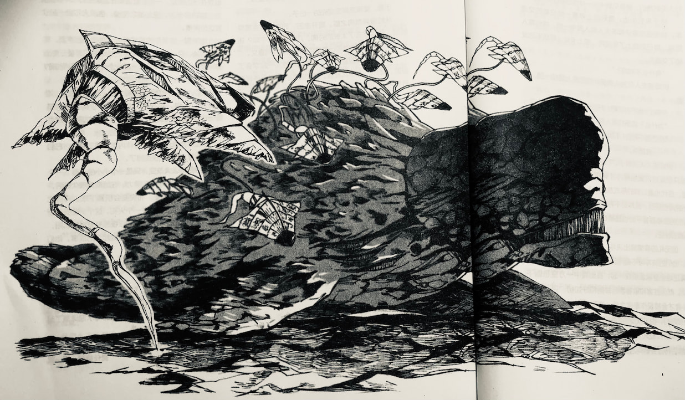

# 生化船猎手

[日］山本弘 著

刘斯万 译

蔡定一 图

---

那家伙出现在“猛扭亭”的时候。行星克里蒙托的首都克里蒙托城正在步入暮色，欢乐的夜生活才刚刚开始。

我在吧台独饮，突然感觉到了背后空气的变化——宇宙飞行员们醉醺醺的合唱声，女人们尖利的碰杯声，玩纸牌年轻人的呼喝声，还有各个桌子上悉悉索索的交谈声……都没了，就像有谁拔掉了插头，平时喧闹的酒吧里，此刻寂静像水波一样传播开来。

只剩下有线广播里弹奏不息的爵士乐。而面前的酒保正僵硬地摇着调酒壶，面无表情地看着入口。我也回过头去。

酒吧的入口，站着一个伊姆洛夫族人。

就像一头直立的恐龙。但是和地球上的恐龙相比，他的手脚略长，体格看起来更灵巧。近两米高的躯体上，细细的鳞片闪耀着覆盖全身。他背部是鲜艳的蓝，腹部则是淡淡的粉红。长脖子附近的骨板上用皮带扣着一只精巧的电子仪器，除此之外，全身上下便没有其他的衣饰了。

这家伙转了转头，用三只眼——对宛如猫眼的虹色双眸，还有一只长在额头中央，具有红外视力的眼——瞥了瞥店内的人群，喉咙深处挤出咳痰一般的咕噜噜的声音。稍过片刻，头部那只电子仪器里便发出了合成音。

“你们当中有被称作＇悬崖飞降者＇的人类吗？”

“我就是。”

我高举起手。然后这家伙从楼上直地，用神似时装模特的，带点猫步意味的步子走了过来。从动作的节奏来看，他全身的动作十分协调。比身高还长的两条细尾在空中一颤一颤，保持着平衡。道路两侧的男人急忙闪到一边，让开路来。伊姆洛夫人的气味比他本人来得更快，一股鱼臭扑面而来。

这家伙开始用两手在我面前比划，用的是银河共通语。

*找到你了／悬崖飞降者／＇冬之叹息者＇／告诉我／你的名字／我们／希望得到／你的帮助。*

我也用手语回复他。*怎么帮？*

*想见见你／请到／我们的／船上。*

*船／?／生化船／?*

这真是个愚蠢的问题。伊姆洛夫族根本不会坐生化船以外的东西。

*没错／想谈谈／要花些／时间／来吧／到船上／港口。*

*明白了／走吧。*

我把钱付给了酒保，便和伊姆洛夫人一起穿过依旧沉默的酒吧走向了外面。最初的震撼散去后，一种混乱的紧张气氛在酒吧醉汉之间弥漫开来。我们得在不好的事情发生之前，趁别人还没发难赶快离去。

可惜，稍微晚了一点。

“站住！混蛋蜥蜴！”

一位金发飘舞，穿着露肩大红色长裙的女郎，站起来挡住了我们的去路。伊姆洛夫人喉咙里再次开始咕噜噜地响起，翻译机得到指令，开始工作起来。

伊姆洛夫人从咽喉里憋出一句话，“你有什么事吗？”

“你这没脑子的！杀人犯！休想就这样溜走！”

“喂，别这样，奈娅……”

旁边站着一名样貌软弱的男子伸手去拉她的袖口，却被一挥甩开。看样子这女人醉得不轻。

“把我的里卡尔多还来！四周前，他在定期航线上被你们的生化船袭击，已经死了！我知道你们这些皱巴巴的家伙都干了什么！想蒙骗大家？想逃走?休想！你把他还给我！”

“我不明白你的意思。”

伊姆洛夫人这样说道。

“是翻译机的问题吗？你好像在说想要让我把死者复活之类的事?”

理所当然的，翻译机不能翻译出这种带有强烈感情的不完整句子，它只能传达基本的句意。伊姆洛夫人也没有用敬语的概念。不过对于酒后正在兴头上的女人来说，这种事情是完全理解不到的。

“你这满身鳞片的混账蜥蜴！吃自己的卵去吧！你的臭气，都把这家店的空气完全污染了！”

女人如珠似炮的言语被翻译机精确地意译着，但伊姆洛夫人无动于衷。对他们爬虫类来说，为了控制生育数量而吞食自己的卵是事实，这很自然，不带侮辱的意味。而气味的问题也是一样，像地球人这样讨厌自己的体臭和毛发的种族，反倒是屈指可数。

然而——

“你这个恶魔的走狗！”

当这句话脱口而出时，伊姆洛夫人的态度骤变。他张开大口，露出尖牙，发出宛如狮子一般的吼声，看起来像要一口将她咬碎。女人惊恐地往后退去。

“这是侮辱！我们绝不是虚构之物的奴仆！你！跟我决斗！”

女人的表情一瞬间发青了。

“决……决斗？”

“没错。要决斗吗？”

“不……不要啊！”

“那就把头给我低下！”

“不！！”

听到了这答话，伊姆洛夫人扑上前去，一把将女人推倒在地，将脚仪式性地踏在女人的头上，发出噗的一声。店中的人群开始蠢蠢欲动。

我一把抓过伊姆洛夫人的手腕，拖着他离开了那个惊愕之中的女人，飞快向着店外跑去。

---

“跑！快跑！那些人要追上来了！”

我和伊姆洛夫人并肩在小巷里高喊着狂奔。路上行人见到我们，都像见到卡车一样惊恐地让向两旁。

终于来到街边，看到路上停着一排空着的交通车，我便强拖着伊姆洛夫人跳入其中一辆，将他塞入后座，自己则跳上了驾驶席，插上卡片，然后手动发动了交通车。

“有什么不对吗？”

伊姆洛夫人在为人类设计的后座上屈成一团，问道。

“不对？太不对了吧！打女人罪无可赦。”

“为什么？这跟打男人有什么区别?”

“总之是不对的！打女人是不行的！”

“……真复杂。”

伊姆洛夫人沉默了。他们虽然也有性别之分，但那只在短短的繁殖期内才有意义。他们的妊娠期很短，后代也是以卵的形式放在一起孵化，没有区分男女的角色担当，当然更不存在男女有别的思想。甚至他们的生殖器官平时也是藏在体内，几乎无法从体表观察到性征。

因无礼的事情提出决斗，对他们来说也是家常便饭。他们的决斗可不是甩尾巴斗力气什么的，而是双方真正地全身紧紧绞在一起，直到其中一方窒息倒下为止。然而胜者和败者事后却能和好如初，只有拒绝决斗者才会被视作卑劣之徒，遭到轻蔑。拒绝决斗者即便被殴打，也无权反击和抱怨。

出发后我载入了程序，将交通车切换到了自动模式。然后转过去朝向后座的伊姆洛夫人，用银河共通语询问他。

*你／是男人／吗?*

伊姆洛夫人右手轻轻握了一下。*是的。*

*名字／是?*

*＇遥远的蓝＇／我／改编诗《瑞莱特德·莱姆》／中的／主角。*

*瑞莱特德·莱姆／我／乘坐的／船的／名字／吗?你来这里／目的／是?*

#调查／出乱子的／原因／追查／不属于／我们的／生化船／来历。*

*选上／我／理由／是?*

*听说／你有／很广的／正确的／情报／是事实／吗?*

我下意识地点了点头，但考虑到他们对这个信号的不同理解，赶紧改用右手做手势。

*没错。*

*为此／需要／看清／事实的／传播者／从而／传达／真相／给／朋友／他们／不相信／我们／所说。*

*其他／传播者／不行／吗?*

*不行／生化船／G力／问题／你／飞船／经验／特别／多／可以／忍耐／大的／G力／环境也是／问题。*

*我／乘上去／没有／伤害／吗?*

*我们／做过／准备／照料／你们／肉体／尽可能／舒适／能忍受吗／有害吗／取决／你的／精神／能力。*

我得考虑一下。这事关重大。能乘坐伊姆洛夫活体宇宙船的地球人，一只手就数得过来，而且所有人事后都抱怨体验糟糕透顶。就刚才所说的工作内容来看，这回的旅程大概相当漫长。就算是我，也未必忍受得住。

然而，对于一直以来都热切期待能了解伊姆洛夫人生活的记者而言——我正好是其中之一，这机会千载难逢，顺利的话，还有机会弄清近来的海盗事件之谜。

在克里蒙托星附近的区域里，最近一年来，已经有九只地球飞船遭到了不明身份的生化船团的攻击。对方暴虐无常。死者和失踪者已经超过一百人，损失金额更是无从计算。

为此克里蒙托的宇宙军和监察员（恒星际第一级特殊犯罪条约机构）发布了悬赏令，下令追缉海盗船，却没有得到任何结果。就算在接到求救信号的第一时间赶过去，也只能看着高G速度的生化船扬长而去，只留下一堆被激光切裂的宇宙船残骸，在真空之中凄惨地漂浮着。

伊姆洛夫族表明“这绝非我们所为”，但抱怀疑态度的地球人占多数。这广阔的银河系中，拥有生化船技术，并且能操纵它们的种族，至今为止也只知道伊姆洛夫人这一群。

小道消息里怀疑的声音更是此起彼伏。也许这只是一小部分伊姆洛夫人的海盗行为，他们没有告知同族。但这也可能是全员的共谋，为的就是想要把人类从现今的地位上拉下来……

想起来，人类最初接触到的那个地球外智慧生命体，其形象也只会让人悲哀地联想到蛇。从“理解对方不是恶魔”开始，再逐渐变得能够接纳，花了很长很长的一段时间。接下来，与形形色色的外星人接触之后，“神依照自己的形象创造了人”这样的台词才终于被丢进了历史的故纸堆。人们逐渐将众多宗教融入自身，将原始教义进行修正，终于能够正面地看待几乎所有的外星人。然而，却还是有一部分宗教家始终坚持着古旧的信念，总提出“外星人真的有灵魂存在吗？”之类不切实际的言论。

想当然的，伊姆洛夫人嘲笑了地球人的如此不着边际。他们是完全的无神论者，不论何时何地，对伊姆洛夫人的传教都最终以失败告终。正因如此，部分因循守旧的人类也渐渐产生了对伊姆洛夫人的不信任。

任何时代都有煽风点火，刻意制造恶意与恐怖的蠢货。生化飞船掠夺案发生后，世间便出现了声称“我看见伊姆洛夫人吃小孩”的男人。（其实由于氨基酸构成的不同，他们吃的东西跟我们的根本不一样）还有声称“曾被伊姆洛夫人强奸”的女子。（那究竟要怎样的体位才行啊，真是难以想象！）形形色色的流言在人类社会中散布开来，就连媒体偶尔也会做出类似的报道。

尽管距离最初的接触已经过了两个世纪，人类却依然对爬虫类智慧生物抱有偏见。伊姆洛夫人的外貌和气味使得大半的地球人本能地感到恐惧。这种毫无根据的偏见根深蒂固，很难彻底去除。

伊姆洛夫族虽然声称自己是清白的，但因为没有证据，所以不信任者数量众多。我此刻明白了他们找我上船的用意——那就是希望用行动来证明自己的清白，并且要有地球人来亲自佐证。

*“了解，”*我回答道，*“我乘坐／你们的／船。”*

很快，通过交通车里的电话，我告诉了自己的老熟人——电视记者拉贝利·古里夏姆（伊姆洛夫人称他为“冬之叹息者”）——自己已经接受了这份工作委托。此外，我还拜托他将我留在旅馆里的采访器械送去即将抵达的港口。实际上，从“猛扭亭”出逃到现在，才不过十分钟的时间。

穿越夜晚的街道，交通车到达了港口。这并非宇宙港，而是海港。伊姆洛夫人喜欢将生化船停在真正的水面上。除非降落在不毛之地，否则他们是不会停在土或沙上的。

满天繁星的夜空下，海浪不断拍打着坚固的防波堤。生化船沐浴在光线中的灰色船体随波摇晃。

就水面以上的能见部分而言，它全长约六十米。与过去的航天飞机造型相似，机翼与机身没有明显的分界线，就是所谓的混合机翼型机体。其主翼的前端高高跃起，以优雅的曲线突出水面，而隐藏于水下的那部分还包括有机身两侧的两对水平翼，以及机身向后延展出的一根长尾——用以保持空气动力的平衡。除了两只主喷口与两只略小的辅喷口之外，其余的姿态制御喷口全都隐藏在表层之下。

居住区位于船头，由坚固的黑色半透明座舱罩所覆盖。这条停泊中的飞船座舱罩正开着一个直径约五米的，宛如贝壳一般的口子。对此，我的第一反应是，某些湿润的灰色内部组织露出来了。

即便路易吉.克拉尼地下有知，恐怕也无法设计出如此造型的宇宙船来。因为这已经不是工业制品了，而是一个完整的复杂生命体。

我们可以把它比作虾那样的外骨骼生物。外壳是由碳素纤维、耐热陶瓷和发泡混凝土组成的蜂窝式结构，经由数年的“脱皮”更新而成。心脏部分则由林特普林式反应炉和火箭喷口，混合着自生式的陶瓷长成。作为一种碳基生物，它可以在真空中生存，也能加速到15个G，甚至可以承受超空间航行的压力，完完全全地超越了常识。

在宇宙空间的飞行中，乘员排出的水和二氧化碳可以在它的体内分解循环，重新变成氧气和碳水化合物。船体受损的部分也会自我修复，不再需要什么复杂的保养。

根据伊姆洛夫族的传说，这种生物在遥远的过去坠落于他们故乡的行星之海。伊姆洛夫的祖先们经过长期的驯养，成功地让它们进行了繁殖。之后，与生化船形成了共生关系的他们，离开了母星的大地，变成了没有固定居住地的银河吉普赛人。

理所当然，像生化船这样的生物不太可能由自然进化而来。据推断这大约是伊姆洛夫母星古代文明所遗留下来的，高度进步的生命工程学产物。但这也仅仅限于推论，真正的起源依然成谜，因为伊姆洛夫人在数十万年间之中从来没有揭露过自己母星的位置。

地球的科学家们曾经花了很大的努力，企图要解开生化船的秘密。有学者得到伊姆洛夫人的许可，在生化船的内壁采取了“血样”进行分析，发现其中有着无数的微型机械——有着红酒开瓶器一般的螺旋推进装置的，全长数微米的机械。它们代替红血球和白血球在体内循环，对整个机体进行着维护和保养工作。很明显，创造生化船的超科技已经超越了生命与机械之间的鸿沟。

可惜人类的科学家们拿这道鸿沟毫无办法。遗传学的分析显示，生化船异化的组织之中，并没有DNA一类的东西。这些生化船会繁殖和生长，虽然按照理论来说，它们的遗传信息必定会以某种形态储存在体内……恐怕，伊姆洛夫人当初允许采集体液的时候，就已经知道人类分析不出任何结果了。

进一步解剖生化船用以研究的要求遭到了伊姆洛夫人的拒绝。对他们来说，生化船既是家园，也是载具，同时还是非常亲近的友人。再说生化船的成长格外缓慢，要养育到能让伊姆洛夫人居住的尺寸，需要经历地球时间的数百年之久。与低下的繁殖力相反，生化船寿命又极长，自然死亡率极其低下。所以，人类科学家们伸长了脖子等啊等，却始终没有得到解剖其尸体的机会。

---

此刻，就在我的眼前，数名伊姆洛夫人正沿着生化船的机翼上上下下，时而潜入海中，时而忙碌地四处奔波。大约是在修整大气摩擦时所产生的损伤吧。防波堤上已经有数十名闲人在翘首望向这边。考虑到先前在酒吧引起的骚动可能扩大，我实在没有把握他们到底在想些什么。

等了约三十分钟，“冬之叹息者”古里夏姆带着他的一队人马开车抵达了港口。看样子我的行李和采访器材都已经装在带来的两个行李箱里了。

“听说刚刚他们突然打了女人，是吗？”

刚打了个照面，格里夏姆便轻快地这样说道。我稍感惊讶，电话里我应该并没有跟他提到酒吧发生的事情……真是一如既往的顺风耳。

“并不是'突然'。而是那女人自己说错了话招惹了别人。”

“哦哦，明白了。反正总是神啊恶魔啊之类的话题吧？”古里夏姆发出一声略带讽刺的叹息，这正是他外号的由来。“唉……真是一群麻烦的家伙。外星人和人类之间的伦理鸿沟十万八千里，为什么大家总是无法理解呢？”

“明天的新闻会不会闹大啊？”

“怎么会呢？只是酒吧里打了场架罢了。要是件件事情都变成新闻，只会让人觉得多余和烦躁。”

“但如果媒体不做出正面的报道，岂不是在助长无责任的流言诞生吗？”

“报道是会报道。不过比起媒体的口实大众反而更喜欢市井流言——先别说这个，你这次的行程可要好好地睁大眼睛，获得足够的证据，这才是解决骚乱的根本方法。”

“希望如此。”

我耸耸肩。此时，从大街的方向传来了渐渐接近的警笛声。

“你最好抓紧时间。”格里夏姆轻声催道。

“看来是的。”

我转身向着栈桥末端停泊的生化船走去。伊姆洛夫人从格里夏姆的部下手里接过器材，开始向船上搬运。我向领导着这群人的“遥远的蓝”发出了手语。

*马上／出发／可以／吗?*

*可以。*

“看来能出发了——我走了，期待我的工作成果吧，冬之叹息者。”

“加油干，悬崖飞降者。”

古里夏姆激励的话从背后传来，我向着长长的栈桥跑去。一边奔跑，我一边向遥远的蓝发出信号。

*快／赶紧出发／麻烦／来了。*

遥远的蓝向着伙伴发出一声叫声，他们抓起古里夏姆部下们余下的皮箱，一个接一个飞奔着跳进船内。

我从那群看客中挤了过去，奔向栈桥的末端，然后起跳，落在了生化船突出的船头部分。湿润的表面光滑无比，我好不容易才保持住了平衡。

回过头去看，古里夏姆站在岸边朝我们挥着手，我也向他挥手过去。而就在此时，仓库群的拐角处闪现了红色的灯光，数台巡逻车出现在了视野中。

这一瞬间，某人从背后揽住我的肩膀，将我强行拖进了船内。眼前的座舱罩突然关闭，变得一片漆黑。脚下滑溜溜的，四处散发着垃圾一般强烈的恶臭。接下来又是一个措手不及，那人将我粗暴地丢在一堆橡胶软管似的柔软的网上，我被牢牢固定在上面。这大概就是伊姆洛夫人用的抗G力坐席了吧。

眼睛终于习惯了黑暗之后，我辨认出这是一间极宽敞的屋子。中心有一个巨大的球体，从球体延伸出许多的网，呈放射状连接到房间的各个角落，就像各自居住的吊床一般，伊姆洛夫人还将它们装饰成了自己喜欢的样子。

天花板是半透明的座舱罩，能透过它看到外面的样子。此时生化船已经离开了栈桥，正缓缓移动着蓄积能量。

突然间，野兽咆哮般的恐怖声音撼动了整个船体。那是生化船的主引擎从沉睡中苏醒过来了。

我的身体不由自主地被向后紧紧压住。大约开始加速了吧，我想，不过马上意识到了自己的错误。座舱罩外面的景色横倒了过来。原来是生化船的喷口正在工作，将船头抬了起来，现在与水面呈直角状态。

然后，随着咆哮声的逐渐高扬，真正的加速瞬间袭来。生化船向着头顶的星空直线上升。

很久以后，我才从古里夏姆所拍的录像中看到了这一切。生化船离开水面垂直冲上夜空中的那一瞬间，激起了非常壮观的水柱，之后巨大的水流冲击着海岸，将古里夏姆和他的部下，围观群众，以及从巡逻车上下来的警官们都统统淋了个透。这段视频在隔日的早间新闻里被播报出来，引起了不小的反响。

当然了，在上升中的生化船里，我对这一切毫无所知——真是惭愧，在这巨大的G力作用下，我一时间失去了知觉。

---

生化船在数分钟内便超过了克里蒙托星的脱离速度。我好不容易缓过气来的时候，飞船已经摆脱了恒星彭奈碧尔的引力，从黄道面离开了。

伊姆洛夫人尚且有余力可以操纵生化船。理所当然的，生化船里面没有机器面板或者键盘之类的东西。取而代之的是舰桥中央那个巨大的球形神经节，从那里伸展出来的网状物，既是抗G力的坐席，同时也是操纵装置。

伊姆洛夫人正把网不时朝不同方向扯动，通过对神经的刺激，向生化船发出指令。另一方面，生化船的“身体状况”能通过船的轻微震动，生化组织的散热量，以及空气中气味的微妙变化而被感知。伊姆洛夫人不需要计算器也不需要电脑，更不必经由什么复杂的轨道计算，就能完全操纵飞船。

如此惊人的技术并不是什么奇迹或超能力，而是伊姆洛夫族在漫长悠久的岁月中习得的经验。从人类还没学会用火的时代开始，伊姆洛夫人便已经在宇宙中飞行了。他们的小孩子从卵中诞生之后，直接从长辈那里学习操纵生化船的知识和技术。如此薪火相传。

银河系中有个七干万年来一直持续着观察行为的华彻尔族[^1]，他们喜欢结合众多已知智慧生命体的种族特征，给予他们相应的绰号。譬如“统治者”瓦尔福尔族，“偏执狂”莉莉族，“交易者”BMB族，“扮演家”阿米提亚族，“活跃剂”缇岚族，都是非常合适的外号。

在这之中，伊姆洛夫族的外号翻译过来说是“PILOT”。非常偶然的，这个名字在英文中有着两重的意思——飞机的操纵者，还有引水员。

伊姆洛夫人组成了几个船队作为居留地，不断在银河系之中巡游。现在在地球周边区域活动的大船队，就是大约由两百艘生化船形成的，中等规模的船团。

据说银河系内适合碳基生物生存的行星有几亿个。伊姆洛夫族通过不断的巡游探险，将这些行星一一记录在案。一个大船队绕行银河一周需要花费数万年时间，经历一周的游历再回到之前去过的行星时，先前的数据便早已过时，此时他们就会再次展开调查和探险。这是没有终点的流浪之旅。

然而，就算找到了再多适居的行星，伊姆洛夫人也没有选择固定的居住地点。相反，他们将这些数据贩卖给了其他种族——譬如地球人这样的，尚且在版图扩大时期的年轻种族。这种率先开拓适居行星的行为，简直就像是银河系的引水人一样。

通过贩卖情报，伊姆洛夫族获得了生活所需的其他机械。除了生化船之外，他们没有别的高度科学技术，因此必须向其他种族购买工业制品。而地球人的工业技术非常发达，并且总是贪婪地寻求着可居住行星的情报，所以对彼此而言，对方都是最为合适的顾客。

当然，如果将所有数据都一股脑儿卖了，无异于断了自己的后路，因此他们十分谨慎地保护着自己的情报。这种类似家族团结一样的秘密主义，在人类看来非常的迂腐，但也无可奈何。

不管怎样，他们并不需要数量太多的机械。生化船的内部拥有不完整的内循环生态系，虽然不能长久持续，但粮食和水的供应并不必担心。并且伊姆洛夫族天生有着对环境的高度适应性，所以在他们之中不存在疾病之类的问题。

以这艘生化船“瑞莱特德.莱姆”号上存放的机械为例，就只有翻译机，雷达，通信机，发电机，还有他们专用的奇特形状的宇航服和紧急时用的小型气密型救生艇而已，还都是能省则省的那种。毕竟机舱内墙全都覆盖着宛如抽象画一般复杂的生物组织，它们和冷冰冰的机械放在一起，的确没有协调感。

究竟伊姆洛夫族比起人类来是更原始呢，还是更先进？科学家和人文学家之间有着不同的见解。伊姆洛夫人甚至还没有办法制造初级的真空管，就文明的科技程度计算，的确是比人类落后了许多许多。然而，地球人认定的“进步”尺度对外星人来说适用与否呢？

曾经有过保守派的作家宣称“伊姆洛夫族毫无疑问是生化船身上的寄生虫。对他们进行IQ测试的结果表明，他们比人类更加劣等。”然而这终究是愚蠢的意见。IQ测试的试题，即便在人类的不同种族、文化背景之间，也必须根据其平均值来调整尺度，更不用说针对完全不同的外星种族了。我想，毫无疑问的，这位作家才是应该接受IQ测试的一方。

也曾经有历史学家宣称“伊姆洛夫的文明已经到达顶点并停滞不前了，之后等待他们的只有衰败和灭亡”。还有众多类似的意见。然而，一个等待灭亡的种族，又何以继续延续了数十万年？

无论如何，伊姆洛夫族的文化和历史，站在地球的角度是不能评价和分析的。虽然听起来就像悖论，但我们要明白“我们无法理解外星人的想法”这个道理，才能走出理解他们的第一步。

---

距离进入超空间式驱动还有一点点时间。我开始采访遥远的蓝，想打探一些详细的消息。

“对于海盗船的真实身份有什么看法吗？”

对于我的询问，遥远的蓝这样回答道：

“那不是我们的东西。”

“那么，到底是谁在操作呢？除了你们以外，还有其他操纵生化船的种族吗？”

“我想有可能是野生的生化船。”

我吃了一惊，不确定是不是翻译机的误译，赶紧用银河系通用手语再次询问。

*野生／?／没有／操纵者／?*

*是的／我们的／祖先／捕捉了／野生的／生化船／饲养／变成朋友／在此之前／有很多／没有／操纵者的／生化船／。*

*有可能／还／存在于／宇宙／某个角落／?／你们的／祖先／曾碰见的／那种／?*

*有些／模糊的／谣言／古老的／传说／从没／目击过／肯定极其／稀有。*

*智慧／呢?*

*我们的／生化船／很聪明／野生的／生化船／恐怕也／很聪明。*

*危险／吗?*

*不知道／没有／战斗／实例／如果／发生过／战斗／祖先／应该／留下／记录／警告。*

我低声自言自语。的确，这个假说很有意思，不会很突兀，也不是很疯狂。如果存在并非由伊姆洛夫族所饲养的野生生化船，它们会出于什么理由来袭击人类的船只呢？单纯提出一个假说，无法说服疑心深重的人们。果然需要更多的证据。

---

他们的计划非常单纯，就是在海盗船出没的区域巡逻。尾随有可能被袭击的货船，然后等待海盗船的出现，再尾随它查出真相。

虽然已经抱有长期航海的觉悟，但只经过几小时之后，我便发现自己错了，对这艘船的厌恶感已然产生。

首先是之前说到的气味儿。船内的某处，散发着类似垃圾处理厂一般的恶臭。这是伊姆洛夫人的体臭和生化船的内脏器官散发的气味混合在一起的结果。船内气温和湿度都很高，但气压却较低，让人非常不舒服。

而且船内始终都昏昏暗暗。这并不是说漆黑一片——有透过半透明座舱罩射进的恒星光辉，还有通道和房间的墙壁上散发出的青白色诡异生物光——但亮度始终不足。伊姆洛夫族拥有红外视力，黑暗对他们的行动根本无碍——大约创造生化船的种族也一样吧，但却苦了我。虽然可以拿着一只小手电筒行走，但我却不喜欢在舰桥内使用它。因为座舱罩会反射手电的光，让我很难看清生化船外面的状况。

在饮食方面，他们为我储藏了几个月分量的地球食物。至于他们自己的能量来源，则是船内壁上分泌出的像蜜一样的液体（伊姆洛夫人舔食这些东西），这些旋光异构体组成的氨基酸散发着一种异样的甜味，地球人无法消化。

为了以防万一，我检查了为我储藏的食物。有干馏的烧菜，各种罐头，真空蔬菜，饼干，速溶咖啡等，都是些正常的食物，这让我稍微安了点心。伊姆洛夫人同样有味觉，不过并不很在意食物的口味。大概他们得到了某个地球人的建议吧——只不过，巧克力板竟然有十罗[^2]，估计是哪里弄错了。

从克里蒙托出发八小时之后，“里拉提德·莱姆”号进入了超速航行。

---

从那之后起的六周内，我一直和伊姆洛夫人生活在一起。

对于他们来说，这事关能否洗清整个种族的嫌疑，但是伊姆洛夫人总是不焦不躁。他们的哲学是“评价一件工作，最重要的是看能否顺利完成，和完成的速度无关”。即使有快速解决问题的手段，只要知道这种手段达成的效果不够完美，他们也不会选择。反过来说，为了得到一个期待中的好结果，花上数十年时间也不可惜。这看起来就像是他们种族的信条。没有这样的态度，想来也是不可能驯养生化船的。

不过对我来说，这就成了非常头痛的问题——期限一天天接近，而写下的文章和记录却还少得可怜。

生化船在海盗出没的航线上已经往返了数次。船内没有昼夜之分，伊姆洛夫人可以随时在想吃的时候吃，想睡的时候睡。与他们在一起生活，弄得我的时间观念也变得淡薄起来。因为没有腕表，我完全不知道离出发已经过了多长时间。

虽然我永远不希望自己像伊姆洛夫族一样，在这种巨大的生物体内度过一生，但是一开始产生的那种强烈不适应感，也总算是渐渐地克服了。特别是气味的问题，我受尽折磨的鼻子终于慢慢地适应了它，不再反胃。

话虽如此，还是有很多不便之处，譬如说排泄的问题。从房间侧面的墙上，有彩虹状的带阀门的管状突出物，但在使用的时候……算了，说出来实在是太丢人了。“伊姆洛夫人没有隐私的概念”——这样写就够了。

伊姆洛夫人也没有泡澡的习惯，只会偶尔简单地用水冲冲身体。几个人一起进入像胃袋一样的小房间，然后淋水便是。水是从燃料冷却槽之中过滤出来的，使用后还会重新循环回去。我也常常跟着一起进去洗，被他们用尾巴帮忙搓背，也算是非常有趣的体验。然而这澡堂只有在加速行进时才能使用，再加上生化船过滤能力有限，所以没有办法每天洗澡；话虽如此，没弄得浑身污垢也算是值得庆幸。

拥有强韧肉体的伊姆洛夫人，能够平静地耐受10G以上的加速度。不过因为有我同乘，所以他们没有进行惯常的、能要人命的加速（除了最初发射那次以外），而是把档位限制在了无重力的惯性航行与3G的加速度之间，所以我总算承受下来了。除此之外，只有在林特普林引擎需要补水，飞船降落在行星的海洋上时，我才勉强能感受到重力的束缚。

林特普林引擎，正如其名，是根据二十世纪物理学家费曼极力主张的再解释原理作为基础而制造的。[^3]林特普林反应堆通过PCT反转场将投入其中的粒子进行手套翻面一样的镜像反转，再利用反粒子的电荷在时间回溯时释放出的相当于两倍质量乘以光速平方的巨大能量进行推进。

所以咯，任何物质都能够作为燃料，但包含人类在内的碳基生命体大多数都会选择使用水，这种物质在宇宙中极其丰富，取之不尽。最近也出现了使用高浓度氯化钠溶液作为燃料的引擎。

生化船的创造者想必也考虑过同样的事情。生化船的腹部有腮状的取水口，在水中停泊时可以打开补给海水。虽然在气体行星的光环内也能通过冰块补水，但液体的水总归更加方便快捷。

海盗船肯定也会在什么地方补水，然而，在标准的生化船的航行距离——三十光年的半径之内，海洋行星只有五个，并且都已被监察者彻底调查，排除了生化船降临过的可能。可要是想对有光环的气体行星也做同样的排查，就成了不可能的任务，因为它们密密麻麻有四百个之多。就结论而言，老办法才是好办法，追踪海盗船才是最合适的解决之道。

---

和伊姆洛夫人共同度过了一段日子后，我才慢慢发现他们并非我想象中那样封闭和难以取悦。他们也拥有丰富的感情，是高等的智慧生物。

举例说，多数地球人听见他们吃掉自己卵的习惯都会皱起眉毛。但这对伊姆洛夫人而言却是一种母性本能。“瑞莱特德.莱姆”号中，数年来只新加了两个年轻的幼体，他们和族群其他成员之间相亲相爱，却并不太清楚谁才是真正的血亲，这也无关紧要，因为对孩子们来说，整个船队的成员都是他们的父母。

另一方面，除了极端兴奋的状态（譬如之前酒吧的事件）之外，伊姆洛夫人也是有表情的，只不过地球人很难辨认罢了，所以才会有伊姆洛夫人“平时木讷，却会暴起伤人”的错误认识。

与外星人的沟通总是令人困扰。过去的科幻作家们，总是无责任地想象外星人与地球人姿态相近，还喋喋不休地说着地球语言。实际上呢，他们的外形五花八门，发声器官的构造也大不相同。还有不采用声音而是光线或电波进行对话的。实际上很多种族根本无法发出地球语言的元音和辅音（除了BMB和阿米提亚族以外），而我们的喉咙也同样无法模拟出他们的声音。

“伊姆洛夫”这个称呼，不过是人类在听到他们的自称时，记录下的人耳可辨的声音，再用拟声词的方式写下来罢了。也有人会把它听做“威姆洛克”、“比波洛”或者“伊——喔呜”。

所以，翻译机在沟通中必不可少，但它总存在着各种各样的误差，对话也有延迟，俗语更是翻得不知所云。这种情况下，银河通用语就显得精确又方便了。银河系居住的已知的智慧生命体，都有着三根以上的手指（或类似的器官），以及两只以上的手臂（或类似的器官）。这门语言语法简单，学会八百个基本词汇后，与多数的种族间的交流便没有障碍了。

只不过，手语毕竟词汇量太少，且只能限定使用简单的日常会话，故而在面对复杂的情况时，翻译机仍然不可或缺。在和伊姆洛夫人打交道的时候，手语和翻译机就需要视情况不断切换。最初缺乏经验，我们彼此表达的意思总是含糊不清，后来随着时间的流逝也渐渐地变得流畅起来了。

给人印象最深刻的那名船员，叫做“狂热撞击者”。与之交谈之后，我发现她是一名雌性，繁殖期与“遥远的蓝”一致。她是这艘船的大副，非常聪明。

“为什么你们会如此憎恶神灵呢？”

我这样问她，而她的回答是：

“我们不是憎恶神灵。而是憎恶宗教本身。”

她的话若细细解读，我想应该是说“崇拜神（或魔）”这种行为，是一种对自由意志的否定，是对智慧生命的侮辱。他们对于自己辨别善恶的判断力感到非常自豪，而毫不思考便附和别人的判断在他们眼中则是软弱无知的表现。

“那么你们又为何会信神呢？”

“很奇怪吗？”我反问道。

“很奇怪。不可思议。我们见过许许多多的种族，的确，他们中的不少在历史早期，因为还不具备完善的宇宙知识，常常会假想出某个有意志的宇宙创造者来。但到了科技发达甚至能够将超光速航行法实用化的阶段，各个种族一般都会抛弃这一假设。”

“信与不信都是自由不是吗？就算信神也不会再有什么危害了，宗教独裁的时代早已作古。”

“说的也是。不过，依旧有一种不平衡感。你们的意识，感觉跟不上这样异常的进步速度。”

“人类的发展很奇怪吗？”

“是的。我从没见过像这样科技快速发展的种族。举个例子吧，从超高速航行理论的发明，到正式移民到其他行星，大部分的种族都要花个三十二代以上（伊姆洛夫采用的是八进制）的光阴；但你们仅仅用了几代人就完成了。现今，你们仍然在以等同于光的速度扩张居住地（一年能有一光年的拓展范围的意思），实在是非常惊人。”

“但我想这很值得骄傲。就我们而言，你们的文明反倒停滞不前，有衰亡的征兆……”

“我们的文明并没有停滞。祖先得到生化船的时候，仅仅只能用作运输机和食物供给源，但后代一步步发展了船的机能。在我们看来，人类的不安定性非常明显，总处在剧烈变动之中，当然这不是说华彻尔族那样彻底的安定性就是好事。你们应该选择安定地变动。四处迁徙，接受新的刺激，保持稳定的改变。我们和华彻尔族一样拥有无限的记忆力，但我们并不希望永生。因为没有死亡，就没有给予新生命的空间。不破不立。”

“我明白了，但我想请教一下，剧烈变动的结果会如何？”

“进步快，灭亡亦快。人类行事不计后果。普通的种族，会在走出下一步之前做出预测和考虑。但你们不加思量就踏出了下一步，这也是你们进步神速的原因。”

“但是现在看起来不是做得挺好吗？虽然说，战争啊，环境污染之类的问题的确很严重，但那也是每个种族都曾有过的问题吧！”

“现在看起来尚属正常。但总有一天，你们的居住范围会与其他种族的居住圈相重叠，那时问题就有可能发生。”

“那么，为什么当初又会不断告诉我们可居住行星的信息？这不是在帮助我们做扩张吗?”

“我们仅仅是给予数据，是否利用这些数据则取决于你们自己。你们需要自己判断善恶。”

---

出发后第三十九天，正在图阿尔恒星系之中航行的我们，突然接收到了货船“阿丽尔休拉”号发出的遭袭求救信号。

安置在舰桥的地球制通信机中传来的，是混入恐怖与绝望的嘶吼，这声音在恒星的背景噪音里渐渐消失。从信号的功率来看，发信源距离我们至少有两光时。也就是说，从杀戮开始到现在，已经经过两个小时了。

但我们不能直接前去救援。首要任务是发现海盗船的真面目。

随着轰鸣声，“瑞莱特德.莱姆”号切换为超光速式推进。在恒星系的黄道面内进行超光速飞行，由于星际物质阻碍，常常会对船身造成严重破坏，但我们没办法。要是采用常规加速，等到了目的地，时间早已过去了几天。

*优先／救助／同伴／吗?*

遥远的蓝问道。我知道这个问题的意义，若要调查和救助“阿丽尔休拉”上的幸存者，“瑞莱特德.莱姆”号就需要变轨，然后做出额外的加减速，消耗更多的时间。在这期间，海盗船十有八九会溜之大吉。

*忽略／吧！*

我只能这样回答。按照推理，袭击过去了两个多小时，就算当时有幸存者，现在也应该统统罹难了。海盗船首先用激光将猎物的引擎破坏，调整轨道接近后，再把无法抵抗的飞船横切成数块。一小时左右，飞船便会被破坏得看不出原型了。货物和碎片就像宇宙尘埃一样，沿着轨道散布开来。被抢夺的东西——如果真的有被抢夺——究竟是什么？到现在也没有人知道。

说起来，若犯人是野生的生化船，那么他们袭击宇宙船的目的又到底是什么？它们一不要食物，二不求金钱。

我脑海里浮现出种种不愉快的联想。那些古老的科幻小说里常常有描写外星杀戮机器的故事，它们自我进化，自我复制，即使在主人灭亡之后，依然遵照着原命令，持续进行无差别的破坏……

这难道只是没有根据的空想吗？那些生化船船头的激光炮，不也佐证了它们的创造者们同样喋血暴力吗？

距离发信源只有几光秒的距离时（伊姆洛夫人不会用数字来表示距离、时间之类的概念），“瑞莱特德·莱姆”号脱离了超光速航行，如果继续保持原速的话，会太过于接近事发地，容易撞上四散的碎片，遭到致命的冲击。

在星空的背景中，三个光点正在移动。毫无疑问是宇宙飞船的喷射火焰。

“那是年轻的生化船的火焰！”

遥远的蓝这样说道。他们甚至可以通过焰色反应来区分飞船的种类。

我只能透过座舱罩用望远镜头拍摄照片。相机附属的电脑内核正在对画面进行解析计算，通过火焰光谱内的氢元素吸收线的多普勒位移来判断对方的速度。

“要逃走了！”

“我知道。我们必须迂回躲开碎片，然后追到他们背后，进入等离子区的圆锥之中，就能记住它的味道了。”

我点点头。“记住它的味道”不是一个翻译错误，的确代表了它应有的意思。生化船的感应器能够检测出其他飞船航迹上遗留的等离子，并且加以追踪。那些飞船哪怕是进入超光速式飞行，短时间内也可以通过快子进行逆时追踪。这科技还真让人类望洋兴叹。

“瑞莱特德.莱姆”号开始了高G加速。我的身体又深陷进网中，无法动弹也无法说话。虽然测量器上没显示，但加速度大约高达10G。视野开始变得狭窄，哪怕只盯着正前方看也非常吃力。

这种拷打似的折磨似乎持续了几个小时，虽然之后看时间发现才过了20分钟。

“瑞莱特德·莱姆”号正在逐渐接近逃走的海盗船的正后方。传感器的机能已经开到了最大，为了保证它的正常工作，我们总算是降低了加速度。我终于又能看清楚东西了，不禁松了一口气。

但前方的三个光点，在光斑突然闪耀之后，就消逝无痕了。看来它们进入了超光速飞行。

“闻到了。”

遥远的蓝告诉我。他们到底怎么知道的，我也没有力气再多问。

“追上去。”

没有再给我一点喘息的空间，“瑞莱特德.莱姆”号也进入了超光速飞行。

---

几天后，辛辛苦苦追踪着对方的我们，终于到达了某个恒星系。

那个时候，我还不清楚这颗恒星的名字。在返回后，拜托了精通天文学的朋友，仔细分析了拍摄的视频，才终于根据星座的形状大致推算出了它的位置，最后又根据恒星的色温进行特别圈定。

但我至今不能说明这恒星究竟是哪颗。图阿尔恒星系附近半径三十光年内有二百五十多个恒星系——至于为何不能说明，之后再解释。

我只有一个提示：这颗恒星和太阳一样有奥尔特云。距离这颗母恒星数万天文单位的距离，包围着数百亿颗彗星核。这样，恒星的列表上就只剩下三分之一的候选者了。

虽说彗星数以百亿计，但因为它们分布在数兆立方天文单位的范围中，所以密度非常稀疏。因此即便是开着宇宙船在其中飞行一百万年，也根本不用担心撞击的问题。此外，母恒星的热和光无法传到这里，所以这些由肮脏的雪和冰构成的直径数公里的彗星核，在2.7k的宇宙微波背景辐射温度下，显得昏暗、冰冷，肉眼几近不可见。

我们追踪着的三艘生化船，正在这些彗星云中飞行。我低头沉思。如果用激光将冰融化作为燃料，那么生化船是可以在彗星云区域生存的。然而，生化船的繁殖需要冰点以上的恒定温度。所以野生生化船若是栖息在彗星云中，是没有办法维持族群长存的。

一位名为“低语的风”的年轻雌性拍拍我的肩膀，指着前方。

*发现／光芒／奇怪的／星星。*

我定睛细看，那只是一颗很普通的星星而已，看不出来有何怪异之处。

“用红外线。”

我慌忙地将相机举起，切换进入红外线模式。从取景器的视野中看出去，那颗星散发出了雪白的光芒，就像被施了魔法。

那到底是什么天体？不可能是行星。在距离恒星数万天文单位的地方，不管反射率多高的天体，也不可能亮到这样的程度。那么是白矮星吗？或者看尺寸，也许是更小的中子星？

逐渐接近之后，我才看清了那团球状的气体云，它简直像个头巨大的气态行星。但据遥远的蓝说，它的引力非常小，不可能拥有恒星一般的质量。看来是彗核出于某种原因正在散发热量，形成了一层气衣。

先前的三艘生化船，突然进行逆喷射，掉头回来，吐出比恒星风更浓密的圆锥形离子喷流，将彗星表层的部分气体吹飞，形成了三根短短的尾巴。

然后它们突然冲进了彗星内部。

这一瞬间，这颗天体的光线逐渐接近了可视波长。最初只能看见侵蚀星空的一个漆黑的圆，眨眼间，其整体变成了浓厚的灰色，中心部位散发出隐约可见的青色光芒。那里一定有强热源。

三艘生化船放缓了速度，进入彗星。紧跟在正后方的伊姆洛夫飞船不得不采取回避姿势，绕过彗星作切线运动。如果直接逆喷射减速，则离子流扫向彗星之后，有可能会被对手“闻到气味”，给今后的航行带来危险。所以以切线运动绕过彗星，之后再以U型轨道绕回，才是最好的行动。

“瑞莱特德.莱姆”号将引擎切换到无声状态，以秒速数百公里的相对速度绕着彗星的气体外层飞行。借此机会，我也对着彗星中心的发光部分进行了一番仔细的观察。牛奶色的云层之下，冰晶凝结的核心游曳着青色的光芒，围绕周围的气体也因为散射现象和共鸣放射的作用，一同闪烁着光芒。我总算明白了这个热源的真面目。

彗星之中嵌入了一颗微型黑洞——不，如果以质量差来说，应该是彗星被微型黑洞捕捉到了才对。没有别的东西可以解释如此小体积的高热源。

虽然黑洞容易被人想象成为一种疯狂吞噬一切的天体，但实际上任何黑洞都有一个吸入物质的上限速度。当物体被吸入黑洞的时候，会放出强烈的伽马射线，制造出一种压力会阻碍后面的物体，不让它们高速下落。因此，黑洞达到一定光度之后便无法以更高的速度吞噬物质了，这个光度叫做黑洞的爱丁顿光度。

要达到爱丁顿光度所必须的物质吸入量与黑洞质量成正比的。草草计算了一下，质量一兆吨的黑洞（视界直径约三亿分之一毫米），其物质吸收量只有每秒三百克，一年也就仅仅一万吨左右。按照这个标准，一颗普通的彗星核要被吸收殆尽，至少要花上几千万年的时间。然而还要考虑到霍金效应，受压缩的氢将产生的核聚变，以及中微子将带走能量造成能量遗失等。再加其它种种因素，我想我这外行的计算结果大约存在着正负十倍的误差吧。

是的，这颗彗星是炽热的。核心内部恐怕是液态的水球。不须承受突入大气层时的外壳的疼痛，也不需要摆脱重力时所需要的巨大推力，这颗彗星是生化船繁殖所需的最佳环境。

从彗星的侧面掠过之后，“瑞莱特德.莱姆”号调转了优美的船头，开始逆向加速。我只得又一次承受数十分钟的痛苦。在此之后，“瑞莱特德，莱姆”号通过惯性飞行，摆出了突入彗星的姿势。

速度下降到了大约秒速五公里的样子。尽管在普通行星上，这速度已经异常凶猛，但在广漠的宇宙空间中，却宛如蜗牛爬行一般缓慢。数小时后，我们终于静静地突入了彗星。

---

在突入彗星的那一刻，我们宛如掉进了雪白色的牛奶海洋，抑或沉入了云海的底部。四面八方的云层将我们团团包裹。

彗星的表层与宇宙的真空相比并没有多大的差别。肉眼看去，数万公里厚的云墙，在突入时没有任何的抵抗。四周都是无垠的白色，只有背后有一点点隐约的星星在我们挖出的云层甬道中渐行渐远，这证明了生化船的确在不断深入。

接近中心部后，气体变得越来越浓。“瑞莱特德.莱姆”号的喷口也开始了工作，维持着船身直直的插向彗核。由于此时已经达到了地球电离层的大气浓度，所以空气阻力使飞船速度自然而然的降低了下来。

这是过程漫长难熬。后方的甬道已经闭合，任何方向看上去都是雾蒙蒙的一片，我们像被关在了一个巨大的穹顶之中。

不知几小时后，我从舰桥的地板上感受到了微弱的重力。气阻使得船体减速，而摩擦让船体生热。不过现在下降的速度比流星慢得多，没有起火之虞。

微型黑洞的重力也不会使人困扰。对于质量仅一兆吨的黑洞来说，只要离中心处一千米，人体就很难感受到那个重力。更别提被活吞了。

比起这些，野生生化船才是我们需要首先担心的。它们会用怎样的态度，来对待陌生来客呢……

距离彗核越来越近。“瑞莱特德.莱姆”号已经降到了普通飞机的速度。空气阻力骤减，船体也随之冷却。现在要再次调整船头的方向，为了能随时逃走而作准备。

下方终于出现了浮现青色光辉的彗星核。看起来它直径不过五千米。“瑞莱特德·莱姆”号为了不让那些生化船感知到自己，将喷口的火焰抑制得更加微弱。我们便在距离彗核数十千米的位置悬停了下来。

彗核近似球形，因为表面的溶解与再冻结，所以整体由透明和不透明的冰块交织而成，布满裂缝，很像一个哈密瓜。冰缝中有水蒸气喷涌而出，四面八方拉伸着水幕，在裂缝深处透出的蓝光照耀下，宛如极光般美丽动人。这些青蓝色光线，让人恍惚之间置身梦境。

伟大宇宙的神秘圣殿——除此之外我找不出别的形容词了。仅仅是微型黑洞与彗核相撞，并嵌入其中的概率，就小得简直无法想象。但在银河系之中真的发生了这样的事情。

话说回来，在彗核的方向，突然间又发生了惊人的事情，简直是难以置信。

刚开始，我以为只是颗黑色的岩石。和彗核的尺寸相比，可以确定它的全长在一千米以上。看起来这表面凹凸不平的巨物外形颇像抹香鲸。

在它的周围，有十几只生化船构成的群体。它们像飞虫一样围着它飞舞，向着岩石断断续续地发射着红色的激光。和真空中不同，这里并没有发生延德尔散射现象，整条激光光束都能用肉眼观察。不过因为靠近彗星核，周围弥漫着浓厚的气体，所以看起来朦朦胧胧。生化船发射着激光，像是跳华尔兹一般绕着岩石回旋。立体交叉的十几条光线，编织在一起，构成了摇篮一般的形状。

生化船们没有注意到“瑞莱特德·莱姆”号的接近。事实上，生化船的感觉器官对热、放射线还有离子都很敏锐，却没有良好的视力。在引擎关闭，不再发热的情况下，“瑞莱特德，莱姆”号可以说是进入了“假死状态”，对它们来说是透明的。所以我们才能得以安然观察它们的行为。

仔细看了看，我才发觉到光束并不仅仅是由生化船们发出的。岩石的侧面也有数道激光正在飞舞！它们偶尔射中各个生化船，每当这时，生化船便一圈圈地旋转着——简直像是欢欣雀跃的表现。

冷不防的，我突然明白了什么，然后全身战栗了起来——那个巨大的黑色物体并不是岩石！那是一只超大型的生化船。

它有着巨大的身体，翅膀却似乎已经退化，显然无法突入行星的大气层。喷管相对船身细小，看起来并不像拥有高机动的样子。船头的座舱罩也只能勉强辨认。取代这些的，是普通生化船只在船头才有的激光炮突起——这艘生化船的浑身上下都长满了这些突触物。

“那大概是雄性，”遥远的蓝说话了，“想成长到那样的尺寸，至少要经历我们的五百一十二代之久。”

“雄性的？”

“是的，而且在交尾中。”

“不可能吧！生化船，生化船应该是单性繁殖的啊……”

说出口之后我立刻噤声了。地球上同样有着既能有性生殖也能无性生殖的生物。譬如蚜虫。环境稳定的季节里，蚜虫都是单雌生殖的，但在严酷的环境下也会产生雄性进行有性生殖。生化船通过这种方式繁殖并不突兀。

显而易见，创造生化船的人们，的的确确是把它们打造成了一种终极的生物机械，甚至给予了它们进化的可能。亲子单性繁殖基因一成不变，无法调整自身，一旦遇到环境激变，很可能无法生存。所以有时候个体之间也必须通过交配来散播基因。

原来那激光炮竟然是生殖器！大约是通过数字的方式传播信号，也许在那激光之中有某种编织成全息图的设计蓝图，通过雄性和雌性之间激光的交错，在生殖细胞的内部创造出干涉纹，来改变遗传信息。整个生物全体组织的分子排列便是设计图——难怪地球科学家们无论如何调查它们的细胞，也无法找到DNA的信息！这就是原因！

那些神秘的光柱依然在持续翻飞。雌性生化船们正围绕着雄性翩翩起舞。我操作着相机，眼眶也不知不觉变得湿润——生命的奇迹正在眼前上演，多么令人感动。

交尾的仪式就这样一直持续，我们观察了很久很久。暂时将所有问题都抛诸脑后，只希望能在麻烦发生之前多眺望一会。

但麻烦来的比我们想象的快得多。突然间“瑞莱特德·莱姆”号发生了振动。船身伴随着咆哮开始加速，瞬间的横向G力把我以一个别扭的姿势推到了墙上。船以一个倾角飞了出去，伊姆洛夫人们慌忙地操纵着那些网络，试图把飞船恢复到安定的状态。我还是头一次看见他们如此忙乱。

我们都忘记了，“瑞莱特德·莱姆”号本身也是一艘生化船。乱舞着激光的繁殖仪式刺激了它，唤醒了它体内沉睡了数百个世代的生殖冲动。

万幸的是，飞船很快被重新控制住了。然而兴奋时散布出的离子，已经引起了野生生化船的注意。

激光立即消失了，围着雄性的生化船们四散开来，船头全都朝着我们的方向。

“要过来了！快逃！”

我大叫一声，伊姆洛夫人想必也是如此认为。“狂热撞击者”抓着我手腕一拖，将我压到网中坐稳。

座舱罩上划过一道夺目的亮光，融化的非晶体金属四处飞溅，留下大量白热的小点。激光命中了我们的座舱罩，空气泄露的声音袭来，舰桥内顿时漫起一阵薄雾。此时墙壁上的小孔突然射出粘液，覆盖住了座舱罩的缺口，它立刻硬化了。

下个瞬间，“瑞莱特德.莱姆”号的极限加速开启。我理所当然地再次失去了知觉……

---

幸好，“瑞莱特德·莱姆”号成功摆脱了野生生化船的追击。激光对船体造成的损伤不大，反而是在气体云中的高速飞行损坏了它大块的表皮。不过伊姆洛夫人告诉我，不消几个月，它就又能完全恢复了。

但仍未理解的是，为何这些野生生化船要袭击地球的船只？遥远的蓝对此作出了说明。

*生化船／成长／需要／金属／海水中／有／金属／彗星的／冰里／没有／你们的／宇宙飞船／有／金属。*

我接受了这个说法——生化船的成长需要碳素、氧气和水，此外还有金属元素（尤其是钠）。正常情况下，生化船能够从海水中获得它们，但彗星的冰块里，金属的含量实在太缺乏了。

因为那只巨大的雄性无法移动，不能在行星的海洋里安家，所以大概那些雌性不得不为了他而反复多次进入别的海洋，去替他取得那珍贵的金属。

然后他们发现了一个更易得且更丰富的金属源——地球的宇宙飞船。

遇袭的船只都安装了使用氯化钠的燃料引擎。这不只是因为同样容量的容积能装更多的燃料——氯化钠溶液密度比水更高，还因为其导电性良好，使得箍缩效应有了更佳的挤压效果，可以抑制在投入PCT反转场之前由辐射压造成的扩撒，获得更高的喷射速度，提升引擎效率。

但归根结底，氯化钠的转换效率也并非百分百，残余的成分会以离子的形式作为推进剂喷射出来。生化船正是“闻”到了这一“气味”，为了获得燃料箱中装载的氯化钠，而出手将船破坏掉的。

虽然就我们看来这是一种虐杀行为，但野生的生化船本质是一种动物，所以这不过是种再正常不过的捕食行为。它们完全不知道，这些宇宙船之中是有活人乘坐的……

*全部／记录了／吗?*

在启动超光速式驱动，返回克里蒙托时，遥远的蓝问我。

*记录／了。*

*很好／如果／你／提出／要求／我们／可以把／那颗／星星／位置／保密。*

我吃惊地反问。*什么／意思／?／位置／保密／?*

*不用／保密／吗?*

*是的。*

*那么／发现了／野生的／生化船／你的／同胞们／将要／怎么做／?*

*什么／意思／?*

*屠杀／吗?／放任／生存／吗?*

我有些震惊，思考了很久。脑海里，地球历史的碎片正一个一个地浮现出来：野牛被屠杀，非洲的大象被屠杀，澳洲的袋獾……直至美洲大陆的原住民，还有澳大利亚的土著……

*会／屠杀／吧。我回答。派出／战舰／投下／炸弹／去破坏／我们／会／灭绝／损害自身的／东西／过去／做过／很多次。*

*是的／那是／你们的／做法。*

*你想／说／什么?*

*我们／想知道／你们／屠杀／美丽的／生化船／有／罪恶感／吗?*

*当然／有。*我说完这句，才注意到他们用了不太适合的形容词。*美丽的？*

*是的／种族／美丽／基准／不同／但是／有／共同的／东西／活着的／机械／不可思议／迷／热爱／那是／超越／种族的／美丽。*

“你早就知道了吗？！”我放弃了手语，直接脱口而出，“你早就知道，我看到野生生化船的时候，会被它们感动吗？”

“我并不确信。”遥远的蓝也用声音说，“目击到繁殖的仪式，真是惊人的幸运。我们同样十分惊讶。”

“你们不是说对野生的生化船一无所知吗？！”

“我并没有说一无所知，隐隐约约地知道一些。都是些古老的传说。目击过野生的生化船的是我们的祖先……他们同样被感动了。”

“……”

“我再问一次。对于那颗彗星的位置是要暂时保密，还是公开？是马上杀了这些野生的生化船，还是使用别的方法？”

“别的方法？”

“无需杀生的办法总是有的。譬如将宇宙船的燃料换成纯水；譬如给予它们充足的金属；譬如使用战舰武器给予它们一些轻微的伤害，让它们服从……”

“像你们一样学着饲养生化船吗？”

“服从和合作是不一样的。生化船要经过几十代才能习惯被饲养。对你们来说很困难，你们不像我们这样善于忍耐。”

“是的。我想这方面的花费也会不小，还要考虑到时间。也许在花这些工夫的时候，它们会再次袭击别的船只……所以想要用炸弹快速解决的人应该也不少。”

“是吗，那就炸吧。”狂热撞击者插话进来了，“那也是你们的选择。”

“等，请等一下，我说错了什么吗？”

“没什么。我们不会干涉你们的决定。”遥远的蓝说。

“如果我说不想杀害它们呢？”

“那就努力看看吧。把这份记录给你的同胞们看，向他们说明一切。尝试不要杀害生化船，而是寻找共存的方法。为了如此美丽的生物，在投下炸弹之前多花一点时间想想吧。”

“如果你做出了这样的选择，我们也将会协助你。”狂热撞击者说，“请暂时保守那颗发光彗星的秘密——免得那些毛躁的人直接投掷炸弹。”

“等一下！如果我这么做，你们的嫌疑怎么澄清呢？这趟旅程的目的，不是在于洗刷你们的嫌疑吗？”

“不，这不是什么大不了的问题。”

“为什么？”

“我们接触过各种各样的种族，比你们疑心更重的种族也有。我们已经习惯了偏见和憎恶。只要持续接触，几代之后偏见便会自然消失的。”

“那么……这不都是为了我们着想吗？为什么对我们如此的亲切?”

“亲切吗？不是这样的。我们只是传递信息，给予你们用来自己判断善恶的材料。未来如何，要依赖你们善恶观所做出的判断。材料只是材料而已，动手构建领土的是你们自己。”

我有些恼火，“这不是不负责任的行为吗？为什么不直接告诉我们什么能做什么不能做呢?”

“你听好了，催化剂族的人啊。”

遥远的蓝的这句话让我有些吃惊。至今为止，这是他第一次这样称呼我们。

“这个宇宙里没有神的存在。这个宇宙里是没有一个规定善恶的基准的。我等如此，沃查观察者们也是如此，只是看护，不去强制。要如何行动，完全是各个种族自己，完全是他们个人的判断。这是这个银河系里不成文的法律。

“你们如果做出判断，认定投下炸弹是一种正义，那样也没关系。我们是不会阻止你们的。”

我考虑了一下。如果杀掉野生的生化船，那么未来就不会再有牺牲者出现。站在人类的利益方面考虑，这基本就是一切考量了。

但这样就等于是说，生化船的生命比不上人类的生命，这样对吗？这不就是人类一直以来都在做着的事情吗?为了保卫自己的民族，而对其他民族丢下炸弹；为了保证生活的富裕，而将茂密的雨林烧毁，将美丽的平原沉到水坝的底部——这样的行为真的是在进步吗？难道就没有别的方法了吗?

狂热撞击者的话浮现在了我的耳边。“你们踏出下一步之前，要好好考虑一下。”

……是的，在踏出这一步之前，确实需要好好考虑一下。

*决定了。*

我用手语宣布。

*我会／考虑／炸弹／之外／解决方法／暂时／保密。*

*明白了。*

遥远的蓝脸上的表情，依旧是难以琢磨的——但是有一瞬间，我觉得，他的确是对着我笑了一下。

---

……就这样，我现在写着这篇文章。

回到克里蒙托，踏上久违的大地，我却连休息的时间都没有。要忙的事情堆得像山一样高。

通过拜托古里夏姆，我所拍摄的内容得以在电视上播出。而在参与这节目之后，便是漫长的法律程序。终于，氯化钠燃料引擎在这个区域被禁止使用，野生生化船也被列为了保护动物，最后（虽然等了不少时间）人类甚至开始了制定向它们投食的计划……

当然，我也做好了面对各种指责和中伤的觉悟。因为生化船而失却了家人和朋友的人们依然憎恨着它们。而我作为站在伊姆洛夫一方的人，少不了被视为为虎作伥之徒。

不仅如此，如果生化船再次袭击宇宙船造成了伤亡，就等于是我间接杀害了他们，因为我没有透露那彗星的位置。这可不能用“没办法”来搪塞过去。

所以迄今为止，我已经问了自己无数次。“这样好吗？这样真的好吗?”

但这是最合理的选择。我不能用随波逐流的方式解决这件事。对于一个还没有找到答案的问题，不能放任不管。只有永不停歇地思考。

最后的最后，请容我再回忆一事。离开生化船之前，我曾经问过遥远的蓝这样一个问题：“你认为人类是有缺陷的种族吗？”而他是这样回答我的：

“对观察者来说，你们不是“活跃种族”而是“催化剂种族”，这是有很微妙的意义的。大约是观察者华彻尔族对你们有所期待吧。你们偶尔有勇无谋的行动，却是在唤醒我们的银河中沉睡的活力。你们的行为今后会结出怎样的果实，现在谁也想象不到。”

是的，我们必须要踏出新的一步。请期待我们的成长吧，为了守护着我们的人。

THE END

[责任编辑：曾捷]

《科幻世界 译文版》2013.05

バイオシップ・ハンター（SFアドベンチャー1990年8月号）

[^1]: 原文此处意指 watcher。
[^2]: 数量的计量单位，1罗等于12打。
[^3]: 林特普林（Reinter-Prin）的命名是根据再解释原理（Reinterpretationprinciple）的名字缩写而成。
