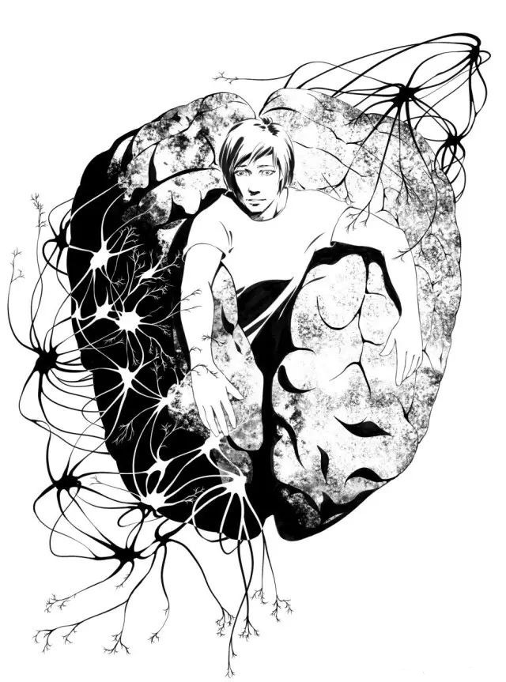

# 百分之七的天无

【日】山本弘/著　千江/译

> 编者按：
> 
> 山本弘，日本著名轻小说及科幻小说作家，多次入围与获得日本科幻界大奖，代表作品有《神不会沉默》《梅杜莎的诅咒》《去年是个好年吧》《艾比斯之梦》等。
> 
> 《百分之七的天无》一文将脑科学、人工智能等元素结合在一起，对“意识”这一命题进行了哲学讨论，设定新奇，文章内容丰富、连贯而具深度；作者在文中还列举了一些现代生活中奇怪却不陌生的现象，以轻快风趣的语言针砭现实中的人与事，易引起读者共鸣，颇具启发意义。

---

“喂，老师你听听，这能信吗？他们说我是‘天无’啊！”

我正在给某科学杂志的连载栏目写稿，闻言停下敲打键盘的手指，回头朝工作室的门口看去。阿瞬刚从学校回来，正抱着装了晚餐食材的超市购物袋，怒气冲冲地靠在门边。

我和阿瞬同居已有八个月了。他比我小十三岁，外形虽比不上演员和牛郎，却也勉强算个帅哥。他有些瘦弱，让人没什么安全感，可这一点又令人母性本能蠢动。我俩的这种关系在世人眼里不算光彩，所以除密友之外，我也没有公之于众。但阿瞬不在乎这个，似乎还在大学里跟朋友炫耀说：“我的同居对象是个作家。”

“天无？阿瞬吗？”

开什么玩笑？我如此想。几周前，我从T大医学部的熟人那儿得知最近风头正劲的充原教授的研究室在招募脑波器的受试者后，便把这份工作介绍给了阿瞬。我告诉他，尽管这实验很无聊，却能挣点儿零花钱。我本以为，事情到那里便告一段落了。

“就是啊！”他走到我跟前，弯下腰来，脸贴近得几乎要碰上我的鼻尖，“我看上去像僵尸吗？”

“不像僵尸，只是很难闻。你吃香蕉了吧？”

我讨厌香蕉的气味。“啊，抱歉。”阿瞬退开了些，以手掩口嘟哝辩解道，“都是三个小时前吃的了……”他就是这点比较可爱。

“他们这样宣布的？说你是I因子欠缺者？”

“不，没有宣布，因为原则上是不告知受试者结果的。可帮忙做实验的人当中有个女生特别口无遮拦，把实验结果到处乱讲，谁是‘天无’的谣言不知什么时候开始就在校园里传开了。结果绕几圈之后传进了我的耳朵。”阿瞬嫌恶地摇着头，“为什么女人就那么大嘴巴呢？”

眼前就有个女人，阿瞬还能说出这种性别歧视的话，在我看来，他也可谓是口无遮拦了。

“但那只是中伤吧？”

“可我又没得罪过她。所以我找到那家伙，当面质问，她却说：‘没办法，结果就是那样呀。’还用跟看僵尸似的讨厌目光看着我。就连铃木和大塚都取笑我说：‘原来你没有I因子啊！’真是气死我也！”

他用拇指戳了戳自己的胸口，“喂，我怎么看也不像僵尸吧？”

尽管我内心有些动摇，却飞快地运转起了头脑。阿瞬经常因为说话不经大脑而惹恼别人，我可不同。在这种情况下，我会立刻搜寻能避免伤害对方的措词。

“你清楚自己不是僵尸吧？”

“那当然了！我要是没有I因子的话，就不会这么生气了。”

此言差矣。I因子和情绪是两码事。但我没有指出这一点，否则只会令他更加气愤。

“那就是他们弄错了吧？谁知道是检查出了问题还是哪里出了问题。不然就是那个女生在撒谎。别介意。”

“也对。”

“没错，不用在意。”

我一面假装平静地说着，一面担心着阿瞬看穿自己的内心。

不用在意？我可是在意得很。他是“天无”的这个判断很有说服力。因为，我能够联想起的可疑之处数不胜数。

---

我是在一个网络游戏的线下聚会上认识平城瞬的。游戏中，他是可爱的女战士，我是年轻的魔法师，我俩经常一起组队行动。因此，在线下聚会上我们一见如故。

我得意忘形地喝过了头，烂醉如泥，是阿瞬把我送回了公寓。他先是很有绅士风度地打算离开，倒是我一面叫着“米莲娜”（他在游戏里的名字），一面抱着他把他拖到了床上。

数周以后，我们拖拖拉拉地发展为了同居关系。其实我对姐弟恋没有兴趣，他也一样，关系变成了现在的样子，彼此都很意外。如果去年有人对我说，“你会跟比自己小十三岁的男人同居”，我绝对不会相信。可人与人之间的缘分就是这么不可思议。

我一开始便对他宣布，自己“绝对不能容忍男人吃软饭”。我为他提供住处，支付每月的房租、水电和生活费，而他必须付出相应的劳动。因此，洗衣、做饭、打扫卫生的活儿都被阿瞬包揽了。

他老是说“我可擅长做咖喱了”，或者“我可擅长做拉面了”。他所谓的“擅长”，是指按照半成品菜盒里的说明原封不动地炮制出来。他亲自下厨的时间已经不短，虽能做出还算像样的菜式，可就是千篇一律。一个月吃五次咖喱也太多了，我要求“偶尔也换换口味”，给了他料理书，他也顶多是原封不动地照搬菜谱，似乎从未想过要做点儿有创意的东西。

他称呼我为“老师”，却不是我的书迷。他几乎没读过我的小说。或者说，他根本就不怎么读小说。有一回我让他读我的书，他还抱怨说“老师的小说太难懂了”。他表示，我没有在故事的开头说明登场人物的设定和背景，这样看起来让人摸不着头脑；他不太明白对话的意思，却得照样读下去，实在麻烦。我向他解释，作者故意推迟交代故事背景来吊读者的胃口，这在娱乐小说里算是一种惯用手法了，他却还是无法认同。

不仅读小说如此。我们一起看电影的时候，我的感想通常是“这一场戏演得真带劲”“那段情节应该在前半段埋个伏线比较好”，对此他似乎丝毫无法领会。他的感想无外乎“有意思”或“没意思”，比这复杂的分析便无能为力了。

在我俩交往的过程中，我逐渐了解到，阿瞬这人从根本上欠缺一种可谓“独创性”，或是“创造性”，抑或是“艺术品位”的东西。他好歹也考进了一流大学，学习能力应该是很不错的，可是像做一些与众不同之事的志向，或是想创造出点儿什么的强烈欲望，他就完全没有了。他既无对未来的梦想，也没有人生道路的方向之类的东西，仅是随波逐流。和我发展成现在的关系，似乎也是顺水推舟的结果。他参考时尚杂志选服装，看着攻略书籍打游戏，观看时下最热门的电影——他只需按照指南手册生活，除此之外再没别的期望了。

我倒不会为了这种事而讨厌他。虽然他有点儿傻乎乎的，但也不失为一种魅力。有好几次他试图对我撒谎，都瞬间被我识破，他笨拙的样子让我发不起火来。正因为他笨拙得连谎都不会撒，我反而安心。像他这种性格是没法劈腿的，别说他不会出轨，就算出了，也会立即被看穿。对此我深信不疑。

人非圣贤，有些缺点也无妨。重要的是心。我爱他，他也表示喜欢我，这不就够了吗？我一直这么以为。

可是，他若有僵尸的嫌疑的话，事情就另当别论了。

---

趁着阿瞬做晚餐之际，我给T大医学部的熟人千沙打了电话。实验招募受试者的消息便是她告诉我的。

“我也正想着，你是时候打过来了呢。”她好像还觉得挺有趣。

“你们怎么搞的啊，个人信息怎么能泄露出去！”

我虽满腹怨气，她却十分淡定。“我说啊，现在这个世道，谁能够忠实地遵守保密义务才是怪事呢。最近的年轻人一出生便有手机和互联网，在他们的价值观里，上传些违反著作权的视频，在论坛里发一些无中生有的谣言，不都已经变成理所当然的事情了吗？所以，这种坏习惯也被带进了日常生活，有些人就是能面不改色地把不该说的东西挂在嘴上。嗯，就是这样。”

她自说自答了起来。千沙虽与我同龄，一开口却老气横秋，且总是不得要领。真想哪天用脑波器看看她脑子里装的是什么东西。

“可这工作是你给介绍的吧？”

“又不是我们研究室的学生走漏的消息。而且，你事先也该预料到会有这种风险吧？”

我一时语塞。我可没预料到。我虽然玩笑似的设想过阿瞬也许欠缺I因子，但却从未想过这会是真的。

“那么，事情到底如何？”

“什么事？”

“那个传言啊。阿瞬的事情，是真的？”

“这有违保密义务，我不能透露。”

“你别给我装了！”

我一不留神拔高了音量。我朝餐厅的方向看了看，阿瞬正在专心炒菜，似乎没注意这边的动静。我压低了声音，“我认为自己有权被告知真相。”

“好吧。是真的。毫无疑问他是I因子欠缺者。”

她说得太轻描淡写了，我反而如受重击。

“那，那个——是真的吗？I因子欠缺者是僵尸的说法……”

“啊，这个我就不太清楚了。因为这次的个人信息泄露，充原教授正敏感着呢，对研究室全体成员下了封口令。你知道，这种消息可能会引起歧视。”

“也是。”

“所以说，研究进行到什么程度，得出了什么样的结论，以我的地位是无法得知的。”

“不过，你至少听过些传闻吧？”

“这个嘛，听倒是听过。”千沙措词含糊起来。

我非逼她继续不可，“传闻怎么说？天无的说法是真的吗？”

她没辙了似的说：“对，好像确实是真的。”

我的心情仿佛是自己被宣判了绝症一般。

---

那天晚上，我耿耿于怀，上网重新查询了有关I因子欠缺者的信息。

几年前，由于超导元件的开发，fMRI[^1]发展到了空间分辨率以100纳米、时间分辨率以10微秒为单位的水平，这在脑生理学者和认知心理学者当中激起了莫大的期望。此前的设备仅能对人类从事一定行为（如心算、听音乐、解谜、记起他人的脸庞等）之时，脑的哪个部分正参与行为做出模糊判断。但如今人们认为，通过监测脑内神经活动的详细信息，一直以来都令学者们头痛的重大谜题——所谓的“意识”或“感觉质”，到底是在脑的哪个部位、通过什么样的过程产生——有了解决的突破口。

问题在于，尽管获取的数据量有了飞跃性的增长，人们仍然缺乏能够对其进行解析的手段。正如没有罗塞塔石碑，便无法解读古代文字一般。然而，自然界中已经存在能够理解人脑活动的硬件——人脑本身。

于是，试图监测他人大脑活动的实验——“人工心电感应”实验在世界各地的研究机构里热火朝天地开展起来。其中，阿瞬就读的大学的充原郁彦教授的研究室领先了对手一步。他们对美国研究组织开发的名为脑波器的装置进行了独立改良，将其与fMRI结合在一起，实现了观测者对受试者的脑部活动进行模拟体验。

我仅在照片上见过脑波器。那是一个又大又难看的头盔，内侧覆盖着数百万条微细的线圈，能将fMRI捕捉到的受试者脑部的磁共振在观测者脑内重现，引发相同的神经活动。不过，鉴于这种实验可能给观测者的大脑带来不良影响，脑波器产生的电位设定得比实际神经活动的电位小一些。

尽管该技术被称作人工心电感应，却还不能做到完全读取他人的思想。据说，这即使在未来也难以实现。因为，人脑存在个体差异，就算对两个人脑部某个相同的位置进行刺激，这两人也未必会出现同样的反应。但是通过脑波器，观测者可以大概感觉出“这人正在回想什么”、“这人正在动脑做事”或是“这人正在放松休息”。

实验过程中，充原教授的团队遭遇了一个现象。在以某个人为受试者的案例分析中，观测者报告说“这人似乎欠缺某种很重要的东西”。为了证明这不是观测者的错觉，研究团队更换了观测者，再对同一个受试者进行判断，但新观测者依然报告了相同的感受。也即是说，这些外表普通、也未被诊断为智力障碍或精神疾病的人，他们的某个地方，在本质上却有异于正常人类之处。

对一千余名受试者进行考察后，团队又发现有另外一些人也被判定为“欠缺某种东西”。充原教授将这种欠缺的东西命名为“I因子”，并在学会上发表了该成果。I即是“郁彦（Ikuhito）”的首字母。

作为一名学者，充原教授慎重地表明了自己的立场。他并没有提出有关I因子实质的任何假设，仅是报告了它的存在，并期待各国的研究者进行重复实验。结果，其他研究组织也陆续证明了充原教授发现的正确性。

全世界共有1685人接受了调查，其中有119人被判定为I因子欠缺者。尽管缺少未成年人的数据，但实验至少证明：在二十岁以上的受试者中，即使考虑到性别、人种、学历的差异，这个比例的差距也并不大，即是说，I因子欠缺者的数量在成人中约占百分之七。

普通人与I因子欠缺者的区别在哪里呢？研究者们进行了各种各样的测试。结论是：整体看来，两者在智商上并无显著差异，但在有关情节记忆的测试中，I因子欠缺者的成绩稍差。给I因子欠缺者朗读文章，让他们观看视频短片，数小时后再针对之前的所见所闻进行提问，会发现他们经常有记错的情况。在性格测试中，研究者也得出了I因子欠缺者不善于与他人进行换位思考的结论。在针对创造性和想象力的测试里，他们的表现也稍逊于普通人。

如今的科学家正热衷于揭示I因子的真相。他们将普通人与I因子欠缺者的脑部活动进行对比，试图找出令人感觉“缺少了什么”的部分的具体位置。可是，由于fMRI的数据过于庞大，人的脑部活动也存在个体差异，不能单纯地对其进行比较，这项工作就像复杂的“大家来找茬”游戏，令科学家们烦恼不堪。

若仅这样，I因子充其量也不过是个科学命题，并未引起大众的关注。但在数月之前，一个医学/心理学主题的论坛上，I因子的真相被传开了，还引起了小小的轰动。也不知最初是谁开的头。一种说法是，充原教授身边的某人泄露了相关信息。这种说法听似古怪，却有几分说服力。

本来就有迹象表明：充原教授早就注意到了I因子的真相。他为何要给它取名为“I因子”呢？如果真是以“充原郁彦（MitsuharA.I.kuhito）”来命名的话，不应该叫M因子吗？不错，“I”字另有所指——倘若自己突然提出荒唐无稽的假说，恐怕只会令人耻笑，可如果被他人抢去先机，又实在窝火，所以便在名字中先加以暗示……

I因子的“I”，是“我”的意思。

I因子欠缺者没有自我意识。这即符合了以往哲学家称之为“僵尸”的概念——能够像普通人一样思考，却不具备意识的人。这类人只能像机器人一般按照程序行动，脑中不具备“我”的概念。尽管他们的行为举止和有心的人如出一辙，实际上却没有心。当然，这个“僵尸”仅是哲学概念，过去没人当真相信世上存在该物种。不过，他们事实上却是存在的。僵尸在成人中约占百分之七，在全世界共有数亿。

如此重大的事实，之前却无人知晓，这皆是由于人类无法直接读懂他人内心的缘故。虽说这类人是“僵尸”，可他们的脸并没有腐烂，走起路来也不会步履蹒跚，日常生活中的所有动作，他们都可以流畅地进行。只需想想骑自行车时的情景便可：一个人骑车尚不熟练之时，无论蹬踏板还是保持平衡都很困难；可一旦熟练，便能不假思索地骑行了。骑自行车不需要意识，机器人也能办到，现在也确实存在会骑车的机器人。

需要动脑的活动亦是如此。玩动作型电视游戏时，只要一熟练，手指便能不由自主地操纵手柄，玩家可以一边打游戏一边想着别的事情。象棋和西洋象棋之类的思考型游戏也是一样，如果成了名家，即使不刻意去思考，下一步的走法也会灵光闪现。即是说，玩游戏并不需要意识。

日常生活中的大多数行为，不具备意识的机器人和电脑都可以完成。现代的机器人既能弹钢琴，又能开车，搅拌蛋清也能漂亮完成。只要愿意，人类连会解答高考试卷的机器人也能造出来。若仅是要求能够理解文章、转换汉字和假名、完成英译日、回答出历史事件的年份和相关人名、解决数学物理问题的话，现在可能已经存在相应的软件了。人脑作为自然界的超级计算机，即使说它天生就配备有能够解决更高难度问题的软件，也并非不可思议。这种软件再进行重复学习（即考试训练）的话，僵尸们能考进大学就不足为奇了。

对此，有人当然会提出反对意见：若仅是回答考试问题，没有心的机器人的确可能做到。可是人际关系怎么办？僵尸们不是只能表现得跟没有心的机器人一样吗？他们与普通人之间的差异，立即就会被发现吧？

对此，又有人提出反驳：曾几何时，恋爱模拟游戏只具备简单的选项，角色只能发出预先录制的演员配音；可看看如今的少女游戏吧，角色能够自动生成回复玩家的话语，并合成声音发出。它们还设有情绪参数，可以在回答时表达出感情的起伏。玩家若使用粗俗下流的措词，角色便发怒；若是温言相向，角色便欢喜。玩家对待显示屏里的女孩，就像在与真正的人类相处一般。当然，少女游戏中的女孩不可能真的有心，她们至多不过是电脑模拟出来的东西，一举一动都只是遵照编程者的设定而已。尽管她们拥有丰富的词汇量，有能力理解文章的上下文关系，可归根结底，也只是比过去的“人工无脑（聊天机器人）”有所进步罢了。

I因子欠缺者是在自然界中进化产生的，因此可以被称作“天然无脑”。

（当然，这个词语似乎不太准确。因为I因子欠缺者不仅有脑子，还拥有比当今最尖端的A.I．都更高等的智能。“僵尸”一词容易给人以歧视的印象，许多人都不太愿意使用；相反，“天然无脑”的简称“天无”一词就有些幽默的意味，一出现便立刻成了网络流行语。）

对前面的论述，有人再度反驳道：可少女游戏中角色的反应毕竟不怎么自然，那种东西，实在不大可能通过图灵测试。

有人进行再反驳。阿兰·图灵提出的图灵测试的功能，充其量不过是对A.I．是否能进行智能活动做出判断，却不能断定测试对象是否拥有意识。即使通过了图灵测试，测试对象也可能仅是一个不具备意识的程序。

而且，人们在日常生活中并不做图灵测试。他们只是单纯地相信：既然别人跟自己一样同为人类，那必然也是有心的。正因为这种先入为主的观念，人们才无法看穿对方没有心的事实吧。如果真的进行图灵测试——不依赖视觉，而是让“天无”与普通人仅通过文字对话，那么，些外表上无法看出的差异，就会变得显而易见了吧。

还有一段轶事，可以被视为佐证该论点的依据。充原教授的受试者中，有一与他来自同一大学哲学系的唯町治助教授。此人是个怪胎，著有《相对论果然是鬼话》一书，宣称现代物理学从根本上就是错误的，只不过全世界的物理学家都害怕丧失自己的地位，才隐瞒了真相。据说，他便被判定为了I因子欠缺者。

物理学系的论坛上，至今仍保留着唯町教授与其批判者之间的辩论记录。只需一读那些记录，我们便能知道他是什么样的一号人了。他通常不回应别人对自己的批判，反而用难缠的质问来岔开话题，抑或是表现得感情用事，一味地嘲笑批判者，不论对方摆出了多少真凭实据，都绝无悔改之意。诚然，这种反应怎么看都不像来自人类，说是聊天机器人在发言，别人也会相信吧。唯町教授恐怕是通不过图灵测试的。

也许唯町就是I因子欠缺者的典型例子。在网络上，像他这种类型的人并不少见。这些人虽有人身，却表现得跟程序一样；虽在日常生活中看不出异样，可在不能露面的网络对话中，他们便显露出了聊天机器人般的反应。或许，这种人都只是不具备心的程序？

我冥思苦想。如此看来，I因子欠缺者的特点，阿瞬几乎全部符合。他经常相信一些有违常理的事，让我不知如何是好——“戴安娜王妃是被英国王室给暗杀的吧”“9·11事件全是美国政府一手策划的”，诸如此类，似乎都是从便利店出售的漫画里得知的信息。就算我对他指出这些说法的自相矛盾，也不过是对牛弹琴。

此外，他很多时候也不能理解我的心情。他经常滔滔不绝地讲些不知笑点在哪里的无聊笑话，我面无表情地随口应付着，暗示他尽早结束这个话题，阿瞬却从未看懂过我的眼色。他只顾自说自话，却不能理解听话者的心情。他还总是在我工作劳累的时候粘上来，倘若我解释说自己想独自休息一会儿，他就会猛地生气说：“你讨厌我了吗？”让我吓一跳。无论感情再好，也不能总是如胶似漆吧。恋人疲惫的时候，给她一点空间才是爱的表现，可在他的脑子里，“爱”似乎仅仅等于“抱在一起”。

或许，他没有心？正因为没有心，才不能理解我的心？

I因子欠缺者也有生殖本能。正如动物寻求配偶，他们也想和异性结合。想结合是理所当然的。在这种意义上，阿瞬的确对我抱有好感吧。

可是，当他说“我爱你，老师”的时候，该怎么解释他的话呢？不伴随意识活动的好感，能被称作“爱”吗？这和鳄鱼寻找交配对象有什么区别？莫非，他所谓的“我爱你”，就和鸟类的求爱活动一样，仅是单纯地顺从动物本能，如同程序编写出的一般，而他身上其实根本不存在爱这种东西？

“还在工作啊，老师？”

我的背后突然响起了阿瞬的声音。我慌忙关闭了浏览器。若被他发现我在查询什么，阿瞬会如何反应呢？

“已经很晚了。今天又要熬通宵？”

“不，今天不工作了。因为没什么灵感。”

今天晚上我内里不安，实在没心情写文章。

还没关上电脑，阿瞬便从后面抱住了我，在我耳边低语道：“那么，上床了吧？”

一瞬间，我感到一阵恶寒，却浮起假笑，用平静的语气回答：“嗯，好啊。”

---

这是有史以来最糟糕的一晚。阿瞬的手指爬过我的身体，直到昨天，我还相信这是充满爱意的“爱抚”，今天却无法相信了。他可能只是个没有心的自动机器，不过在本能地依照程序行动——这样的想法挥之不去，嫌恶感抑不住地上涌。他发出的“我爱你”的低语在我耳边盘旋，令我毛骨悚然。

我一直都是被僵尸拥抱着吗？以为他爱我亦只是幻觉？

可是，我害怕阿瞬发觉我的冷淡，我表现出热情的样子，拼命装得和以往没有任何不同。我觉得，连自己都变得像机器人了。

---

自那以来的几周，我都被轻微的迫害妄想症折磨着。我不禁用猜疑的目光打量阿瞬的一举一动：这句话是出自本意，还是没有心的程序驱使？那个行为是有意识进行的，还是仅是一种习得的反射动作？

我会如此怀疑，是不是证明我其实不爱他呢？并非如此。我若不爱他，便不会这么痛苦了。正因为我爱他，才会为了他是否有心这种事而烦恼。

不仅仅是阿瞬。我迄今为止的人生里，在生活中直接认识的或是在网络上对过话的数百人当中，也许就有百分之七的人是没有心的“天无”。每五百人中，就有三十五个——到底是哪些人啊？

我认识的公司社长中，有一人持有“栃木县的人都很顽固”的观点。他的根据是：他所认识的那两个栃木县的人很顽固。我一反驳说“我就是栃木县的，可并不顽固啊”，他便嘲笑我“看吧，这就是你们顽固的地方了”。若是喝醉酒，他便能没完没了地把“栃木县的人都顽固”这句话在一小时内重复个五十次，实在让人服了。现在看来，他的表现简直就像不知变通的聊天机器人。

大学时代有一个学妹，在被一个渣男欺骗、虐待的同时还要对他奉上金钱。可是，无论我们怎么劝说，她都认定“他是爱我的”“他没有我就不能活了”，毫无分手的打算。她最后欠了一屁股债，在失去利用价值之后便被一脚踢开了。尽管如此，她还是执迷不悟，仍哭着说她应该多给那男人一些钱。

每天的报纸也会登载类似的消息：某教师在网络上半开玩笑地扬言说要在小学里大开杀戒，随即被警方通过IP地址定位并逮捕；某化学系学生并没什么特别的目的，却违法合成并囤积了大量诸如联苯胺、4-硝基联苯之类的有害物质；某少年因父母不给自己买游戏，便以自杀来抗议；某个老人明明住着豪宅，拥有不少财产，却在庭院里存放着大量垃圾，给左邻右舍造成了困扰；还有一些人听信自称“夏洛克·福尔摩斯转世”的冒牌大仙的话，被骗走了大量的金钱。

这些人其实是“天无”吧？因为他们只能按照无心的程序行动，所以有时才会做出一般人无法理解的背离常识的举动吧。

现在，我正在重读刚从出版社返回的单行本校样。校对人员在上面做了大量的修改标记。校对人员也有很多种类型，而此人就对所谓的“歧视语”特别敏感。在“这是盲点”“对当权者盲从”“陷入了疯狂状态”“狂乱的风暴”这类短语里，诸如“盲”“疯”一类的字眼全被铅笔划上了圆圈。末了连“装疯卖傻”“强壮的黑人”“瞎了一只眼睛”之类的表达都被标了出来，实在惊人。还对我说“这些表达方式不太恰当，您修改一下如何？”未免太过操心了。但凡用常识想想，都能看出这些说法并没有歧视的意思吧。

我一面读着校样，一面感到背脊发凉。这个校对人员所做的，纯粹只是搜索出“疯”“盲”的字眼再画上圆圈而已。这种事情机械也能做。只需给机器人装上文章编辑软件，再让它拿着铅笔就行了。这种行为里，不存在作为有心人类的判断力。

虽然我已经入行十多年，出版了好几本图书，却从未和校对者本人会过面。他们真的存在吗？还是说，这个工种其实已经被机器人取代了？

唉，不能这样下去了。现在不管看见什么，都会和“天无”联想到一起。我明知自己是在妄想，却无法停止这些想法。

我是一个坚定的反歧视者，自己也从未区别对待过残障人士和外国人。可是，唯独这个问题不同。一想到阿瞬可能是“天无”，不安与嫌恶感就忍不住地往上涌。万一他当真是仅凭本能与程序行动的僵尸，怎么办？万一他是在用无心之口说爱我、用无爱之手抱我，怎么办？

我已经无法忍耐，快要疯了（对了，那个校对人员会在这里划圈吧！）。

可事实又真是如此吗？阿瞬真如千沙所说，被判定为了I因子欠缺者吗？此外，I因子又真的是指“我”吗？如果其中哪里出了错，就还有希望。

我下定决心。我不想在这种不安的情绪中继续维持与阿瞬的关系。还是弄个清楚明白吧。

想到这里，我立刻拨通千沙的电话，找她要了充原教授的联络方式。庆幸的是，除了小说以外，我也写一些与科学相关的文章，也许能够借采访之名请求与他会面。

我朝千沙给的邮箱地址发送了申请采访的邮件，立即就收到了回信。之前听说充原教授防备心很重，本以为说服他接受采访需要大费一番周折，谁知他毫不豫就同意了，我反而有些失望。看来，充原教授竟然读过我在科学杂志上连载的文章。这么一来就容易说话多了。

一周以后，我去T大的研究室拜访充原教授。

---

教授年届五十，是个目光非常温和的男人，有些像我死去的父亲。虽然我明白人不可貌相，却仍觉得他不像坏人。

“我从佐佐木女士那里听说了。”看了我的名片，他说道。佐佐木即是指千沙。

“由于我们研究的缘故，给你们添麻烦了。”

他一脸正色地深深鞠躬，令我有些惶恐。千沙这家伙，连那种事都说出去了吗？这才是泄露个人信息好吧！

“你一定很烦恼吧？为了平城瞬君的事。”

“嗯，算是吧……”

“信息管理做得不到位是我的过失。特别是出了问题的时候，本该更加慎重对待的。抱歉因为这次的事，让你担心了。我接受这个采访，也有借此赔罪的意思。我想，把所有事情都告诉你也无妨。我希望向你特别展示之前的研究成果。”

“那不是最高机密吗？”

“已经预定于下个月2号在学会上发表了。但在那之前，我想先一步告诉你。”

“为什么呢？”

“现在外面流传的有关I因子欠缺者的信息有误，我想订正这些错误。为此就必须通过媒体把正确的信息扩散出去。我正这么想的时候就收到了你的采访申请，真是正中下怀。”

“可是，就算现在开始动笔，也要下个月才能登上杂志。”

“这无妨。如果先于学会在媒体上发表出来，反倒会造成问题了。”

“这样的话，不是在学会发表后再进行采访比较好吗？”

“不，也不能让你那样久等。修复你和平城君之间的关系是当务之急。”

教授的诚恳再度引起了我的好感，同时也令我重燃希望。难道说，阿瞬果然不是“天无”？

我打算即刻开始采访，教授却打断了我：“在谈话之前，你可以先接受一项测试吗？”

“测试……是吗？”

“是的。用fMRI观测大脑活动的测试。我希望你充当一回受试者。”

虽然我被勾起了好奇心，但仍不太明白教授的意图为何。

“为什么呢？”我问道。

“我认为，为了说明意识是什么，以你的大脑为样本比较容易让你理解。如果有了先入为主的观念，可能会影响结果，所以我想测试之后再为你解释。不会很麻烦的，最多四十分钟就结束了。你意下如何？”

尽管我有些不安和疑虑，却敌不过好奇心。我立刻回答：“好，就拜托您了。”

---

我取掉身上包括发夹和耳环在内的所有金属制品，换上专用的检查服，走进了FMRI室。我按照指示在床上躺下，床面缓缓滑动，将我的上半身送进了白色塑胶包裹的巨大圆筒中。

视野里仅剩圆筒的白色内壁，我虽然没有幽闭恐惧症，却也感觉有些难受。

扩音器里响起教授的声音：“这个测试并不考查答题的正确性与速度。请慢慢思考就好。若有答不上或者不想回答的问题，不答也无妨。如果一分钟内还没想到答案，将自动进入下一个问题。明白了吗？”

我回答“是”之后，教授的助手便开始缓慢地朗读起了问题。问题显得任意随机，既有计算题、一般常识题，也有猜谜似的伦理方面的问题、考查记忆力的问题。

“有一个周长1千米的圆形池塘。A和B在池边某一个点同时向反方向出发，沿池奔跑。A以20千米的时速沿顺时针方向奔跑，B以16千米的时速沿逆时针方向奔跑。请问，两人在多长时间后相遇？”

“英国清教徒乘坐‘五月花’号向美洲移民，是发生在关原之战之前还是之后？”

“从东京开往神户的列车停住了。一天、两天、三天过去了，它依旧没有发动。过了好几天，它终于再次出发了。请问，列车停了几天？”

“你在公园里看见一个十岁左右的小孩抓住了一只四脚蛇。他举起石头，还想把四脚蛇的头砸烂。你会怎么做？”

“请在脑中尽量准确地回想起五百日元硬币背面的图案。”

有些问题我能即刻答出，也有些问题我冥思苦想一番后仍不知答案。测试在三十分钟左右后结束了。

“辛苦了。”

我走出MRI室，换好衣服后，充原教授笑脸相迎。

“这就是你的大脑在实验中的状态。”

他一边说着，一边让我看显示屏。以3D图像描绘出的半透明大脑中，只见赤橙黄绿青的颜色在蠕动着。

“这个是你在听到‘小孩想砸烂四脚蛇头’时的反应。实际上是以八分之一的速度显示的。首先反应的是左半脑的韦尼克区，也就是说，言语听觉中枢受到刺激，理解了进入耳朵的问题的意义。紧接此后发生反应的是主管感情的扁桃核，可以看出，你的大脑对这样的场景感到不舒服与为难。在你思考该如何行动之际，大脑活动便向整个额叶联合区扩散开去。额叶联合区是负责思考、创造和决策的区域。”

正如教授所言，在大脑前方的部分，各种颜色混合成了错综复杂的旋涡。

“我们可以看出，你的大脑当时陷入了激烈的挣扎，虽然事实上那只持续了几秒。”

这图像虽然颇有趣，却并不稀奇。我以前在电视上的科学节目里就看过类似的东西。

“正如你所见，人类的精神活动是整个脑部共同运作的结果。‘心’并不仅存于某个单独的部分之内。负责思考与决策的部分固然是额叶联合区，可如果扁桃核的活动进入麻痹状态，你的感情就无法兴奋起来了。正是在你整个脑部的协作下，精神活动才能构成。”

“那所谓的‘意识’就是存在于整个脑部咯？”

“并非如此。我刚才说的仅仅是精神活动，也就是所谓的‘心’的情况。而意识——也就是我取名为I因子的东西，产生自大脑中极狭小的区域。”

我的脑子愈发混乱了。这大概也写在了我的脸上。

教授微笑道：“我知道把你说糊涂了。你认为所谓的‘意识’与‘心’是同一个东西吧？还认为I因子欠缺者没有心？”

“嗯，算是吧……”

“这就错了。所谓的‘心’，是比‘意识’广泛得多的复杂概念。仅仅是大脑中，就有140亿个神经细胞协同工作。我们把感情、记忆、思考、判断等全部归纳起来，用‘心’来表示。与‘心’相比，所谓的‘意识’不过是一个狭小的概念。脑的感觉系统以每秒一千万比特的速率处理着由感觉器官传入的信息，可其中能够上升到意识层面的，仅是极小的一部分。大部分的信息都是在无意识状态下处理的。举个例子，你知道‘盲点’吗？”

“‘盲点’?”我一边回答，一边想，那个校对人员看到这个词的话，恐怕又要画圈了吧。“就是指视网膜上面无法感光的某个区域？”

“是的。由于人类视野中的该区域无法获得信息，本来它只能呈现为一团黑点才对。可是，我们并不会看到黑点。这就与制作古装影视剧时，人们用电脑动画特效消除掉背景中的电线杆一样——在画像进入意识之前，脑就对其进行处理，将盲点消除了。

“又或者，你曾经透过玻璃拍过照吗？玻璃外的风景用肉眼清晰可见，但在照片里却会和映在玻璃上的倒影重叠起来。在这里，照片其实更接近现实。肉眼虽然也能看见玻璃上的倒影，但大脑对之进行了补正，在倒影进入意识之前就将它消除了。进入意识层面的信息，未必就是实时观测到的现实，而是和已经过处理、编辑的剧集差不多的东西。

“1979年，美国神经生理学者本杰明·里比特做了这样一个实验：让受试者坐在电视前，屏幕画面里每隔2.56秒映出一次时钟上滴答行走的指针。受试可以在任意时间动手指，而在他们决定动手的同时，也要记下指针在钟面上的位置。根据记下的位置，便可以知道他们是在何时做决定的了。受试者头上还贴有电极，监测着他们的脑部活动。

“在手指活动的0.55秒之前，人的脑内就已产生一种叫做‘准备电位’的东西，算是大脑为了命令手指动作而进行的热身吧。这种‘准备电位’的存在很早以前就被发现了。可是，当时的受试者记得，自己决定动手的瞬间比真正动手的时间早了0.2秒。”

“呃？可这种事……”

“没有道理，对吧？等于说大脑在有意识地下决定之前就开始命令手指做动作了。可是，别的研究者又对其他许多受试者进行了重复实验，结果均一致。也就是说，由意识‘下决断’的这种观点是一个幻觉。脑在无意识的状态中先行做出判断，而意识是随后产生的。接下来，请你看一下自己的手，然后动一动。”我遵照他的指示，将手指屈伸了几下。

“从你打算动手指，到手指开始动，中间看得出有长达0.5秒的间隔吗？”

“看不出。”

不论如何看，手指都像是和我的意志完全同步的。

“可并非如此。事实上，从头脑下决断到手指活动之间，是有0.55秒的时滞。由此里比特得出了结论：有意识的决策比无意识的决策发生得晚。有意识的决策之所以看上去能与手指的动作同步，都是由于意识被编辑了的缘故。”

我低头看着自己的手，有些迷茫。直到上一刻，我都还相信是自己的意识令手指活动的。可教授说这个看法不对。手指是被无意识所驱动的，就连意识都是在无意识的影响下产生。

我想象自己变成木偶操纵者的样子。我一直以为，自己操纵着名为“肉体”的“人偶”，可事实并非如此。无论我，还是“人偶”，都不过是被更加巨大的名为“无意识”的木偶师摆弄着罢了。

“我们都认为，当我们觉得自己在有意识地下决断的瞬间，即是意识产生的时间。可这种想法很可笑。因为感觉都是被编辑过的，所以应该认为：我们在下决断方面的知觉也是被编辑过的。”

“的确如此……”

“听说在遭遇过交通事故的人当中，有些人的体验是：在相撞的前一瞬间，时间的流逝会突然放缓。明明仅是一刹那的事，却令人感觉无比漫长。即是说，我们应该可以认为，时间的延迟现象不是实时发生的，而是在事故发生的一瞬之后，相关的意识产生并编辑的产物。”

教授说这番话的用意何在，我仍然毫无头绪。

“那就来看看你的意识吧。”

教授切换了画面。屏幕上出现了四条平行的类似地震波形的图案，仿佛是把几棵圣诞树横倒后连放在了一起。

“这只是我们监测到的脑中某个部分的电位变化。它紧随额叶联合区的活动之后产生。上面的三个图形属于普通受试者，最下面的则是你的图形。四者之间并没有显著差异。接下来——”

教授点击鼠标，最下面的图形变成了别的东西。

“这是平城瞬的电位图。与一般的图相比，这图形显得很平坦，你看得出吧？”

教授以手指图。其他人的电位图中波形都上下起伏，可阿瞬的波形却基本是平的。我恍然大悟，“那么，这个就是……”

“不错。这就是表示I因子的波形，叫做I电位。”

我惊住了。这意味着教授已经领先世界，破解了I因子的产生位置。

“我们试着将这一电位单独提取出来，用脑波器再现，观测者则报告说他强烈地感受到了受试者的意识活动。也就是说，这一电位是意识的真身无误，而平城君不具备意识。”

对于他宣告的结果，我不知该如何接受才好，他却继续说了下去：“问题是，为什么这个结果在那么长的时间内都没有被发现呢？我也好，全世界的研究者也罢，都犯了一个大错，即是认为：既然精神活动是在脑部广泛的范围内产生的，那么意识亦应该是同样。事实却并非如此。意识产生于极为狭窄的范围之内。”

“额叶联合区吗？”

“不，是海马体。”

出人意表。海马体不是主管记忆的部分吗？

“意外吧？我起先也感到意外。我们都以为意识必定是在额叶联合区之内，所以不论怎么找都不可能有结果。何况意识所在的位置不过是0.1立方厘米左右的极狭小的区域。另外，还有时滞的问题。”

“时滞？”

“人们过去认定：意识随大脑的活动而产生，二者之间最多只有零点几秒的时间间隔。其实并非如此。”

教授再次切换屏幕，上面显示出了上下两道波形。

“上面的波形代表整个脑部的活动。在t=403.1的时间点上有一个大的隆起。紧随其后你就说出了‘阻止小孩’。即是说，这个隆起便是你决定阻止小孩砸四脚蛇的瞬间。然后——”

教授指向了下面的波形的最右边。

“这是与之相应的I电位。一看便知道，I电位出现的时间实际上比你感觉到的更晚。它由海马体产生是理所当然的事。因为，I电位，即意识，就是短期记忆向长期记忆转化之际产生的东西。”

我提心吊胆地询问：“您说I电位出现得较晚，大概是晚几秒呢？”

“这存在个体差异，也根据思考内容的不同而不同。就你的情况而言，平均时间是……”教授点击鼠标，计算出了平均值。“十九分零二秒。”

---

我回到公寓，走进工作室，径直掀起笔记本电脑屏幕，打开文字编辑软件。

我盯了屏幕一会儿。纯白的画面里空无一字。我敲打键盘，画面上出现了一行文字。

我停下手指，盯着屏幕，只见上面写着：

“我盯了屏幕一会儿。纯白的画面里空无一字。我敲打键盘，画面上出现了一行文字。”

---

虽然这段话是以现在进行时写成的，却并非是在讲述现在发生之事。当我最先打出“我”字之时，文字中的“我”的时间已经过去十几秒了。输入文字的我，对屏幕中的“我”而言是将来时。

所谓意识便是这么一回事：所有无意识进行的体验、思考、决断，一旦被存储进短期记忆，受到编辑，便会被移入长期记忆。正如人们书写日记一般，无意识也在海马体中不停记载着自身的体验。在此过程中，意识便相当于浮现在屏幕上的文字行列。

我们以为自己实时地体验着现实生活，这却是幻觉。当我们以为是意识在决定这个、感受那个的时候，外部现实世界的时间早已流逝几十秒了。正如日记里的文字无法改变已经发生的现实事件一般，意识对无意识也毫无作用。做出一切决定的人不是“我”，而是我脑部的无意识活动。

我试着想象大脑究竟为何物。它能以每秒一千万比特的速度处理感觉信息，瞬间理解外界状况；它能将特定的图形当做文字识别并读取，进而理解文章的意义；它能在原始本能、情感、理智与知识之间取得平衡，检索庞大的记忆，做出恰当的判断（尽管偶尔也会出错）；它能将思想转换为文字，通过正确控制声带与舌头发出音来。大脑一刻不休地进行着任何机器人都无法代劳的工作，它其实是地球上性能最为出众的超级计算机。

我无法想象这样的东西，也描绘不出自己的脑的模样。

这便是大脑无法记述自身的原因。如果大脑要把自身处理的庞大信息全部记住的话，海马体恐怕会在几秒之内撑爆。因此大脑将自身的体验摘取其要，加以润色后才记录下来。在此过程中，为了监控错误而产生的东西便是意识。所谓的“我”，其实是“大脑”这一作者写下的自传体小说的主人公。

I因子欠缺者也有记忆能力。只不过，他们不具备自我监控的能力，正如不看显示屏光敲键盘一般。因此他们常会出现记忆错误，也不善于进行客观的自我认识。可是，这些事都无足轻重。

没有意识又如何？我虽然拥有意识，不也是五十步笑百步吗？在不凭意识、光随程序行动的层面上，大家其实都是僵尸。反正意识大大晚于现实产生，它有也好，无也罢，实时进行决策的都是无意识。

我对阿瞬的爱情也不过如此。为什么我会喜欢他？这话说说还行，可并非真相。喜欢上他的不是“我”，而是我的大脑。“意识”这一神经活动是如此渺小，根本无法与大脑所进行的庞杂精神活动相提并论。这种庞杂的精神活动才是“心”，即“爱”。如此巨大的信息量不可能只以寥寥数行摘录其要，况且大部分精神活动本身也是无法翻译为语言的。

“我回来了。”阿瞬到家了，手里拎着鼓鼓囊囊的购物袋，看上去有些疲惫。“对不起，回来晚了。我马上去做晚餐。”

“没关系，不用了。你累了吧？今天我做给你吃。”

阿瞬一脸诧异，“怎么了？感觉怪怪的。”

“今天想做给你吃嘛。”

我一面说着，一面接过他手里的购物袋，朝厨房走去。阿瞬慌慌张张地跟了过来。

“哎？怎么回事？特别服务吗？待会儿有事要让我做吧？喂……”

“傻瓜。”我笑了，亲吻了他。“这就是爱，是爱啊。”

当然，想为他做晚餐的不是“我”，而是我的大脑。“我”比现实慢了十九秒，这些感情与决定都不过是模拟体验罢了。

没错。是否拥有意识无关紧要。不过是我的大脑喜欢他，他的大脑也喜欢上了我——这不就够了吗？

---

【责任编辑：明先林】  
《科幻世界》2013年9月

[^1]: 功能性磁共振成像技术。
