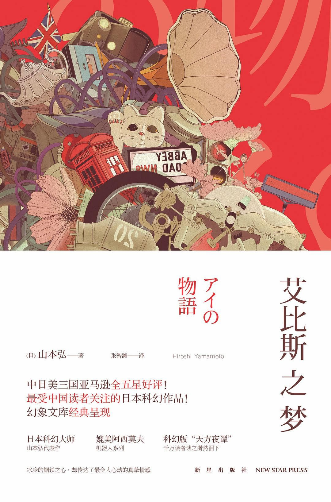

# 艾比斯之梦

(日) 山本弘 著  
张智渊 译

新星出版社  
2015年5月第二版
ISBN 978-7-5133-1763-4  

## 目录

- [楔子](艾比斯之梦-01楔子.md)
- [中场休息 一](艾比斯之梦-02中场休息一.md)
- [宇宙尽在我指尖](艾比斯之梦-03宇宙尽在我指尖.md)
- [中场休息 二](艾比斯之梦-04中场休息二.md)
- [令人雀跃的虚拟空间](艾比斯之梦-05令人雀跃的虚拟空间.md)
- [中场休息 三](艾比斯之梦-06中场休息三.md)
- [镜中女孩](艾比斯之梦-07镜中女孩.md)
- [中场休息 四](艾比斯之梦-08中场休息四.md)
- [黑洞潜者](艾比斯之梦-09黑洞潜者.md)
- [中场休息 五](艾比斯之梦-10中场休息五.md)
- [正义不打折的世界](艾比斯之梦-11正义不打折的世界.md)
- [中场休息 六](艾比斯之梦-12中场休息六.md)
- [诗音翩然到来之日](艾比斯之梦-13诗音翩然到来之日.md)
- [中场休息 七](艾比斯之梦-14中场休息七.md)
- [艾比斯之梦](艾比斯之梦-15艾比斯之梦.md)
- [中场休息 八](艾比斯之梦-16中场休息八.md)
- [尾声](艾比斯之梦-17尾声.md)

> 献给妻子真奈美——  
> 
> 感谢你帮忙考证作品内容，并在日常生活中一直支持我。
> 
> 献给女儿美月——
> 
> 愿你的未来充满喜悦。

  
第一版(2013)封面

  
第二版(2015)封面(本电子版)

---

## 资料

日本原作名：《アイの物語》

> “‘爱’是用片假名表示的，它可以表示智能机器人‘AI’，还同英语的‘I’谐音，还可以表示虚数‘I’……总之它可以表示多重意思。”
> —— 山本弘在《去年是个好年吧》中，对本书名的解释

## 专有名词
- VFC: 用 Voice、Face、Communication 形容情绪
- DIMB: Dreamer in Mirror Bottle, 镜瓶中的梦想家。虽然抱持错误的想法，但是大致上无害。
- SI: Secret Identity，秘密人格 (正义不打折的世界)

## 注
- 网上资源都是台版直接转简体，此版为大陆发行版
- 大陆版与台版为同一译者，应该基于台版稍作修改，目测区别主要在用词习惯上